<!--* caratula -->

<div align="center">

# Informe Trabajo Final 📙


### Universidad Peruana de Ciencias Aplicadas ♨️

🧑‍💻 Ingeniería de software - 2025-02

**Sección:** 7414

**Docente:** Alex Humberto Sánchez Ponce

**StartUp:** F1nTrack

**Producto:** KapakID

<div align='left'>	

~~~C#
static string[] Integrantes() {
    return new string[] {
        "🧑‍💻 Taquiri Calderon, Jhunior Giussepe - u20221C576",
        "👩‍💻 Tasayco Osorio, Raul Hiroshi - U202319415",
        "👩‍💻 Ruiz Huisa, Daniel Elias - U202210764",
        "👩‍💻 Salcedo Champi, Matias Rodolfo - u202319698 ",
        "👩‍💻 Quiroz Zambrano, Fabrizio Javier - u202213406", 
    };
}
~~~

<!-- Registro de versiones -->
<h1 align="left">Registro de versiones del Informe</h1>
<br>

<table border="1" cellpadding="10" cellspacing="0" style="border-collapse: collapse; width: 100%; font-family: system-ui, -apple-system, Segoe UI, Roboto, Arial, sans-serif; font-size: 14px;">
  <thead>
    <tr style="background:#f7f7f7;">
      <td align="center" style="border: 1px solid #ddd; padding: 8px; width: 10%;">Versión</td>
      <td align="center" style="border: 1px solid #ddd; padding: 8px; width: 12%;">Fecha</td>
      <td align="center" style="border: 1px solid #ddd; padding: 8px; width: 33%;">Autores</td>
      <td align="center" style="border: 1px solid #ddd; padding: 8px;">Descripción</td>
    </tr>
  </thead>
  <tbody>
    <tr>
      <td style="border: 1px solid #ccbebeff; padding: 8px; font-weight: 600;">TB1</td>
      <td style="border: 1px solid #ddd; padding: 8px;">19/09/2025</td>
      <td style="border: 1px solid #ddd; padding: 8px;">
        <ul style="margin:0 0 0 18px;">
          <li>Jhunior Giussepe Taquiri Calderon – u20221C576</li>
          <li>Raul Hiroshi Tasayco Osorio – U202319415</li>
          <li>Daniel Elias Ruiz Huisa – U202210764</li>
          <li>Matias Rodolfo Salcedo Champi – u202319698</li>
          <li>Fabrizio Javier Quiroz Zambrano – U202213406</li>
        </ul>
      </td>
      <td style="border: 1px solid #ddd; padding: 8px;">
        <strong>Proyecto:</strong> F1nTrack – KapakID
        <ul style="margin:6px 0 0 18px;">
          <li>Capítulo I: Introducción</li>
          <li>Capítulo II: Requirements Elicitation & Analysis</li>
          <li>Capítulo III: Requirements Specification</li>
          <li>Capítulo IV: Product Design</li>
          <li>Capítulo V: Product Implementation, Validation & Deployment (hasta el primer sprint)</li>
          <li>Avance de Conclusiones, Bibliografía y Anexos</li>
        </ul>
      </td>
    </tr>
  </tbody>
</table>
<br>

<br>

<table border="1" cellpadding="10" cellspacing="0" style="border-collapse: collapse; width: 100%; font-family: system-ui, -apple-system, Segoe UI, Roboto, Arial, sans-serif; font-size: 14px;">
  <thead>
    <tr style="background:#f7f7f7;">
      <td align="center" style="border: 1px solid #ddd; padding: 8px; width: 10%;">Versión</td>
      <td align="center" style="border: 1px solid #ddd; padding: 8px; width: 12%;">Fecha</td>
      <td align="center" style="border: 1px solid #ddd; padding: 8px; width: 33%;">Autores</td>
      <td align="center" style="border: 1px solid #ddd; padding: 8px;">Descripción</td>
    </tr>
  </thead>
  <tbody>
    <tr>
      <td style="border: 1px solid #ccbebeff; padding: 8px; font-weight: 600;">TP2</td>
      <td style="border: 1px solid #ddd; padding: 8px;">10/10/2025</td>
      <td style="border: 1px solid #ddd; padding: 8px;">
        <ul style="margin:0 0 0 18px;">
          <li>Jhunior Giussepe Taquiri Calderon – U20221C576</li>
          <li>Raul Hiroshi Tasayco Osorio – U202319415</li>
          <li>Daniel Elias Ruiz Huisa – U202210764</li>
          <li>Matias Rodolfo Salcedo Champi – U202319698</li>
          <li>Fabrizio Javier Quiroz Zambrano – U202213406</li>
        </ul>
      </td>
      <td style="border: 1px solid #ddd; padding: 8px;">
        <strong>Proyecto:</strong> F1nTrack – KapakID
        <ul style="margin:6px 0 0 18px;">
          <li>Capítulo V: Product Implementation, Validation & Deployment (implementación del <strong>Sprint 2</strong>).</li>
          <li>FrontEnd Web: desarrollo completo de vistas principales (Login, Dashboard, Documentos, Recargas y Notificaciones) e integración con API simulada.</li>
          <li>Despliegue del FrontEnd en entorno de pruebas (<em>Netlify</em>) y validación funcional.</li>
          <li>Actualización de conclusiones, bibliografía y anexos.</li>
        </ul>
      </td>
    </tr>
  </tbody>
</table>


<br>


<table border="1" cellpadding="10" cellspacing="0" style="border-collapse: collapse; width: 100%; font-family: system-ui, -apple-system, Segoe UI, Roboto, Arial, sans-serif; font-size: 14px;">
  <thead>
    <tr style="background:#f7f7f7;">
      <td align="center" style="border: 1px solid #ddd; padding: 8px; width: 10%;">Versión</td>
      <td align="center" style="border: 1px solid #ddd; padding: 8px; width: 12%;">Fecha</td>
      <td align="center" style="border: 1px solid #ddd; padding: 8px; width: 33%;">Autores</td>
      <td align="center" style="border: 1px solid #ddd; padding: 8px;">Descripción</td>
    </tr>
  </thead>
  <tbody>
    <tr>
      <td style="border: 1px solid #ccbebeff; padding: 8px; font-weight: 600;">TB2</td>
      <td style="border: 1px solid #ddd; padding: 8px;">20/11/2025</td>
      <td style="border: 1px solid #ddd; padding: 8px;">
        <ul style="margin:0 0 0 18px;">
          <li>Jhunior Giussepe Taquiri Calderon – U20221C576</li>
          <li>Raul Hiroshi Tasayco Osorio – U202319415</li>
          <li>Daniel Elias Ruiz Huisa – U202210764</li>
          <li>Matias Rodolfo Salcedo Champi – U202319698</li>
          <li>Fabrizio Javier Quiroz Zambrano – U202213406</li>
        </ul>
      </td>
      <td style="border: 1px solid #ddd; padding: 8px;">
        <strong>Proyecto:</strong> F1nTrack – KapakID
        <ul style="margin:6px 0 0 18px;">
          <li>Capítulo V: Product Implementation, Validation & Deployment (implementación del <strong>Sprint 3</strong>).</li>
          <li>FrontEnd Web: mejoras completas de módulos (Documentos, Recargas, Transporte, Perfil y Notificaciones) y navegación final.</li>
          <li>Web Services: primera versión de endpoints REST (Autenticación, Usuarios, Documentos, Recargas y Notificaciones) con documentación en Swagger.</li>
          <li>Despliegue de Landing Page, FrontEnd y Backend en entornos productivos.</li>
          <li>Incorporación del “Video About-the-Product” y “Video About-the-Team”.</li>
          <li>Sección 5.3 completada: diseño de entrevistas, registro de entrevistas y evaluación heurística.</li>
          <li>Actualización de conclusiones, bibliografía y anexos según lineamientos del Final Project Statement.</li>
        </ul>
      </td>
    </tr>
  </tbody>
</table>


<br>


## Contenido del Informe
[Student Outcome](#student-outcome)

- [Informe Trabajo Final 📙](#informe-trabajo-final-)
    - [Universidad Peruana de Ciencias Aplicadas ♨️](#universidad-peruana-de-ciencias-aplicadas-️)
  - [Contenido del Informe](#contenido-del-informe)
    - [1.2.2 Lean Ux Process](#122-lean-ux-process)
      - [1.2.2.1. Lean UX Problem Statements](#1221-lean-ux-problem-statements)
      - [1.2.2.2. Lean UX Assumptions](#1222-lean-ux-assumptions)
      - [Business Outcomes 📊:](#business-outcomes-)
    - [User Outcomes 🙋](#user-outcomes-)
      - [1.2.2.3. Lean UX Hypothesis Statements](#1223-lean-ux-hypothesis-statements)
      - [1.2.2.4. Lean UX Canvas](#1224-lean-ux-canvas)
      - [Segmentos Objetivos:](#segmentos-objetivos)
- [Capítulo II: Requeriments Elicitation \& Analysis](#capítulo-ii-requeriments-elicitation--analysis)
  - [2.1 Competidores](#21-competidores)
    - [¿Por qué llevar a cabo este análisis?](#por-qué-llevar-a-cabo-este-análisis)
    - [2.1.1 Análisis competitivo (Comparativa)](#211-análisis-competitivo-comparativa)
    - [**¿Por qué KapakID es superior?**](#por-qué-kapakid-es-superior)
    - [2.1.2 Estrategias y tácticas frente a competidores](#212-estrategias-y-tácticas-frente-a-competidores)
  - [2.2 Entrevistas](#22-entrevistas)
    - [2.2.1 Diseño de entrevistas](#221-diseño-de-entrevistas)
      - [Preguntas:](#preguntas)
    - [2.2.2. Registro de entrevistas](#222-registro-de-entrevistas)
    - [2.2.2 Registro de entrevistas](#222-registro-de-entrevistas-1)
      - [Entrevistas a estudiantes universitarios](#entrevistas-a-estudiantes-universitarios)
  - [| Timing        | Ver grabación |](#-timing---------ver-grabación-)
      - [Entrevistas a padres/madres o tutores](#entrevistas-a-padresmadres-o-tutores)
    - [2.2.3. Análisis de entrevistas](#223-análisis-de-entrevistas)
  - [2.3. Needfinding](#23-needfinding)
    - [2.3.1. User Personas](#231-user-personas)
    - [2.3.2. User Task Matrix](#232-user-task-matrix)
    - [Task Matrix](#task-matrix)
    - [2.3.3. User Journey Mapping](#233-user-journey-mapping)
    - [2.3.4. Empathy Mapping](#234-empathy-mapping)
    - [2.3.5. As-is Scenario Mapping](#235-as-is-scenario-mapping)
  - [2.4. Big Picture EventStorming](#24-big-picture-eventstorming)
  - [2.5. Ubiquitous Language](#25-ubiquitous-language)
    - [Identity \& Documents (Identidad y Documentos)](#identity--documents-identidad-y-documentos)
    - [Transportation \& Cards (Transporte y Tarjetas)](#transportation--cards-transporte-y-tarjetas)
    - [Payments \& Transactions (Pagos y Transacciones)](#payments--transactions-pagos-y-transacciones)
    - [Governance \& Voting (Gobernanza y Votaciones)](#governance--voting-gobernanza-y-votaciones)
    - [Notifications \& Alerts (Notificaciones y Alertas)](#notifications--alerts-notificaciones-y-alertas)
    - [Access \& Profiles (Acceso y Perfiles)](#access--profiles-acceso-y-perfiles)
- [Capítulo III: Requeriments Specification](#capítulo-iii-requeriments-specification)
  - [3.1. To-Be Scenario Mapping](#31-to-be-scenario-mapping)
  - [3.2. User Stories](#32-user-stories)
  - [3.3. Impact Mapping](#33-impact-mapping)
  - [3.4. Product Backlog](#34-product-backlog)
- [Capítulo IV: Product Design](#capítulo-iv-product-design)
  - [4.1. Style Guidelines](#41-style-guidelines)
    - [4.1.1. General Style Guidelines](#411-general-style-guidelines)
      - [Branding](#branding)
      - [Paleta de Colores – KapakID](#paleta-de-colores--kapakid)
      - [Tipografía – KapakID](#tipografía--kapakid)
      - [Iconografía](#iconografía)
      - [Jerarquía Visual](#jerarquía-visual)
    - [4.1.2. Web Style Guidelines](#412-web-style-guidelines)
      - [Panel de control principal (Dashboard)](#panel-de-control-principal-dashboard)
      - [Gestión de Documentos y Pagos](#gestión-de-documentos-y-pagos)
      - [Transporte y Movilidad](#transporte-y-movilidad)
      - [Alertas y Notificaciones](#alertas-y-notificaciones)
      - [Comunicación y Soporte](#comunicación-y-soporte)
  - [4.2. Information Architecture](#42-information-architecture)
    - [4.2.1. Organization Systems](#421-organization-systems)
      - [Landing Page e Inicio de la Aplicación](#landing-page-e-inicio-de-la-aplicación)
      - [Gestión de Documentos y Pagos](#gestión-de-documentos-y-pagos-1)
      - [Módulos de Transporte y Movilidad](#módulos-de-transporte-y-movilidad)
      - [Alertas y Notificaciones](#alertas-y-notificaciones-1)
      - [Historial de Transacciones y Actividades](#historial-de-transacciones-y-actividades)
      - [Contenido Personalizado por Perfil de Usuario](#contenido-personalizado-por-perfil-de-usuario)
      - [Búsqueda de Documentos y Servicios](#búsqueda-de-documentos-y-servicios)
    - [4.2.2. Labeling Systems](#422-labeling-systems)
      - [Landing Page](#landing-page)
      - [Web Application](#web-application)
    - [4.2.3. SEO Tags and Meta Tags](#423-seo-tags-and-meta-tags)
      - [Landing Page](#landing-page-1)
    - [4.2.4. Searching Systems – KapakID](#424-searching-systems--kapakid)
    - [4.2.5. Navigation Systems – KapakID](#425-navigation-systems--kapakid)
      - [Landing Page](#landing-page-2)
      - [Web Application](#web-application-1)
  - [4.3. Landing Page UI Desing](#43-landing-page-ui-desing)
    - [4.3.1. Landing Page Wireframes](#431-landing-page-wireframes)
    - [4.3.2. Landing Page Mock-Up](#432-landing-page-mock-up)
  - [4.4. Web Applications UX/UI Desing](#44-web-applications-uxui-desing)
    - [4.4.1. Web Applications Wireframes](#441-web-applications-wireframes)
    - [4.4.2. Web Applications Wireflow Diagrams](#442-web-applications-wireflow-diagrams)
    - [4.4.3. Web Applications User Flow Diagrams](#443-web-applications-user-flow-diagrams)
    - [4.4.4. Web Applications Mockup](#444-web-applications-mockup)
  - [4.5. Web Applications Prototyping](#45-web-applications-prototyping)
  - [4.6. Domain-Driven Software Architecture](#46-domain-driven-software-architecture)
    - [4.6.1. Software Architecture Context Diagram](#461-software-architecture-context-diagram)
    - [4.6.2. Software Architecture Container Diagram](#462-software-architecture-container-diagram)
    - [4.6.3. Software Architecture Components Diagram](#463-software-architecture-components-diagram)
  - [4.7. Software Object-Oriented Desing](#47-software-object-oriented-desing)
    - [4.7.1. Class Diagram](#471-class-diagram)
    - [4.7.2. Class Dictionary](#472-class-dictionary)
  - [4.8. Database Desing](#48-database-desing)
    - [4.8.1. Database Diagram](#481-database-diagram)
- [Capítulo V: Product Implementation, Validation \& Deployment](#capítulo-v-product-implementation-validation--deployment)
  - [5.1. Software Configuration Management](#51-software-configuration-management)
    - [5.1.1. Software Development Environment Configuration](#511-software-development-environment-configuration)
    - [5.1.2. Source Code Management](#512-source-code-management)
      - [Repositorios del proyecto](#repositorios-del-proyecto)
      - [GitFlow Workflow](#gitflow-workflow)
        - [Ramas principales](#ramas-principales)
        - [Ramas de soporte](#ramas-de-soporte)
      - [Convenciones de versionado](#convenciones-de-versionado)
      - [Convenciones de commits](#convenciones-de-commits)
    - [5.1.3. Source Code Style Guide \& Conventions](#513-source-code-style-guide--conventions)
      - [HTML](#html)
      - [CSS](#css)
      - [JavaScript](#javascript)
  - [Vue.js](#vuejs)
  - [C#](#c)
  - [BDD (Gherkin) para pruebas de aceptación](#bdd-gherkin-para-pruebas-de-aceptación)
  - [Resumen de nomenclatura por lenguaje](#resumen-de-nomenclatura-por-lenguaje)
    - [5.1.4. Software Deployment Configuration](#514-software-deployment-configuration)
    - [1. Landing Page](#1-landing-page)
    - [2. Web Services (Backend)](#2-web-services-backend)
    - [3. Frontend Web Applications](#3-frontend-web-applications)
  - [5.2. Landing Page, Service \& Applications Implementation](#52-landing-page-service--applications-implementation)
    - [5.2.1. Sprints](#52x-sprints)
     - [5.2.1.1. Sprint Planning 1](#5211-sprint-planning-1)
      - [5.2.1.2. Aspect Leaders and Collaborators](#5212-aspect-leaders-and-collaborators)
      - [5.2.1.3. Sprint Backlog 1.](#5213-sprint-backlog-1)
      - [5.2.1.4. Development Evidence for Sprint Review](#5214-development-evidence-for-sprint-review)
      - [5.2.1.5. Execution Evidence for Sprint Review](#5215-execution-evidence-for-sprint-review)
      - [5.2.1.6. Services Documentation Evidence for Sprint Review](#5216-services-documentation-evidence-for-sprint-review)
      - [5.2.1.7. Software Deployment Evidence for Sprint Review](#5217-software-deployment-evidence-for-sprint-review)
      - [5.2.1.8. Team Collaboration Insights during Sprint](#5218-team-collaboration-insights-during-sprint)
    - [5.2.2. Sprint 2](#522-sprint-2)
      - [5.2.2.1. Sprint Planning 2](#5221-sprint-planning-2)
      - [5.2.2.2. Aspect Leaders and Collaborators](#5222-aspect-leaders-and-collaborators)
      - [5.2.2.3. Sprint Backlog 2.](#5223-sprint-backlog-2)
      - [5.2.2.4. Development Evidence for Sprint Review](#5224-development-evidence-for-sprint-review)
      - [5.2.2.5. Execution Evidence for Sprint Review](#5225-execution-evidence-for-sprint-review)
      - [5.2.2.6. Services Documentation Evidence for Sprint Review](#5226-services-documentation-evidence-for-sprint-review)
      - [5.2.2.7. Software Deployment Evidence for Sprint Review](#5227-software-deployment-evidence-for-sprint-review)
      - [5.2.2.8. Team Collaboration Insights during Sprint](#5228-team-collaboration-insights-during-sprint)
    - [5.2.3. Sprint 3](#523-sprint-3)
      - [5.2.3.1. Sprint Planning 3](#5231-sprint-planning-3)
      - [5.2.3.2. Aspect Leaders and Collaborators](#5232-aspect-leaders-and-collaborators)
      - [5.2.3.3. Sprint Backlog 3.](#5233-sprint-backlog-3)
      - [5.2.3.4. Development Evidence for Sprint Review](#5234-development-evidence-for-sprint-review)
      - [5.2.3.5. Execution Evidence for Sprint Review](#5235-execution-evidence-for-sprint-review)
      - [5.2.3.6. Services Documentation Evidence for Sprint Review](#5236-services-documentation-evidence-for-sprint-review)
      - [5.2.3.7. Software Deployment Evidence for Sprint Review](#5237-software-deployment-evidence-for-sprint-review)
      - [5.2.3.8. Team Collaboration Insights during Sprint](#5238-team-collaboration-insights-during-sprint)


  - [5.3. Validation Interviews](#53-validation-interviews)
    - [5.3.1. Diseño de Entrevistas](#531-diseño-de-entrevistas)
    - [5.3.2. Registro de Entrevistas](#532-registro-de-entrevistas)
    - [5.3.3. Evaluaciones según heurísticas](#533-evaluaciones-según-heurísticas)


    
  - [5.4. Video About-the-Product](#54-video-about-the-product)
- [Conclusiones](#conclusiones)


</div>
<div align='left'>
<!-- student outcome -->

# ## Student Outcome ABET–EAC – Student Outcome 5  
### **F1nTrack – KapakID**

---

## 🧩 Evaluación del SO5 – Trabajo en Equipo, Liderazgo y Colaboración  
*(TB1 – TP1 – TB2 incluidos por integrante)*

| Criterio específico | Acciones realizadas (TB1, TP1, TB2) | Conclusiones (TB1, TP1, TB2) |
|---|---|---|
| **Trabaja en equipo para proporcionar liderazgo en forma conjunta** | **Giussepe Taquiri – TB1:** Alineé investigación y diseño consolidando needfinding y creando lineamientos de producto (branding, paleta, tipografía, iconografía, jerarquía). Diseñé arquitectura de información web/móvil. <br> **TP1:** Lideré la comunicación de avances UX–UI, ajustando pantallas según feedback y manteniendo trazabilidad de decisiones. <br> **TB2:** Aporté a la integración final del Front-End, revisé consistencia visual y documenté flujos de navegación. <br><br> **Raúl Tasayco – TB1:** Organicé repositorios GitHub, fragmenté tareas y establecí fechas de entrega. <br> **TP1:** Coordiné revisiones técnicas y actualicé estructuras de integración API. <br> **TB2:** Lideré la refactorización del Back-End, corrigiendo endpoints y asegurando coherencia del diseño. <br><br> **Daniel Ruiz – TB1:** Gestión de configuraciones (SDCM/SCM), guía de estilo, control de versiones y despliegues. <br> **TP1:** Gestioné PRs, validaciones automáticas y mejoras en el pipeline técnico. <br> **TB2:** Lideré el ordenamiento de servicios y lógica de negocio, corrigiendo inconsistencias y documentando endpoints. <br><br> **Matías Salcedo – TB1:** Conceptualización inicial: misión, visión, propuesta de valor y perfiles del equipo. <br> **TP1:** Aporté a la estructura del Pitch, narrativa de producto y roadmap. <br> **TB2:** Participé en la revisión de documentación y coherencia entre front, back y modelo del dominio. <br><br> **Fabrizio Quiroz – TB1:** Fomenté liderazgo colaborativo enseñando el uso de GitHub y trabajo en equipo. <br> **TP1:** Apoyé en integración de pantallas, pruebas y flujos. <br> **TB2:** Contribuí en ajustes al Back-End y verificación de datos intercambiados entre módulos. | **TB1:** El equipo demostró un liderazgo distribuido que permitió decisiones rápidas y sin reprocesos. Cada miembro aportó desde su especialidad fortaleciendo un TB1 coherente. <br><br> **TP1:** La coordinación técnica y de diseño mejoró el rendimiento del equipo, permitiendo integrar cambios en front y back de manera organizada. La comunicación constante evitó inconsistencias entre módulos. <br><br> **TB2:** El liderazgo compartido permitió consolidar correctamente Front-End y Back-End, documentar servicios y dejar un producto final estable y entendible. Se evidenció madurez en la toma de decisiones técnicas. |
| **Crea un entorno colaborativo e inclusivo, establece metas, planifica tareas y cumple objetivos** | **Giussepe Taquiri – TB1:** Definí metas claras, prioridades y responsables; realicé seguimiento con métricas. <br> **TP1:** Organicé sesiones de revisión de diseño, asegurando coherencia visual y usabilidad. <br> **TB2:** Coordiné ajustes finales del Front-End y documentación visual. <br><br> **Raúl Tasayco – TB1:** Planifiqué tareas por semanas, elaboré Lean UX Process, definí segmentos y el DDD con C4. Normalicé base de datos. <br> **TP1:** Coordiné integración técnica y ajustes en el modelado del dominio. <br> **TB2:** Aseguré la correcta integración del Back-End y la estructura de endpoints finales. <br><br> **Daniel Ruiz – TB1:** Definí ubiquitous language, scenario mapping, épicas, Impact Mapping, Product Backlog y diccionario de clases. <br> **TP1:** Organicé revisiones técnicas del Back-End y validación de historias de usuario. <br> **TB2:** Coordiné documentación de servicios y su consistencia con el modelo final. <br><br> **Matías Salcedo – TB1:** Aporté a la definición inicial con 5Ws+2H, permitiendo claridad en metas y etapas. <br> **TP1:** Supervisé la coherencia entre narrativa de producto y entregables técnicos. <br> **TB2:** Revisé el enfoque del informe y su alineación con las metas del proyecto. <br><br> **Fabrizio Quiroz – TB1:** Revisé entregables intermedios y ajusté contenido según retroalimentación. <br> **TP1:** Aporté a pruebas funcionales y verificación de rutas. <br> **TB2:** Validé la integración final y el intercambio de datos entre Back-End y Front-End. | **TB1:** Se cumplieron todos los objetivos del entregable con alta calidad gracias a planificación, metas claras y revisión por pares. <br><br> **TP1:** El equipo consolidó un entorno colaborativo maduro, integrando cambios entre UX, Front-End y Back-End sin perder trazabilidad. <br><br> **TB2:** La coordinación final permitió un cierre completo del sprint, documentación clara y un sistema integrado y funcional. El equipo demostró dominio del SO5: colaboración, planificación, liderazgo y cumplimiento. |

---

### ✔️ Resultado General del SO5  
El equipo alcanzó satisfactoriamente el **Student Outcome 5**, demostrando liderazgo conjunto, colaboración inclusiva, planificación efectiva y cumplimiento de objetivos en todas las fases: **TB1, TP1 y TB2**.

---


<section id="startup-profile">
  <h2>1.1 Startup Profile</h2>

  <!-- 1.1.1 Descripción de la Startup -->
 <article id="descripcion-startup" aria-labelledby="descripcion-startup-title">
  <h3 id="descripcion-startup-title">1.1.1 Descripción de la Startup</h3>

  <p>
    <strong>KapakID</strong> es una startup enfocada en desarrollar soluciones
    tecnológicas para la <strong>gestión personal de documentos e identidad digital</strong>. 
    Nuestro objetivo es ayudar a los usuarios a centralizar, proteger y acceder de forma segura 
    a sus documentos esenciales desde cualquier dispositivo conectado a internet.
  </p>

  <h4>Propuesta de valor</h4>
  <ul>
    <li><strong>Seguridad:</strong> reducción del riesgo de pérdida o robo de documentos físicos.</li>
    <li><strong>Ahorro de tiempo:</strong> búsqueda rápida y consolidación de información en un solo lugar.</li>
    <li><strong>Acceso inmediato:</strong> disponibilidad de documentos en situaciones de emergencia.</li>
    <li><strong>Gestión eficiente:</strong> recordatorios automáticos para fechas de vencimiento.</li>
    <li><strong>Integración:</strong> conexión con sistemas de pago y recarga de servicios.</li>
  </ul>

  <h4>Misión</h4>
  <p>
    Proporcionar soluciones digitales accesibles e innovadoras que permitan a estudiantes, 
    profesionales y familias <strong>gestionar de forma centralizada y segura sus documentos personales</strong>, 
    facilitando el acceso, la organización y la protección de su identidad digital.
  </p>

  <h4>Visión</h4>
  <p>
    Convertirnos en la <strong>plataforma líder en gestión de documentos e identidad digital en Latinoamérica</strong>, 
    reconocida por brindar seguridad, confianza y accesibilidad, contribuyendo al bienestar 
    de las personas y al avance hacia sociedades más digitales y organizadas.
  </p>
</article>


</div>
<div align='left'>
<h3>1.1.2. Perfiles de los integrantes del grupo</h3>
<div align='center'>
   <!--TODO: integrante 1 -->
  > 🧑‍💻 <strong>Matias Rodolfo Salcedo Champi</strong> 
   

   <div align='center'>
     
   

   ~~~txt
   Soy estudiante de Ingeniería de Software en la Universidad Peruana de Ciencias Aplicadas (UPC), actualmente cursando el 5to ciclo de la carrera.
   
   Durante mi formación he adquirido conocimientos en diversas tecnologías y buenas prácticas de desarrollo. Mis principales fortalezas se encuentran en C++, HTML y Java, lenguajes en los que me desenvuelvo con mayor seguridad, aplicando conceptos de programación estructurada y orientada a objetos, así como el diseño de interfaces y el desarrollo de aplicaciones.

   Adicionalmente, he trabajado con SQL para la gestión de bases de datos, y con tecnologías web que me permiten tener una visión integral del desarrollo de software.

   Me considero una persona responsable, comprometida y con facilidad para el trabajo en equipo, cualidades que me impulsan a mejorar constantemente.

   Mis expectativas para el curso de Aplicaciones Web son muy altas, ya que representa una gran oportunidad para ampliar mis conocimientos tanto en frontend como en backend, explorando nuevos frameworks como Vue, que complementarán mi formación y me permitirán crecer profesionalmente en el campo del desarrollo web. 💻
   ~~~

   </div>
  
   <!--TODO: integrante 2 -->
**> 🧑‍💻 Raul Hiroshi Tasayco Osorio**
   <div align='center'>

   

   ~~~txt
   Soy un estudiante de Ingeniería de Software de la Universidad Peruana de Ciencias Aplicadas (UPC),
   actualmente me encuentro cursando el 6to ciclo de la carrera.
    
    A lo largo del tiempo que me encuentro en la carrera pude aprender diferentes tecnologías, tanto lenguajes de programación, buenas prácticas de desarrollo, estructuras de datos, normalización de base de datos, así como su uso, finalmente Frameworks como mi Angular en el cual me desempeño en el Frontend:
      1️⃣ C++     
      2️⃣ Python  
      3️⃣ SQL     
      4️⃣ Angular    
      5️⃣ HTML,CSS & TS     
    Me considero una persona responsable, listo para trabajar en equipo y con un fuerte compromiso con todos mis deberes. 
    
    Mis expectativas para el curso de Aplicaciones Web son muy altas, puesto que es un curso en el cual aprenderé diferentes habilidades tanto frontend como backend, con un nuevo Framework el cual es Vue. 💻
   ~~~

   </div>

   <!--TODO: integrante 3 -->
**> 🧑‍💻 Ruiz Huisa, Daniel ELias**
   <div align='center'>

   

   ~~~txt
   Soy estudiante de Ingeniería de Software en la Universidad Peruana de Ciencias Aplicadas (UPC), actualmente cursando el 6to ciclo de la carrera.
  Durante mi formación he adquirido conocimientos en diversas tecnologías y buenas prácticas de desarrollo. Mis principales fortalezas se encuentran lenguajes con orientados fuertemente a la POO como C++ y Java. 
  Adicionalmente, he trabajado con PGAdmin, MongoAtlas, MySQLlite como gestores de bases de datos, y con tecnologías web que me permiten tener una visión integral del desarrollo de software.

   ~~~

   </div>

   <!--TODO: integrante 4 -->
**> 🧑‍💻Jhunior Giussepe Taquiri Calderon (U20221C676)**
   <div align='center'>

   
  

   ~~~txt
   Soy estudiante del sexto ciclo de Ingeniería de Software en la UPC, con una formación orientada al desarrollo de software y al uso de diversas tecnologías.
    Tengo experiencia en C++, Python, Java y SQL, además de bases en HTML, CSS y JavaScript, lo que me ha permitido trabajar tanto en lógica de programación como en aspectos de desarrollo web.
    Me considero una persona responsable, organizada y comprometida, con facilidad para el trabajo en equipo y con interés en seguir aprendiendo para fortalecer mi perfil profesional.
    Mis expectativas para el curso de Aplicaciones Web son muy altas, ya que representa una oportunidad para profundizar en el desarrollo frontend y backend, así como para aprender
    nuevos frameworks como Vue, que serán de gran valor en mi futuro como desarrollador.
   ~~~

   </div>
   <!--TODO: integrante 5 -->

**> 🧑‍💻 Fabrizio Javier Quiroz Zambrano (U202213406)**
   <div align='center'>

   

   ~~~txt
    Actualmente curso el sexto ciclo de Ingeniería de Software en la Universidad Peruana de Ciencias Aplicadas (UPC), donde he venido desarrollando una sólida base técnica y una visión crítica
    sobre el desarrollo de soluciones digitales. Mi formación me ha permitido explorar distintos lenguajes y herramientas, desde la lógica estructurada de C++ hasta el dinamismo de frameworks
    modernos como Angular, con los que he trabajado principalmente en el frontend. También tengo experiencia en Python y SQL, lo que me ha ayudado a comprender mejor la gestión de datos y la
    construcción de aplicaciones más completas.

    Más allá de lo técnico, me considero una persona comprometida con el aprendizaje constante, con facilidad para adaptarme a nuevos entornos y colaborar en equipo. Me gusta enfrentar desafíos
    que me obliguen a pensar fuera de lo convencional y a buscar soluciones eficientes y sostenibles.

    Tengo grandes expectativas para el curso de Aplicaciones Web, ya que representa una oportunidad para fortalecer mis habilidades en el desarrollo fullstack y familiarizarme con nuevas tecnologías
    como Vue. Estoy convencido de que este tipo de experiencias me acercan cada vez más al perfil profesional que quiero construir: uno capaz de crear software útil, escalable y centrado en las personas.
   ~~~

   </div>
   
<!-- 1.2.1 Antecedentes y problemática -->
<div align='left'>
<article id="solution-profile">

<h2>1.2. Solution profile</h2>
<article id="antecedentes-problematica">
  <h3>1.2.1 Antecedentes y problemática</h3>
  <p>
    En la actualidad, muchas personas y pequeñas empresas enfrentan dificultades al momento de 
    <strong>gestionar, proteger y acceder a sus documentos importantes</strong>. 
    La dependencia de formatos físicos, el desorden en el almacenamiento digital y la ausencia de 
    herramientas tecnológicas accesibles generan pérdida de tiempo, riesgo de extravío y 
    complicaciones en trámites que requieren información inmediata. 
  </p>
  <p>
    Frente a esta problemática surge la necesidad de contar con soluciones digitales prácticas que 
    permitan a los usuarios centralizar, resguardar y disponer de sus documentos en cualquier momento 
    y lugar, de forma segura y confiable.
  </p>

  <h4>5“W”s + 2"H"</h4>
  <ul>
    <li>
      <strong>WHAT (QUÉ):</strong>  
      El problema principal es la <strong>dificultad para gestionar documentos personales y empresariales</strong>.  
      Muchos usuarios no tienen un sistema ordenado para guardar DNI, contratos, certificados o 
      recibos, lo que ocasiona pérdidas de información, duplicidad de archivos y retrasos en 
      procesos administrativos.
    </li>
    <br>
    <li>
      <strong>WHEN (CUÁNDO):</strong>  
      Este problema ocurre <strong>de manera frecuente</strong>, especialmente en situaciones críticas:  
      - Renovación de documentos o trámites legales.  
      - Acceso a información en emergencias.  
      - Fechas de vencimiento de contratos, pólizas o servicios.  
      La falta de organización se hace evidente justo cuando más se necesita la información.
    </li>
    <br>
    <li>
      <strong>WHERE (DÓNDE):</strong>  
      El problema se da en distintos <strong>ámbitos</strong>:  
      - En el <em>personal</em>, cuando alguien requiere documentos médicos, escolares o financieros.  
      - En el <em>profesional</em>, entre estudiantes y trabajadores que deben presentar certificados o 
        contratos.  
      - En el <em>empresarial</em>, en micro y pequeñas empresas que no cuentan con sistemas digitales 
        para organizar facturas, permisos o documentación interna.
    </li>
    <br>
    <li>
      <strong>WHO (QUIÉN):</strong>  
      Los principales afectados son:  
      - <strong>Personas naturales</strong> que dependen de trámites frecuentes.  
      - <strong>Estudiantes y profesionales</strong> que requieren tener certificados y documentos al día.  
      - <strong>Emprendedores y pequeñas empresas</strong> que no pueden costear soluciones corporativas 
        avanzadas de gestión documental.
    </li>
    <br>
    <li>
      <strong>WHY (POR QUÉ):</strong>  
      Porque actualmente <strong>no existen herramientas accesibles, seguras y fáciles de usar</strong> 
      que permitan gestionar documentos de manera integral.  
      Las soluciones disponibles suelen ser:  
      - Limitadas a almacenamiento básico en la nube sin organización avanzada.  
      - Costosas para usuarios comunes o pequeñas empresas.  
      - Poco personalizables para distintos tipos de documentos y recordatorios de vencimiento.
    </li>
    <br>
    <li>
      <strong>HOW (CÓMO):</strong>  
      La solución se plantea mediante el desarrollo de una <strong>plataforma web</strong> que:  
      - Centralice el almacenamiento digital de documentos.  
      - Brinde recordatorios automáticos para fechas de vencimiento.  
      - Permita acceso inmediato y seguro desde cualquier dispositivo.  
      - Ofrezca integración con pagos y recargas de servicios relacionados a la documentación.
    </li>
    <br>
    <li>
      <strong>HOW MUCH (CUÁNTO):</strong>  
      Actualmente, contratar un gestor documental empresarial o servicios especializados supone un 
      <strong>costo elevado</strong>, inaccesible para la mayoría.  
      KapakID busca ofrecer una solución <strong>económica, accesible y escalable</strong>, con planes 
      gratuitos para funciones básicas y opciones premium de bajo costo para usuarios con mayores 
      necesidades.
    </li>
  </ul>
</article>

___

### 1.2.2 Lean Ux Process
#### 1.2.2.1. Lean UX Problem Statements
 
Actualmente, las personas enfrentan grandes dificultades para gestionar y llevar consigo sus documentos personales y tarjetas, como DNI, pasaporte, tarjetas bancarias, licencias de conducir, carnés universitarios, entre otros, debido a la incomodidad de portar documentos físicos, el riesgo de pérdida o robo, y la falta de una solución digital integrada que facilite su uso y administración. Esto se debe a varios factores, como la ausencia de una plataforma centralizada para almacenar y verificar documentos, la complejidad de realizar trámites digitales como renovaciones o pagos, y la falta de acceso offline a información crítica, lo que resulta en inconvenientes, pérdida de tiempo y dificultades para gestionar trámites y pagos de manera eficiente.

Nosotros consideramos que estos usuarios necesitan una solución integral y segura que les permita centralizar, gestionar y utilizar sus documentos y tarjetas desde su celular, sin depender de llevar documentos físicos o acceder a múltiples plataformas para realizar trámites. Por ello, KapakID resuelve este problema mediante una aplicación web intuitiva desarrollada en Vue, que permite registrar y verificar documentos como DNI, pasaporte, tarjetas bancarias, licencias, carnés, certificados de vacunas, y más. Ofrece funcionalidades como recarga de tarjetas de transporte, pago de deudas, recarga de teléfono, renovación de documentos, consulta de saldos, historial de trámites y pagos, notificaciones de saldo bajo o vencimiento de documentos, modo offline para acceso limitado a documentos verificados, y una opción premium para gestionar múltiples perfiles (por ejemplo, documentos de hijos). Sabremos que hemos tenido éxito cuando los usuarios reporten una reducción significativa en el uso de documentos físicos, un aumento en la eficiencia al realizar trámites digitales, y una mejora en la satisfacción con la gestión de sus documentos y pagos dentro de los primeros tres meses de uso.

#### 1.2.2.2. Lean UX Assumptions

#### Business Outcomes :


* **🔵 Crecimiento de la Base de Usuarios** <br>


     KapakID busca atraer a personas que desean gestionar sus documentos y tarjetas de manera digital con campañas de marketing que resalten la facilidad de uso de la plataforma. Su diseño intuitivo y herramientas como el registro de DNI, pasaporte, tarjetas bancarias y notificaciones fomentarán una adopción amplia y sostenida.


* **🔵 Alta Retención de Usuarios** <br>


     Buscamos retener a los usuarios comprometidos con una experiencia fluida y funcionalidades valiosas como consulta de saldos, historial de trámites y notificaciones de vencimiento. El dashboard principal, claro y accesible, asegurará que los usuarios integren KapakID en su rutina diaria.


* **🔵 Ingresos por Suscripciones Premium** <br>


     Generaremos ingresos a través de suscripciones premium, con funciones avanzadas como soporte para múltiples perfiles (por ejemplo, para gestionar documentos de hijos). Estas herramientas motivarán a los usuarios a optar por planes pagos para una mayor comodidad en la gestión de documentos.


* **🔵 Minimización del Churn Rate** <br>


     Reducir la pérdida de usuarios es clave para KapakID. Con un dashboard principal útil y herramientas como modo offline y notificaciones de vencimiento, la plataforma ofrecerá valor continuo, manteniendo a los usuarios leales y comprometidos a largo plazo.


* **🔵 Satisfacción del Usuario (NPS)** <br>


     KapakID maximizará la satisfacción con una interfaz intuitiva y funciones prácticas como recarga de tarjetas, renovación de documentos y modo offline. La retroalimentación constante permitirá ajustar la plataforma para superar las expectativas de los usuarios.


* **🔵 Adopción de Funciones de Gestión de Documentos** <br>


     Fomentaremos el uso de herramientas para registrar y verificar documentos como DNI, pasaporte, licencias y carnés, accesibles desde el dashboard principal. Estas funcionalidades serán clave para que los usuarios reemplacen documentos físicos por la app.


* **🔵 Establecimiento de Hábitos de Gestión Digital** <br>


     Buscaremos motivar a los usuarios a gestionar trámites y pagos, como recargas de teléfono o renovación de documentos, con una interfaz sencilla y notificaciones motivadoras en el dashboard principal. Esto convertirá a KapakID en un aliado para la organización personal.


* **🔵 Optimización de Trámites Digitales** <br>


     KapakID ayudará a los usuarios a optimizar trámites con herramientas de renovación de documentos, consulta de saldos y historial de pagos, accesibles desde el dashboard principal. Notificaciones personalizadas apoyarán la eficiencia y la organización.


* **🔵 Precisión en Notificaciones de Vencimiento** <br>


     KapakID mejorará la experiencia con notificaciones precisas sobre vencimientos de documentos o saldos bajos, integradas en el dashboard principal. Esto permitirá a los usuarios planificar y actuar con anticipación.


* **🔵 Usuarios Activos en Familias** <br>


     KapakID atraerá a familias con la opción premium para gestionar múltiples perfiles, como documentos de hijos, desde un dashboard principal intuitivo. Su enfoque práctico y escalable lo convertirá en la opción ideal para la gestión documental familiar.


* **🔵 Uso de Funciones de Pago y Recarga** <br>


     KapakID promoverá el uso de herramientas para recargar tarjetas de transporte, pagar deudas y recargar teléfonos desde el dashboard principal. Esto facilitará una gestión financiera responsable y aumentará la confianza en la plataforma.


* **🔵 Asociaciones con Entidades Gubernamentales y Financieras** <br>


     KapakID establecerá alianzas con entidades gubernamentales y financieras para integrar servicios como renovación de documentos y pagos de tarjetas. Estas colaboraciones, accesibles desde el dashboard principal, enriquecerán la experiencia y el valor para los usuarios.


* **🔵 Frecuencia de Uso del Dashboard Principal** <br>


     KapakID incentivará el uso frecuente del dashboard principal, que muestra documentos, saldos, historial de trámites y notificaciones de forma clara. Su diseño atractivo asegurará que los usuarios lo consulten regularmente para gestionar sus documentos y pagos.


* **🔵 Precisión en Notificaciones de Saldo Bajo**<br>

     KapakID fortalecerá la confianza con notificaciones precisas de saldos bajos en tarjetas, integradas en el dashboard principal. Estas alertas ayudarán a los usuarios a identificar necesidades de recarga y tomar medidas rápidas.


* **🔵 Reducción de Costos de Soporte**<br>

     KapakID minimizará los costos de soporte con tutoriales interactivos y FAQs integrados en la plataforma. Esto permitirá a los usuarios resolver dudas de forma autónoma, mejorando la experiencia general.

### User Outcomes 

* **🟢 Control Documental Personal Mejorado**<br>

     Los usuarios de KapakID lograrán un mayor control sobre sus documentos personales y tarjetas, como DNI, pasaporte, licencias y carnés, al utilizar herramientas de registro y verificación digital. El dashboard principal les proporcionará una visión clara de sus documentos, saldos y trámites, permitiéndoles gestionar todo desde su celular y reducir la dependencia de documentos físicos.

* **🟢 Organización Eficiente para Familias**<br>

     Los usuarios, especialmente familias, usarán KapakID para organizar documentos de múltiples perfiles (como los de sus hijos) con la opción premium. El dashboard principal les ofrecerá una vista consolidada de documentos y trámites, ayudándoles a anticipar vencimientos y gestionar renovaciones de manera eficiente.

* **🟢 Optimización de Trámites Digitales**<br>

     Los usuarios optimizarán sus trámites con KapakID, utilizando herramientas para renovar documentos, recargar tarjetas de transporte y pagar deudas desde el dashboard principal. Esto les permitirá ahorrar tiempo, reducir la necesidad de acudir a oficinas físicas y mantener un historial organizado de sus gestiones.

* **🟢 Confianza en la Gestión de Pagos**<br>

     Los usuarios que realizan pagos encontrarán en KapakID una herramienta confiable para recargar tarjetas, pagar deudas o recargar teléfonos. Desde el dashboard principal, podrán consultar saldos y revisar el historial de pagos, tomando decisiones informadas sin comprometer su organización financiera.

* **🟢 Adopción de Gestión Documental Digital**<br>

     KapakID empoderará a los usuarios para gestionar documentos digitalmente, como DNI, pasaporte o certificados, con una interfaz sencilla y notificaciones de vencimiento en el dashboard principal. Esto les ayudará a mantenerse organizados y reducir el uso de documentos físicos con facilidad.

* **🟢 Reducción del Estrés Documental**<br>

     Los usuarios experimentarán menos estrés al gestionar documentos gracias a la claridad que ofrece el dashboard principal y las notificaciones de vencimiento o saldo bajo. Estas funcionalidades les permitirán monitorear sus documentos en tiempo real, reaccionar ante alertas y mantener el control sin esfuerzo.

* **🟢 Mayor Confianza en la Seguridad de Documentos**<br>

     KapakID aumentará la confianza de los usuarios al proporcionar un entorno seguro para almacenar y verificar documentos, con acceso offline a documentos verificados desde el dashboard principal. Esto permitirá a los usuarios sentirse protegidos y acceder a su información incluso sin conexión.

* **🟢 Experiencia de Uso Intuitiva**<br>

     Los usuarios disfrutarán de una experiencia fluida y accesible con KapakID, gracias a su interfaz intuitiva y al dashboard principal que centraliza documentos, saldos y trámites. Esto facilitará la adopción de la plataforma, incluso para aquellos con poca experiencia digital, integrándola en su rutina diaria.

* **🟢 Gestión Colaborativa de Documentos Familiares**<br>

     Las familias se beneficiarán de la opción premium de KapakID, que permite gestionar documentos de varios miembros desde el dashboard principal. Esto fomentará una organización coordinada, asegurando que todos los documentos estén centralizados y accesibles.

* **🟢 Acceso a Servicios de Trámites Externos**<br>

     A través de asociaciones con entidades gubernamentales y financieras, los usuarios de KapakID accederán a servicios como renovación de documentos o pagos directamente desde la plataforma. Esto, integrado en el dashboard principal, enriquecerá su experiencia y les proporcionará recursos adicionales para gestionar sus documentos.

* **🟢 Monitoreo Frecuente de Documentos y Pagos**<br>

     KapakID incentivará a los usuarios a monitorear sus documentos y pagos regularmente a través del dashboard principal, que presenta documentos, saldos, historial de trámites y notificaciones de forma clara. Este hábito les permitirá mantenerse informados y tomar medidas rápidas para mantener todo en orden.

* **🟢 Resolución Autónoma de Dudas**<br>

     Los usuarios resolverán dudas de manera autónoma con los tutoriales interactivos y FAQs integrados en KapakID. Esta funcionalidad reducirá la necesidad de soporte externo, permitiéndoles aprovechar al máximo la plataforma con confianza y facilidad.

* **🟢 Mayor Claridad en Trámites y Pagos**<br>

     KapakID ayudará a los usuarios a comprender mejor sus trámites y pagos mediante reportes claros en el dashboard principal. Esta claridad les permitirá ajustar sus hábitos de gestión y alinear sus decisiones con sus necesidades personales o familiares.

* **🟢 Motivación para Mantener Documentos Actualizados**<br>

     Los usuarios se sentirán motivados para mantener sus documentos actualizados con las notificaciones de vencimiento y recordatorios de KapakID, integrados en el dashboard principal. Esta funcionalidad les ayudará a mantenerse organizados y celebrar sus logros en la gestión documental.

* **🟢 Reducción de Errores en Gestión Documental**<br>

     KapakID minimizará los errores en la gestión documental al automatizar el registro de documentos y ofrecer notificaciones precisas en el dashboard principal. Esto permitirá a los usuarios evitar equivocaciones costosas y mantener registros precisos con menos esfuerzo.

#### 1.2.2.3. Lean UX Hypothesis Statements

Creemos que digitalizar y centralizar todos los documentos personales y tarjetas en KapakID facilitará la vida diaria de los usuarios al reducir la dependencia de llevar documentos físicos.

Sabremos que esto es cierto cuando los usuarios reporten un uso reducido de su billetera física para trámites o pagos cotidianos en el primer mes de uso.
___
Creemos que las notificaciones automatizadas sobre vencimientos de documentos y saldos bajos ayudarán a los usuarios a mantenerse proactivos y a evitar inconvenientes o estrés por no tener sus documentos al día.

Sabremos que esto es cierto cuando el 90% de los usuarios que reciban una notificación de vencimiento inicien el trámite de renovación directamente desde la app, y cuando el uso de la función de recarga aumente un 15% tras las alertas de saldo bajo.
___
Creemos que la función de modo offline proporcionará un valor esencial y aumentará la confianza del usuario, asegurando que siempre tengan acceso a sus documentos verificados, incluso sin conexión a internet.

Sabremos que esto es cierto cuando al menos el 20% de los usuarios acceda a la app en modo offline en un periodo de 30 días, y cuando los comentarios sobre la seguridad y la conveniencia de esta función sean consistentemente positivos.
___
Creemos que el plan premium con soporte para múltiples perfiles motivará a los usuarios a suscribirse, ya que les permitirá administrar de forma eficiente los documentos de sus hijos y otros miembros de la familia.

Sabremos que esto es cierto cuando al menos el 10% de los usuarios que usen la prueba gratuita del plan premium decidan pagar por la suscripción en el primer mes.
___
Creemos que una interfaz de usuario intuitiva y los tutoriales interactivos permitirán a usuarios con poca familiaridad tecnológica adoptar la app y completar tareas clave como el registro de documentos y los trámites sin necesitar soporte técnico directo.

Sabremos que esto es cierto cuando el 85% de los usuarios nuevos completen su perfil y registren al menos tres documentos personales en la primera semana sin abrir un ticket de soporte.
___
Creemos que la integración con entidades gubernamentales para la renovación de documentos y el acceso a servicios como el pago de impuestos o multas facilitará la adopción masiva, ya que los usuarios verán la app como una plataforma oficial y confiable para realizar trámites importantes.

Sabremos que esto es cierto cuando al menos el 25% de los usuarios que hayan registrado un documento con fecha de vencimiento próxima intenten iniciar el proceso de renovación a través de la app.
___
Creemos que la capacidad de pagar deudas y servicios básicos (como la recarga de teléfono) directamente desde KapakID aumentará la frecuencia de uso diario y posicionará a la app como una herramienta esencial para la gestión financiera personal.

Sabremos que esto es cierto cuando el 40% de los usuarios que tengan tarjetas bancarias registradas realicen al menos una transacción de pago o recarga en un periodo de 30 días.

#### 1.2.2.4. Lean UX Canvas


#### Segmentos Objetivos:

En KapakID, tenemos dos segmentos objetivos principales que se benefician de las funcionalidades de nuestra aplicación:

* **Estudiantes Universitarios (18–29)**

  Este segmento busca la conveniencia y eficiencia. Su principal problema es la necesidad de llevar múltiples tarjetas (universidad, transporte, débito), lo que aumenta el riesgo de pérdida. KapakID les permite centralizar todo en su celular para hacer consultas de saldo y recargas al instante, simplificando su rutina diaria y reduciendo el riesgo.

* **Padres/Madres o Tutores (25–45)**

  Este grupo se enfoca en la organización y la seguridad familiar. Su dolor es la gestión dispersa de los documentos de sus hijos, desde carnés escolares hasta certificados de vacunas. KapakID resuelve esto con su función premium de perfiles múltiples, que les permite centralizar de forma segura toda la información familiar en un solo lugar, brindándoles control total y tranquilidad.


# Capítulo II: Requeriments Elicitation & Analysis

## 2.1 Competidores


### ¿Por qué llevar a cabo este análisis?

El análisis de competidores es un paso esencial para el desarrollo estratégico de **KapakID**, ya que permite:

- **Identificar el panorama competitivo actual**: conocer qué aplicaciones ofrecen servicios similares (billeteras digitales, apps de identidad, apps de transporte) y cómo se posicionan en el mercado.
- **Detectar fortalezas y debilidades de la competencia**: entender qué hacen bien y en qué fallan, para aprovechar oportunidades y evitar errores.
- **Definir nuestra propuesta de valor diferencial**: garantizar que **KapakID** no sea “una app más”, sino una solución única que combine lo mejor de las demás y agregue funcionalidades innovadoras.
- **Optimizar la estrategia de marketing y producto**: orientar esfuerzos hacia segmentos desatendidos y necesidades no cubiertas por los competidores.
- **Reducir riesgos y anticipar amenazas**: prever cambios regulatorios, tendencias tecnológicas y movimientos de la competencia que puedan impactar el proyecto.


---

### 2.1.1 Análisis competitivo (Comparativa)

**¿Por qué llevar a cabo este análisis?**  
El análisis competitivo de **KapakID** permite entender el panorama actual de billeteras digitales e identidades electrónicas en Perú, identificar qué hacen bien los competidores y en qué fallan, y posicionar a KapakID como una solución integral que combina pagos, identidad y gestión de documentos.

---

| **Aspecto** | **KapakID** | **Yape** | **Plin** | **IDPerú (RENIEC)** | **Google Wallet** |
|-------------|-------------|----------|----------|----------------------|-------------------|
| **Perfil** |||||  
| **Overview** | Plataforma digital que integra identidad, pagos, transporte y gestión de documentos. | Billetera digital bancaria popular en Perú. | Billetera digital interoperable entre bancos. | Plataforma estatal de identidad digital. | Billetera digital global de Google. | 
| **Ventaja competitiva / Valor ofrecido** | Centralización de documentos + pagos + alertas + transporte en una sola app. | Confianza y popularidad entre usuarios peruanos. | Interoperabilidad bancaria amplia. | Identidad digital oficial. | Integración global en dispositivos Android. |
| **Nivel de Marketing** ||||| 
| **Mercado objetivo** | Estudiantes, familias y ciudadanos que requieren gestionar trámites, transporte y pagos en Perú. | Jóvenes y adultos bancarizados en Perú. | Usuarios de banca digital en Perú. | Ciudadanos peruanos que requieren autenticación oficial. | Usuarios globales de Android interesados en pagos digitales. |
| **Estrategias de marketing** | Diferenciación por seguridad, centralización y adaptación local (Metropolitano, Línea 1, SUNEDU, CONADIS). Campañas digitales y alianzas institucionales. | Marketing masivo, respaldo bancario. | Posicionamiento en interoperabilidad y simplicidad. | Difusión estatal y obligatoriedad en trámites oficiales. | Estrategia global en Google Pay y servicios Android. |
| **Perfil de Producto** |||||  
| **Productos & Servicios** | Identidad digital, pagos, recargas de transporte, alertas inteligentes, asistente de trámites. | Pagos y transferencias. | Pagos y transferencias entre bancos. | Autenticación y certificados digitales. | Pagos digitales y almacenamiento de tarjetas. |
| **Precios & Costos** | Modelo freemium: básico gratis, premium con alertas avanzadas y perfiles múltiples. | Gratis para usuarios. | Gratis para usuarios. | Gratis para ciudadanos (respaldado por el Estado). | Gratis, requiere dispositivos Android. |
| **Canales de distribución (Web/Móvil)** | App móvil (Android/iOS) con integración a servicios locales. | App móvil Android/iOS. | App móvil Android/iOS. | Plataforma digital oficial, apps de gobierno. | App móvil preinstalada en Android. |
| **Análisis SWOT** |||||  
| **Fortalezas** | Centralización total de documentos, alertas inteligentes, perfiles múltiples, modo offline, asistente de trámites. | Popularidad masiva, confianza en respaldo bancario. | Interoperabilidad bancaria, simplicidad. | Respaldo oficial del Estado, obligatoriedad en trámites. | Integración global y masiva en Android. |
| **Debilidades** | Requiere generar confianza inicial en usuarios para almacenar documentos sensibles. | No gestiona documentos ni transporte. | No maneja alertas ni documentos. | No cubre pagos ni transporte. | No adaptado al contexto peruano, sin enfoque en trámites locales. |
| **Oportunidades** | Creciente digitalización de trámites en Perú, necesidad de integración transporte + pagos + identidad. | Crecer en funcionalidades más allá de pagos. | Mejorar experiencia de usuario e incluir servicios adicionales. | Ampliar servicios digitales más allá de identidad. | Expandirse en mercados emergentes con servicios locales. |
| **Amenazas** | Competidores bancarios consolidados, desconfianza en gestión digital de documentos sensibles. | Aparición de apps más completas en Perú. | Nuevos competidores fintech más versátiles. | Baja adopción si usuarios prefieren soluciones privadas. | Regulaciones locales que limiten su alcance. |

---

### **¿Por qué KapakID es superior?**
- **Integra lo mejor de todos los competidores**: pagos (como Yape/Plin), identidad segura (como IDPerú), y almacenamiento de tarjetas (como Google Wallet).
- **Agrega valor único**: centralización de documentos, alertas inteligentes, perfiles múltiples, modo offline y asistentes de trámites.
- **Diseñada para el contexto peruano**: compatible con Metropolitano, Línea 1, SUNEDU y CONADIS.


---

### 2.1.2 Estrategias y tácticas frente a competidores

**Estrategias:**
- Diferenciación por **centralización y seguridad** (cifrado, biometría).
- Experiencia **adaptada al contexto peruano** (Metropolitano, Línea 1, SUNEDU, CONADIS).
- Cumplimiento **Ley 29733** para generar confianza.

**Tácticas:**
- **Alianzas** con universidades y colectivos de transporte.
- **Campañas digitales**: “Olvídate de cargar documentos físicos, usa KapakID”.
- **Modelo freemium**: básico gratis, premium con alertas avanzadas y perfiles múltiples.

---

## 2.2 Entrevistas

### 2.2.1 Diseño de entrevistas

**Segmentos objetivo:**
- **Estudiantes universitarios (18–29)** que usan transporte público.
- **Padres/madres o tutores (25–45)** que gestionan documentos de hijos.

**Objetivo:** Validar confianza, fricciones en trámites y pagos, valor de alertas y perfiles múltiples para **KapakID**.

---

#### Preguntas:

1. **¿Qué documentos y tarjetas llevas contigo a diario?** (DNI, carné universitario, tarjetas de transporte, bancarias). ¿En qué situaciones los usas más?
2. **¿Has perdido u olvidado algún documento importante en el último año?** ¿Cómo lo resolviste?
3. **¿Cómo recargas actualmente tu tarjeta del Metropolitano o Línea 1?** ¿Qué pasos te resultan más molestos?
4. **¿Qué tan difícil es para ti renovar documentos como DNI, carné universitario o CONADIS?** ¿Qué parte del proceso te genera más estrés?
5. **Si KapakID te avisara del vencimiento de un documento o saldo bajo,** ¿qué tipo de alerta preferirías (push, correo, WhatsApp) y con cuánta anticipación?
6. **¿Confiarías en KapakID para guardar copias digitales de tus documentos?** ¿Qué medidas de seguridad necesitas (biometría, PIN, cifrado)?
7. **Si pudieras administrar documentos de tus hijos desde KapakID,** ¿qué funciones serían imprescindibles (alertas, perfiles separados, acceso offline)?
8. **¿Qué tan útil sería para ti que KapakID incluya un asistente con checklist para trámites** (renovación de DNI, carné universitario, CONADIS)?
9. **¿Qué funciones priorizarías en KapakID?** (alertas, recargas, historial, perfiles múltiples, modo offline)
10. **¿Estarías dispuesto a pagar por funciones premium en KapakID?** ¿Qué precio considerarías justo?

### 2.2.2. Registro de entrevistas


### 2.2.2 Registro de entrevistas

#### Entrevistas a estudiantes universitarios

| Campo         | Información |
|---------------|-------------|
| Entrevistado 1 | Hany Pareja Berocal |
| Edad          | 20 años |
| Distrito      | Miraflores |
| Foto          |  |
| Timing        | [Ver grabación](https://upcedupe-my.sharepoint.com/:v:/g/personal/u20221c576_upc_edu_pe/EQuM6qNAe-5MhSFGE_dESuYBpHtdmfK5y9TPWPT4EQjGyA?nav=eyJyZWZlcnJhbEluZm8iOnsicmVmZXJyYWxBcHAiOiJPbmVEcml2ZUZvckJ1c2luZXNzIiwicmVmZXJyYWxBcHBQbGF0Zm9ybSI6IldlYiIsInJlZmVycmFsTW9kZSI6InZpZXciLCJyZWZlcnJhbFZpZXciOiJNeUZpbGVzTGlua0NvcHkifX0&e=1WERnv) |
---


| Campo          | Información |
|----------------|-------------|
| Entrevistado 1 | Sebastian Delgado  |
| Edad           | 20 años     |
| Distrito       | San Borja   |
| Foto           |  |
| Timing         | [Ver grabación](https://drive.google.com/file/d/1L56VeFgJNXZNlBG1SJi8R2q2ly_IwkGr/view?usp=sharing) |

---

| Campo         | Información |
|---------------|-------------|
| Entrevistado 3 | Santiago Baldeon |
| Edad          |     25      |
| Distrito      |  Villa Maria del Triunfo  |
| Foto          |  |
| Timing        | [Ver grabación](https://upcedupe-my.sharepoint.com/:v:/g/personal/u202319698_upc_edu_pe/Ea0to8pDhttOhst0CPbOsT4B6GESisWNpC92K_xX7bteNA?nav=eyJyZWZlcnJhbEluZm8iOnsicmVmZXJyYWxBcHAiOiJPbmVEcml2ZUZvckJ1c2luZXNzIiwicmVmZXJyYWxBcHBQbGF0Zm9ybSI6IldlYiIsInJlZmVycmFsTW9kZSI6InZpZXciLCJyZWZlcnJhbFZpZXciOiJNeUZpbGVzTGlua0NvcHkifX0&e=5T1kLL) |

---

#### Entrevistas a padres/madres o tutores

| Campo         | Información |
|---------------|-------------|
| Entrevistado 1 |  Freddy Jesus Torre Valverde    |
| Edad          | 25            |
| Distrito      | Surco         |
| Foto          |  |
| Timing        | [Ver grabación](https://youtu.be/LSnkTj_Xj1Q) |

---

| Campo         | Información |
|---------------|-------------|
| Entrevistado 2 |    Daniel Paolo Ita Rojas         |
| Edad          |     21        |
| Distrito      |          Villa Maria del Triunfo   |
| Foto          |  |
| Timing        | [Ver grabación](https://drive.google.com/file/d/16iohQr01hyAhS6zoUO3Td08Vxon0hDhe/view?usp=sharing) |


---

| Campo         | Información |
|---------------|-------------|
| Entrevistado 2 |     Jose Rodrigo Rodriguez     |
| Edad          |   20      |
| Distrito      |      Villa Maria del Triunfo    |
| Foto          |  |
| Timing        | [Ver grabación](https://drive.google.com/file/d/1NJMvMY5To5xtlis-if2pwjwBhdjVMOpi/view?usp=sharing) |

---

### 2.2.3. Análisis de entrevistas

**Segmento 1: Jóvenes universitarios usuarios de transporte y documentos digitales (Hany Pareja Berocal)**

  * **Perfil**
    * Hany, 20 años, estudiante universitario en Miraflores, usa diariamente DNI, carné universitario, tarjeta del corredor y tarjeta bancaria. Maneja múltiples documentos físicos para distintos contextos: identificación, acceso a campus, transporte y pagos.  

  * **Insights clave**
    * Los usuarios jóvenes dependen de una combinación de documentos físicos y tarjetas para actividades cotidianas, pero los procesos presenciales generan fricción y estrés, especialmente al olvidar tarjetas o enfrentar colas para recargas.  
    * Valoran la eficiencia, la conveniencia y la seguridad digital como factores determinantes para adoptar nuevas soluciones.  
    * Prefieren alertas multicanal (push y WhatsApp) con anticipación suficiente para evitar problemas con vencimientos o saldo bajo.  

  * **Problemas y frustraciones**
    * Olvido de tarjeta de transporte obliga a pagos en efectivo, generando inconvenientes.  
    * Recargar tarjetas físicas implica tiempo de espera y desplazamientos.  
    * Renovación de documentos como DNI es percibida como complicada y estresante por colas y citas.  

  * **Necesidades**
   
    Gestión centralizada de documentos y tarjetas para reducir fricción y olvidos.
  
    Alertas multicanal y personalizables que notifiquen vencimientos de documentos y saldo bajo.
   
    Funcionalidades offline y perfiles múltiples que permitan organizar documentos personales y académicos.
    
    Métodos seguros de almacenamiento digital (biometría, PIN, cifrado) para garantizar confianza.
  
    Recarga de transporte y pagos integrados dentro de la app para ahorrar tiempo.
   

  * **Oportunidades para KapakID**
    
    Alertas multicanal: Implementar notificaciones push y por WhatsApp para documentos y saldo bajo.
    
    Gestión integral: Permitir almacenar, organizar y acceder a documentos personales y académicos desde la app.
    
    Recargas y pagos integrados: Incluir funcionalidades para recargar tarjetas de transporte y realizar pagos de manera segura.
    
    Funcionalidades offline: Garantizar acceso a documentos y perfiles sin conexión a internet.
    
    Modelo freemium/premium: Ofrecer funciones avanzadas (historial, perfiles múltiples, checklist de trámites) con opción de suscripción anual.
    


## 2.3. Needfinding
### 2.3.1. User Personas

- **Estudiante universitario**  
<td></td>

- **Madre de familia**  
<td></td>

### 2.3.2. User Task Matrix
### Task Matrix

| **Task** | **Estudiante universitario (Luis, 21 años)** | | **Madre de familia (Patricia, 39 años)** | |
|----------|---------------------------------------------|-------------------------------------------|------------------------------------------|------------------------------------------|
|          | Frequency                                   | Importance                                | Frequency                                | Importance                               |
| Centralizar documentos digitales | Often | High | Always | High |
| Recargar tarjeta de transporte | Always | High | Often | Medium |
| Recibir alertas de saldo bajo / vencimiento | Always | High | Always | High |
| Configurar y gestionar perfiles múltiples | Rarely | Medium | Often | High |
| Acceso offline a documentos | Sometimes | Medium | Often | High |
| Asistente para trámites (checklist, pasos guiados) | Sometimes | Medium | Often | High |
| Historial de transacciones (pagos, recargas, trámites) | Sometimes | Medium | Often | Medium |
| Seguridad y validación biométrica | Often | High | Always | High |
| Vincular billeteras digitales (Yape, Plin, Google Wallet) | Often | High | Sometimes | Medium |
| Compartir documentos verificados (ej. envío digital de DNI) | Sometimes | Medium | Often | High |
| Configurar notificaciones personalizadas (push, correo, WhatsApp) | Often | Medium | Often | High |
| Renovar documentos en línea (DNI, carné universitario, CONADIS) | Rarely | High | Sometimes | High |
| Gestionar pagos de servicios (teléfono, agua, luz, internet) | Rarely | Medium | Often | High |
| Monitorear gastos y generar reportes | Rarely | Medium | Often | Medium |

El análisis de las tareas de estudiantes universitarios y madres de familia muestra enfoques distintos en el uso de KapakID. Los estudiantes se orientan a actividades operativas y cotidianas, como recargar la tarjeta de transporte, recibir alertas de saldo bajo, centralizar documentos y acceder en modo offline. Su prioridad es evitar olvidos, ahorrar tiempo y simplificar la movilidad diaria, con alto valor en funciones de seguridad biométrica y vinculación con billeteras digitales. Sin embargo, relegan a un segundo plano tareas menos frecuentes como renovación de documentos o generación de reportes. Las madres de familia, en contraste, priorizan la gestión integral y el control familiar, enfocándose en administrar múltiples perfiles, recibir alertas de vencimientos, acceder a documentos de manera segura y simplificar trámites repetitivos. Además, otorgan gran importancia al seguimiento financiero, utilizando historial de transacciones, pagos de servicios y reportes como parte de su rol en la organización del hogar. Mientras ambos segmentos coinciden en valorar la centralización documental, las alertas inteligentes y la seguridad, difieren en su enfoque: el estudiante busca rapidez y autonomía personal, mientras que la madre necesita organización, control y previsión familiar, consolidando a KapakID como una solución versátil para ambos perfiles.

### 2.3.3. User Journey Mapping
- **Empathy Map Estudiante Universitario**

<td></td>

- **Empathy Map Madre de Familia**
<td></td>

### 2.3.4. Empathy Mapping
**User Journey Mapping Estudiante Universitario** 
 <td></td>
 
**User Journey Mapping Madre de Familia**  

<td></td>

### 2.3.5. As-is Scenario Mapping

- **TO-BE Scenario Mapping Estudiante Universitario (Luis)**
  
 <td></td>

- **TO-BE Scenario Mapping Madre de Familia (Patricia)**
  
 <td></td>


## 2.4. Big Picture EventStorming

<td>
  
</td>


## 2.5. Ubiquitous Language

En esta sección se presenta el glosario de términos y conceptos contemplados por el Bussiness  Domain.
Los términos están definidos en inglés (con su equivalente en español entre paréntesis) y su definición en español.  
Este lenguaje ubicuo debe ser utilizado de forma consistente por todos los miembros del equipo.

---

### Identity & Documents (Identidad y Documentos)
- **National ID (DNI – Documento Nacional de Identidad):** Documento oficial de identidad emitido por RENIEC, utilizado para acreditar identidad en Perú.  
- **Passport (Pasaporte):** Documento emitido por la autoridad competente que permite viajar al extranjero.  
- **Driver’s License (Licencia de Conducir):** Documento emitido por el MTC que autoriza a una persona a conducir vehículos.  
- **University ID (Carné Universitario):** Documento emitido por SUNEDU o universidades, utilizado para identificar a estudiantes en Perú.  
- **Disability ID (Carné CONADIS):** Documento oficial que acredita a una persona con discapacidad en Perú.  
- **Digital Document (Documento Digital):** Versión electrónica y certificada de un documento físico almacenado en KapakID.  

### Transportation & Cards (Transporte y Tarjetas)
- **Metro Card (Tarjeta del Tren):** Tarjeta recargable utilizada para acceder al Tren Electrico de Lima.  
- **Metropolitano Card (Tarjeta del Metropolitano):** Tarjeta recargable utilizada en el sistema de transporte público Metropolitano de Lima.  
- **Transport Balance (Saldo de Transporte):** Monto disponible en tarjetas de transporte registrado en KapakID.  
- **Top-Up (Recarga):** Acción de añadir saldo a una tarjeta de transporte o celular desde KapakID.  

### Payments & Transactions (Pagos y Transacciones)
- **Debt Payment (Pago de Deuda):** Transacción realizada para cancelar obligaciones pendientes como servicios, multas o préstamos.  
- **Phone Top-Up (Recarga Telefónica):** Proceso de añadir saldo a un número de celular desde KapakID.  
- **Transaction History (Historial de Transacciones):** Registro detallado de recargas, pagos y movimientos financieros realizados en la app.  
- **Service Renewal (Renovación de Documento/Servicio):** Trámite para actualizar o extender la vigencia de un documento desde KapakID.  

### Governance & Voting (Gobernanza y Votaciones)
- **Presidential Election (Elección Presidencial):** Proceso electoral nacional para elegir al Presidente del Perú, habilitado en KapakID mediante identificación única.  
- **Municipal Election (Elección Municipal):** Proceso electoral local para elegir alcaldes y autoridades municipales.  
- **Digital Vote (Voto Digital):** Emisión de voto certificado y único a través de KapakID utilizando la identidad verificada del usuario.  

### Notifications & Alerts (Notificaciones y Alertas)
- **Low Balance Alert (Alerta de Saldo Bajo):** Notificación enviada al usuario cuando el saldo de una tarjeta de transporte o celular es insuficiente.  
- **Expiration Alert (Alerta de Vencimiento):** Notificación enviada cuando un documento o tarjeta está próximo a caducar.  
- **Reminder (Recordatorio):** Aviso programado para acciones importantes como renovaciones, votaciones o recargas.  

### Access & Profiles (Acceso y Perfiles)
- **Offline Mode (Modo Offline):** Acceso limitado a documentos previamente verificados cuando no hay conexión a internet.  
- **Verified Document (Documento Verificado):** Documento validado oficialmente en la app para uso legal y seguro.  
- **User Profile (Perfil de Usuario):** Identidad principal del dueño de la cuenta en KapakID.  
- **Family Profile (Perfil Familiar):** Espacio dentro de la app que permite administrar documentos de hijos u otros dependientes.  


# Capítulo III: Requeriments Specification

## 3.1. To-Be Scenario Mapping

- **TO-BE Scenario Mapping Estudiante Universitario (Luis)**
  
 <td>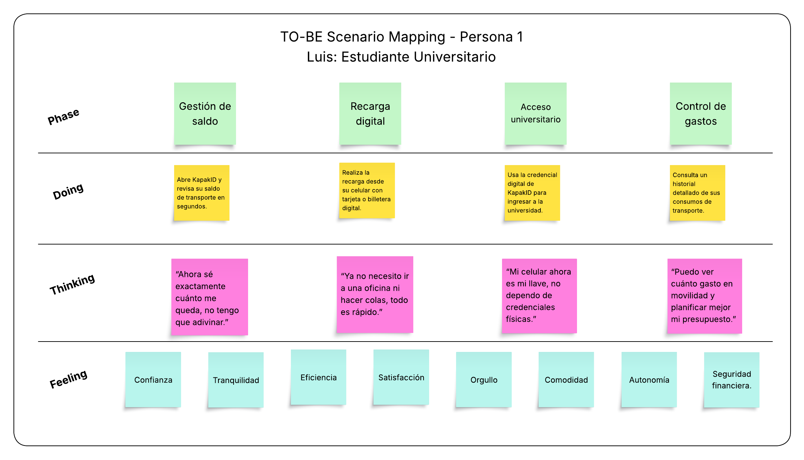</td>

- **TO-BE Scenario Mapping Madre de Familia (Patricia)**
  
 <td></td>

## 3.2. User Stories
**Tabla de Epics**
| Epic ID | Título                       | Descripción                                                                 |
|---------|------------------------------|-----------------------------------------------------------------------------|
| E1      | Gestión de Usuarios y Perfiles | Administración de usuarios, autenticación y creación de múltiples perfiles familiares. |
| E2      | Gestión de Documentos Digitales | Registro, validación, visualización y renovación de documentos oficiales en la app. |
| E3      | Pagos y Recargas             | Recarga de tarjetas de transporte y celulares, pagos de deudas y registro de historial de transacciones. |
| E4      | Votaciones Digitales         | Emisión de votos únicos y seguros en procesos electorales mediante identificación digital. |
| E5      | Notificaciones y Alertas     | Envío de recordatorios y notificaciones sobre saldos bajos y vencimiento de documentos. |
| E6      | Acceso Offline               | Permitir acceso limitado a documentos previamente verificados sin conexión a internet. |
| E7      | Landing Page Informativa     | Presentar la propuesta de valor de KapakID, funcionalidades clave, guías de descarga y contacto. |
| E8      | API REST Backend             | Servicios técnicos para manejar autenticación, gestión de documentos, pagos y notificaciones. |

**Tabla de US**

| US ID | Título                     | Descripción | Criterios de Aceptación (Gherkin) | Epic Relacionada |
|-------|-----------------------------|-------------|----------------------------------|------------------|
| US1   | Registro de usuario         | Como **usuario**, quiero registrarme con mi correo o celular para crear mi cuenta en KapakID. | **Scenario 1:**<br>Given un usuario no registrado <br>When ingresa sus datos válidos <br>Then el sistema crea la cuenta y confirma el registro.<br><br>**Scenario 2:**<br>Given un usuario intenta registrarse <br>When ingresa datos inválidos o incompletos <br>Then el sistema rechaza el registro y muestra el motivo. | E1 |
| US2   | Creación de perfiles familiares | Como **usuario**, quiero agregar perfiles de mis hijos para administrar sus documentos desde mi cuenta. | **Scenario 1:**<br>Given un usuario autenticado <br>When agrega un nuevo perfil familiar <br>Then el sistema registra el perfil vinculado a la cuenta.<br><br>**Scenario 2:**<br>Given un usuario intenta crear un perfil <br>When excede el límite permitido <br>Then el sistema rechaza la acción con un mensaje. | E1 |
| US3   | Registro de documentos      | Como **usuario**, quiero registrar mi DNI, pasaporte y otros documentos para tenerlos disponibles en la app. | **Scenario 1:**<br>Given un usuario autenticado <br>When registra un documento válido <br>Then el sistema almacena el documento digitalmente.<br><br>**Scenario 2:**<br>Given un usuario ingresa un documento inválido <br>When intenta registrarlo <br>Then el sistema rechaza la operación con justificación. | E2 |
| US4   | Renovación de documentos    | Como **usuario**, quiero renovar mis documentos vencidos desde la app para evitar trámites presenciales. | **Scenario 1:**<br>Given un documento próximo a vencer <br>When el usuario solicita renovación <br>Then el sistema envía la solicitud a la entidad correspondiente.<br><br>**Scenario 2:**<br>Given un documento ya vencido <br>When el usuario intenta renovarlo <br>Then el sistema informa si la renovación aún es posible. | E2 |
| US5   | Recarga de transporte       | Como **usuario**, quiero recargar mi tarjeta del Metropolitano para no quedarme sin saldo. | **Scenario 1:**<br>Given un usuario autenticado <br>When selecciona una tarjeta válida y monto de recarga <br>Then el sistema procesa el pago y actualiza el saldo.<br><br>**Scenario 2:**<br>Given una tarjeta inválida <br>When el usuario intenta recargar <br>Then el sistema rechaza la operación. | E3 |
| US6   | Pago de deudas              | Como **usuario**, quiero pagar mis deudas de servicios o multas desde la app para evitar filas. | **Scenario 1:**<br>Given un usuario autenticado <br>When selecciona una deuda pendiente <br>Then el sistema procesa el pago y registra la operación.<br><br>**Scenario 2:**<br>Given un pago realizado <br>When el usuario consulta el historial <br>Then el sistema muestra el registro de pago exitoso. | E3 |
| US7   | Registro de transacciones          | Como **usuario**, quiero registrar los movimientos de los documentos que he realizado desde la aplicacion. | **Scenario 1:**<br>Given un usuario autenticado <br>When ingresa para revisar sus movimientos <br>Then el sistema le muestra los movimientos registrados de sus documentos.<br><br>**Scenario 2:**<br>Given un usuario autenticado <br>When accede a un documento vencido <br>Then el sistema le alerta que el documento vencio | E3 |
| US8   | Voto digital único          | Como **ciudadano**, quiero emitir mi voto en elecciones mediante KapakID para participar de manera segura. | **Scenario 1:**<br>Given un ciudadano autenticado <br>When emite su voto en el proceso electoral vigente <br>Then el sistema registra el voto de forma cifrada.<br><br>**Scenario 2:**<br>Given un ciudadano ya votó <br>When intenta hacerlo nuevamente <br>Then el sistema rechaza el intento.<br><br> **Scenario 3:** Given un cuidadano votante <br> When intenta votar con un Documento de Identidad Vencido <br> Then el sistema rechaza la solicitd y le informa que su documento vencio| E4 |
| US9   | Alerta de vencimiento       | Como **usuario**, quiero recibir una notificación cuando mis documentos estén próximos a vencer. | **Scenario 1:**<br>Given un documento con 30 días antes de su vencimiento <br>When el sistema procesa la verificación <br>Then envía una alerta al usuario.<br><br>**Scenario 2:**<br>Given un documento vencido <br>When el sistema detecta la fecha caducada <br>Then notifica al usuario inmediatamente. | E5 |
| US10   | Notificacion de Tramite       | Como **usuario**, quiero recibir una notificación cuando se haya cumplido una solicitu de tramite. | **Scenario 1:**<br>Given un documento puede ser recogido <br>When el sistema procesa la verificación <br>Then envía una alerta al usuario.<br><br>**Scenario 2:**<br>Given un documento nuevo <br>When el sistema detecta la generacion del documento <br>Then notifica al usuario inmediatamente. | E5 |
| US11   | Acceso a documentos offline | Como **usuario**, quiero acceder a mis documentos verificados incluso sin conexión a internet. | **Scenario 1:**<br>Given un usuario autenticado previamente <br>When no tiene conexión <br>Then el sistema permite visualizar documentos validados.<br><br>**Scenario 2:**<br>Given un usuario sin conexión <br>When intenta realizar una recarga <br>Then el sistema informa que la función no está disponible. | E6 |
| US12  | Información de funcionalidades | Como **visitante**, quiero ver en la landing page las funcionalidades principales de KapakID para entender sus beneficios. | **Scenario 1:**<br>Given un visitante accede a la landing <br>When navega a la sección de funcionalidades <br>Then visualiza la lista con descripciones claras.<br><br>**Scenario 2:**<br>Given un visitante explora la página <br>When busca información de seguridad <br>Then encuentra detalles sobre la protección de datos. | E7 |
| US13  | Visualizar términos y políticas | Como **visitante**, quiero acceder fácilmente a los **términos legales y políticas de privacidad** desde la landing page para conocer las condiciones de uso. | **Scenario 1:**<br>Given un visitante accede a la landing <br>When hace click en “Términos y Políticas” en el footer <br>Then se abre una página con los documentos legales.<br><br> **Scenario 2:**<br>Given un visitante accede a la landing <br>When hace scroll hasta el final <br>Then encuentra enlaces visibles a términos legales y políticas de privacidad.<br><br> | E7 |
| US14  | Visualizar reseñas de usuarios  | Como **visitante**, quiero ver **reseñas de usuarios satisfechos (casos de éxito)** en la landing page para confiar en la calidad del servicio ofrecido.       | **Scenario 1:**<br>Given un visitante accede a la landing <br>When navega por la sección de testimonios <br>Then visualiza un carrusel con reseñas de usuarios reales.<br><br> **Scenario 2:**<br>Given un visitante accede a la landing <br>When da click en “Ver más casos de éxito” <br>Then se redirecciona a una página con testimonios ampliados.<br><br> | E7 |
| US15  | Acceso a la app          | Como **visitante**, quiero encontrar enlaces de acceso de KapakID en la landing page para acceder a la aplicación. | **Scenario 1:**<br>Given un visitante no registrado accede a la landing <br>When hace click en registrate <br>Then redirecciona al signin.<br><br> **Scenario 2:**<br>Given un visitante registrado accede a la landing <br>When hace click en ingresa <br>Then redirecciona al login.<br><br> | E7 |
| US16  | API de autenticación        | Como **developer**, quiero consumir un endpoint de autenticación para validar credenciales de usuarios. | **Scenario 1:**<br>Given un request con credenciales válidas <br>When se envía al endpoint de login <br>Then el sistema responde con un token válido.<br><br>**Scenario 2:**<br>Given un request con credenciales inválidas <br>When se procesa en el backend <br>Then el sistema devuelve un error 401 Unauthorized. | E8 |
| US17  | API de documentos           | Como **developer**, quiero consumir un endpoint para registrar y consultar documentos de un usuario. | **Scenario 1:**<br>Given un request válido con documento y metadatos <br>When se envía al endpoint correspondiente <br>Then el sistema responde confirmando el registro.<br><br>**Scenario 2:**<br>Given un request de consulta con un ID de documento válido <br>When se procesa en el backend <br>Then el sistema devuelve la información del documento. | E8 |

## 3.3. Impact Mapping

<td>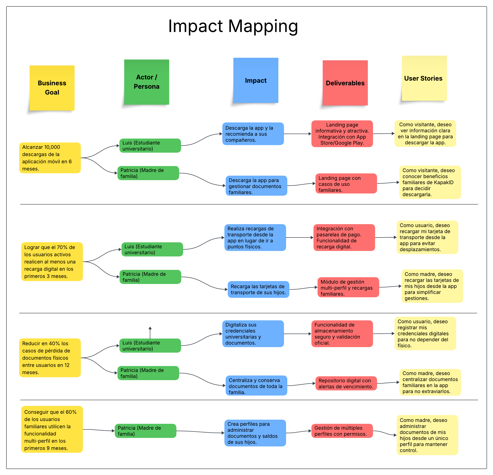</td>

## 3.4. Product Backlog

| Order | US ID | Título | Descripción | Story Points |
|-------|-------|--------|-------------|--------------|
| 1 | US12 | Información de funcionalidades | Como **visitante**, quiero ver en la landing page las funcionalidades principales de KapakID para entender sus beneficios. | 3 |
| 2 | US13 | Acceso a la app | Como **visitante**, quiero encontrar enlaces de acceso de KapakID en la landing page para acceder a la aplicación. | 2 |
| 3 | US13 | Visualizar términos y políticas | Como **visitante**, quiero acceder fácilmente a los **términos legales y políticas de privacidad** desde la landing page para conocer las condiciones de uso. | 2 |
| 4 | US14 | Visualizar reseñas de usuarios | Como **visitante**, quiero ver **reseñas de usuarios satisfechos (casos de éxito)** en la landing page para confiar en la calidad del servicio ofrecido. | 3 |
| 5 | US1 | Registro de usuario | Como **usuario**, quiero registrarme con mi correo o celular para crear mi cuenta en KapakID. | 5 |
| 6 | US2 | Creación de perfiles familiares | Como **usuario**, quiero agregar perfiles de mis hijos para administrar sus documentos desde mi cuenta. | 4 |
| 7 | US3 | Registro de documentos | Como **usuario**, quiero registrar mi DNI, pasaporte y otros documentos para tenerlos disponibles en la app. | 5 |
| 8 | US4 | Renovación de documentos | Como **usuario**, quiero renovar mis documentos vencidos desde la app para evitar trámites presenciales. | 3 |
| 9 | US5 | Recarga de transporte | Como **usuario**, quiero recargar mi tarjeta del Metropolitano para no quedarme sin saldo. | 4 |
| 10 | US6 | Pago de deudas | Como **usuario**, quiero pagar mis deudas de servicios o multas desde la app para evitar filas. | 3 |
| 11 | US7 | Registro de transacciones | Como **usuario**, quiero registrar los movimientos de los documentos que he realizado desde la aplicación. | 4 |
| 12 | US8 | Voto digital único | Como **ciudadano**, quiero emitir mi voto en elecciones mediante KapakID para participar de manera segura. | 5 |
| 13 | US9 | Alerta de vencimiento | Como **usuario**, quiero recibir una notificación cuando mis documentos estén próximos a vencer. | 2 |
| 14 | US10 | Notificación de trámite | Como **usuario**, quiero recibir una notificación cuando se haya cumplido una solicitud de trámite. | 2 |
| 15 | US11 | Acceso a documentos offline | Como **usuario**, quiero acceder a mis documentos verificados incluso sin conexión a internet. | 3 |
| 16 | US16 | API de autenticación | Como **developer**, quiero consumir un endpoint de autenticación para validar credenciales de usuarios. | 3 |
| 17 | US17 | API de documentos | Como **developer**, quiero consumir un endpoint para registrar y consultar documentos de un usuario. | 4 |

En el siguiente apartado se mostrara el product Backlog generado en Jira, que ayudara al equipo durante el desarrollo de este proyecto

 <td>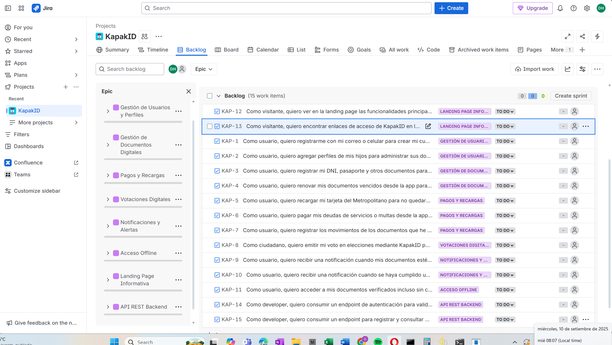</td>


# Capítulo IV: Product Design

En este capítulo se describen las directrices de diseño del producto **KapakID**, estableciendo lineamientos visuales y de interacción que garanticen una experiencia de usuario coherente, accesible y adaptada al contexto peruano.  
El objetivo es asegurar la consistencia estética y funcional en todas las plataformas (web y móvil), respetando tanto estándares internacionales de diseño como particularidades culturales y normativas locales.


## 4.1. Style Guidelines

Las guías de estilo definen la identidad visual del producto, determinando los principios básicos de **tipografía, color, iconografía, componentes y usabilidad**.  
Estas directrices buscan un equilibrio entre **modernidad, simplicidad y confianza**, elementos clave para una aplicación que gestiona documentos y pagos sensibles.


### 4.1.1. General Style Guidelines

#### Branding

El nombre **KapakID** proviene del término quechua *Qhapaq*, que significa **importante o principal**.  
Esta raíz cultural refuerza la esencia de la aplicación: ser una identidad digital central, segura y confiable para las personas.  

La marca proyecta tres valores fundamentales:

- **Seguridad**: protección de datos y confianza.  
- **Centralidad**: ser el eje principal de la identidad digital del usuario.  
- **Cultura**: rescatar lo importante (*Qhapaq*) como base de la modernidad.  

El logo combina un **escudo** como símbolo de protección, con un sistema de **nodos inspirados en los quipus**, que representan la unión de distintos servicios (documentos, movilidad, transacciones y validaciones).  
Esta integración transmite innovación tecnológica con un fuerte vínculo a la herencia cultural andina.  

<td></td>


#### Paleta de Colores – KapakID

Los colores refuerzan los valores de **confianza, identidad cultural, seguridad y accesibilidad**.  
Se dividen en institucionales, de acción, alerta, neutrales y de acento cultural.  

<td>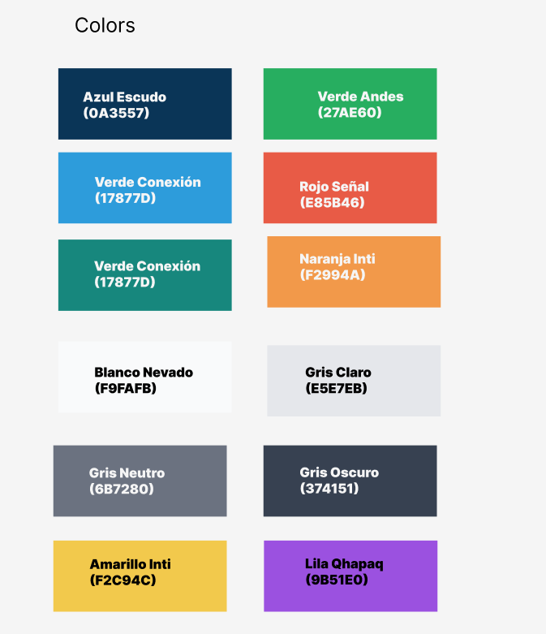</td>

**Colores institucionales**  
- Azul Escudo #0A3557: principal. Seguridad, headers, botones primarios.  
- Celeste Andino `#2D9CDB`: frescura, innovación, fondos alternativos.  

**Acción positiva**  
- Verde Conexión #17877D: validación, éxito, checkmarks.  
- Verde Andes #27AE60: energía, accesibilidad.  

**Alertas**  
- Rojo Señal #E85B46: errores críticos.  
- Naranja Inti #F2994A: advertencias preventivas.  

**Neutrales**  
- Blanco Nevado #F9FAFB: fondo principal.  
- Gris Claro #E5E7EB: fondos secundarios.  
- Gris Neutro #6B7280: textos secundarios, íconos inactivos.  
- Gris Oscuro #374151: textos principales.  

**Acento cultural**  
- Amarillo Inti #F2C94C: energía, resaltes, microinteracciones.  
- Lila Qhapaq #9B51E0: innovación, modernidad.  

#### Tipografía – KapakID

La tipografía es un eje central en la identidad visual. Se busca un estilo **moderno, claro y altamente legible** en dispositivos móviles y entornos digitales.  

<td></td>

**Fuentes principales**  
- **Poppins Bold** → títulos y encabezados.  
- **Poppins Medium** → subtítulos y secundarios.  
- **Roboto Regular** → párrafos y formularios.  
- **Roboto Mono** → datos técnicos, validaciones, códigos.  
<td></td>

**Escala tipográfica**  
- H1: 32–36 px, Poppins Bold, Azul Escudo.  
- H2: 24–28 px, Poppins Medium, Gris Oscuro.  
- H3: 18–22 px, Poppins Medium, Gris Neutro.  
- Texto cuerpo: 14–16 px, Roboto Regular.  
- Texto técnico: 12–14 px, Roboto Mono.  
- Texto ayuda: 12–14 px, Roboto Regular Gris Claro.  
<td></td>

**Line-height y espaciado**  
- Encabezados: 110%.  
- Texto principal: 140–150%.  
- Texto técnico: 130%.  
#### Iconografía

La iconografía aporta **claridad, simplicidad y accesibilidad** en la navegación.  

<td>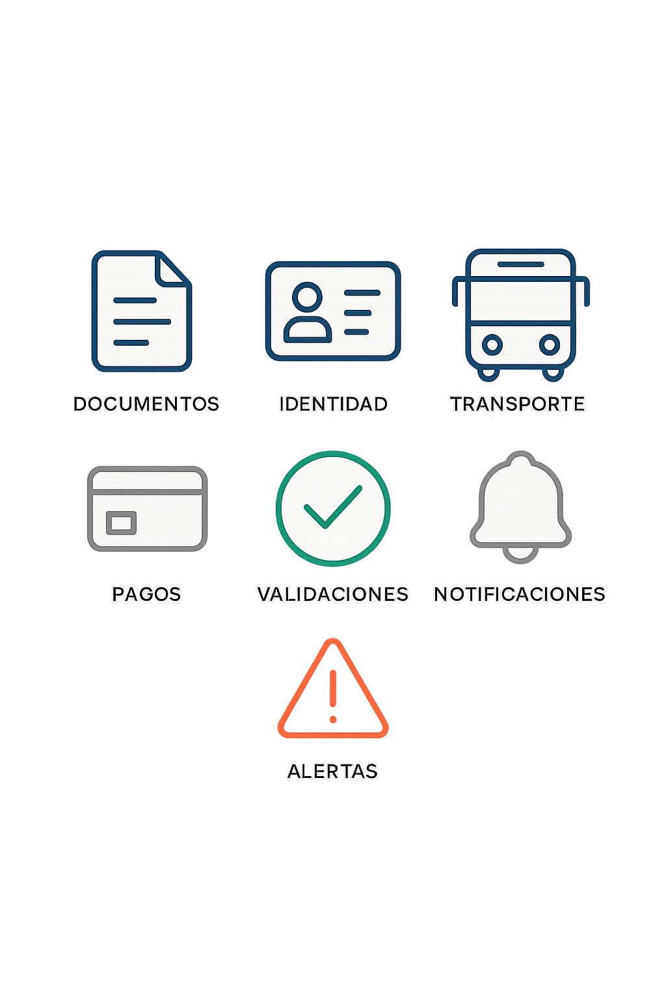</td>

- Estilo outline minimalista, 2 px.  
- Esquinas redondeadas, coherentes con botones y tarjetas.  
- Colores según estado:  
  - Azul Escudo → íconos principales.  
  - Verde Conexión → validaciones.  
  - Rojo Señal → errores.  
  - Gris Neutro → inactivos.  
- Ejemplos: documentos, identidad, transporte, pagos, validaciones.  
- Todos los íconos deben tener etiquetas accesibles (`alt` / `aria-label`).  

#### Jerarquía Visual
La jerarquía organiza la información de forma clara y priorizada:  
- **Títulos principales (H1):** Azul Escudo, 32–36 px.  
- **Subtítulos (H2–H3):** Gris Neutro, 18–28 px.  
- **Texto principal:** Roboto Regular, 14–16 px, Gris Oscuro.  
- **Botón primario:** Azul Escudo, texto blanco.  
- **Botón secundario:** Verde Conexión o Gris Neutro.  
- **Acciones críticas:** Rojo Señal + ícono de advertencia.  


### 4.1.2. Web Style Guidelines
Para KapakID, se plantea una plataforma web con un enfoque de **seguridad, claridad y accesibilidad**, que ofrezca una experiencia confiable y eficiente para la gestión de identidad y servicios digitales.  
Se implementará un **diseño adaptable (Responsive Design)** que optimice la presentación de la información en cualquier dispositivo, garantizando legibilidad y usabilidad en todo momento.

#### Panel de control principal (Dashboard)
- Acceso centralizado a documentos digitales (DNI, pasaporte, carné universitario).  
- Visualización de saldo disponible y notificaciones relevantes.  
- Gestión rápida de pagos, recargas y alertas.  

#### Gestión de Documentos y Pagos
- Añadir, validar y consultar documentos oficiales.  
- Realizar pagos de servicios básicos y transporte.  
- Módulos organizados en tarjetas visuales fáciles de identificar con íconos representativos.  

#### Transporte y Movilidad
- Recarga de tarjetas de transporte.  
- Consulta de historial de viajes.  
- Alertas sobre vencimientos o saldos bajos.  

#### Alertas y Notificaciones
- Avisos sobre documentos próximos a vencer.  
- Pagos pendientes o validaciones críticas.  
- Priorización de seguridad para evitar contratiempos.  

#### Comunicación y Soporte
- Sección de ayuda accesible desde el menú principal.  
- Guías, preguntas frecuentes y chat de asistencia en tiempo real.  

Este diseño garantiza **usabilidad, eficiencia y confianza**, consolidando a KapakID como una **super-app peruana de conectividad y modernidad digital**.


## 4.2. Information Architecture
### 4.2.1. Organization Systems

#### Landing Page e Inicio de la Aplicación
- **Tipo de organización:** Jerárquica.  
- La landing page destacará: beneficios, funcionalidades principales (documentos, pagos, transporte y alertas) y testimonios.  
- En la pantalla de inicio se priorizan accesos rápidos al DNI digital, saldos, pagos pendientes y alertas urgentes.  

#### Gestión de Documentos y Pagos
- **Tipo de organización:** Secuencial.  
- Flujos: registro → validación → confirmación.  
- Reduce errores y refuerza la seguridad.  

#### Módulos de Transporte y Movilidad
- **Tipo de organización:** Matricial.  
- Acceso a recargas, historial de viajes y tarjetas vinculadas.  
- Exploración flexible por saldo, fecha o tipo de transporte.  

#### Alertas y Notificaciones
- **Esquema de categorización:** Por tópicos.  
- Categorías: seguridad, transporte, pagos, documentos.  
- Permite priorizar atención de forma inmediata.  

#### Historial de Transacciones y Actividades
- **Esquema de categorización:** Cronológico.  
- Pagos, recargas y validaciones ordenados por fecha.  
- Registro confiable y auditable.  

#### Contenido Personalizado por Perfil de Usuario
- **Esquema de categorización:** Según audiencia.  
- **Estudiantes:** Recargas rápidas, gestión de carné universitario, beneficios educativos.  
- **Familias:** Perfiles familiares para pagos y documentos de dependientes.  
- **Ciudadanos generales:** Validación de identidad, pagos de servicios básicos, transporte.  

#### Búsqueda de Documentos y Servicios
- **Esquema de categorización:** Alfabético.  
- Localización rápida de documentos y servicios.  
  
### 4.2.2. Labeling Systems
#### Landing Page
- **Home/Inicio:** Propuesta de valor de KapakID.  
- **Features/Características:** Funciones clave (identidad digital, pagos, transporte).  
- **Benefits/Beneficios:** Seguridad, rapidez, confianza y centralización.  
- **Testimonials/Testimonios:** Experiencias de usuarios.  
- **About/Acerca de:** Equipo desarrollador y propósito de KapakID (*Qhapaq = importante*).  
- **Contact/Contacto:** Soporte, redes sociales, correo.  

#### Web Application
- **Home/Inicio:** Accesos rápidos a DNI digital, saldo, pagos pendientes y alertas.  
- **Perfil:** Gestión de información personal, documentos, métodos de pago y preferencias.  
- **Documentos:** DNI, pasaporte, carné universitario, brevete.  
- **Pagos:** Servicios, transporte y recargas. Incluye historial.  
- **Transporte:** Tarjetas vinculadas, historial de viajes, saldos y recargas.  
- **Búsqueda:** Localización de documentos o servicios.  
- **Favoritos:** Acceso a elementos prioritarios.  
- **Alertas/Notificaciones:** Vencimientos, saldos bajos, pagos pendientes.  
- **Soporte:** FAQs, guías y contacto con atención al cliente.  
  

### 4.2.3. SEO Tags and Meta Tags
– KapakID  

#### Landing Page  
Title: Texto visible en la parte superior del navegador y en los resultados de búsqueda.  

```html
<title>KapakID – Tu identidad y pagos digitales seguros en un solo lugar</title>
-Codificación de caracteres:
<meta charset="utf-8">
-Description: Breve descripción de la aplicación.
<meta name="description" content="KapakID es tu plataforma digital segura para gestionar tu identidad, documentos y pagos en un solo lugar."/>

-Key Words: Palabras clave relacionadas con la app.
<meta name="keywords" content="identidad digital, billetera electrónica, pagos seguros, transporte, documentos digitales, Perú"/>

Author & Copyright:

<meta name="author" content="KapakID Team"/>
<meta name="copyright" content="Copyright KapakID Team" />

-Web Application
-Title:
<title>KapakID</title>
-Description
<meta name="description" content="KapakID – Plataforma oficial para gestionar tu identidad digital, documentos y pagos de forma segura."/>

-Key Words:
<meta name="keywords" content="KapakID, identidad digital, pagos, transporte, documentos, seguridad, conectividad"/>
-Author & Copyright:
<meta name="author" content="KapakID Team"/>
<meta name="copyright" content="Copyright KapakID Team" />

```

### 4.2.4. Searching Systems – KapakID  

- **Barra de búsqueda general:**  
  Ubicada en la parte superior derecha de la plataforma web y dentro del menú principal de la app.  
  Permitirá acceder rápidamente a recursos como: validación de documentos, historial de pagos, transporte, billetera digital y servicios vinculados.  

- **Sugerencias automáticas (autocompletado):**  
  El sistema mostrará resultados predictivos mientras el usuario escribe, basados en documentos registrados (DNI, brevete, carnés), transacciones recientes y accesos frecuentes.  

- **Filtros de búsqueda:**  
  Se ofrecerán filtros que permitan refinar la búsqueda según:  
  - Categorías: Identidad, Pagos, Transporte, Beneficios Sociales.  
  - Contenido: Documentos, Transacciones, Validaciones, Recibos.  
  - Estado: Activo, Expirado, Pendiente de validación.  

- **Filtros avanzados:**  
  Opciones adicionales como:  
  - Recientes / Más antiguos.  
  - Monto de transacción.  
  - Tipo de pago (tarjeta, QR, billetera digital).  
  - Institución asociada (RENIEC, bancos, transporte).  
---
### 4.2.5. Navigation Systems – KapakID  

#### Landing Page  
La navegación en la landing page estará orientada a generar confianza y facilitar el registro.  
Se implementará un menú superior con enlaces visibles hacia:  

- **Inicio:** Presentación general de KapakID.  
- **Características:** Explicación de las principales funciones (identidad digital, pagos, transporte).  
- **Beneficios:** Cómo mejora la vida del usuario en seguridad, accesibilidad y rapidez.  
- **Testimonios:** Opiniones de usuarios reales y casos de uso.  
- **Acerca de:** Información del equipo y visión de KapakID.  
- **Contacto:** Formulario y canales de atención.  


#### Web Application  

Dentro de la **aplicación web**, la navegación se centrará en un **dashboard central**, accesible tras el inicio de sesión.  

- **Dashboard principal:**  
  Vista general con accesos rápidos a identidad, billetera digital, transporte y notificaciones prioritarias.  

- **Panel lateral de navegación (sidebar):**  
  - **Perfil:** Información personal, configuración y preferencias.  
  - **Documentos:** Gestión y validación de DNI, brevete, carnés, etc.  
  - **Pagos:** Métodos de pago, recargas, historial de transacciones y comprobantes.  
  - **Transporte:** Tickets, pasajes electrónicos y servicios de movilidad urbana.  
  - **Historial:** Registro cronológico de actividades, transacciones y validaciones.  
  - **Notificaciones:** Alertas de vencimiento, confirmaciones y actualizaciones del sistema.  
  - **Soporte / Ayuda:** FAQs, chat en línea y contacto directo con asistencia.  

- **Consistencia visual:** El logotipo en la parte superior del sidebar permitirá volver al **dashboard principal**.  
- **Acciones rápidas:** Atajos destacados en el dashboard (ej. “Validar documento”, “Recargar saldo”, “Comprar pasaje”) para reducir clics y mejorar eficiencia.  

## 4.3. Landing Page UI Desing
### 4.3.1. Landing Page Wireframes


### 4.3.2. Landing Page Mock-Up


## 4.4. Web Applications UX/UI Desing
### 4.4.1. Web Applications Wireframes


### 4.4.2. Web Applications Wireflow Diagrams
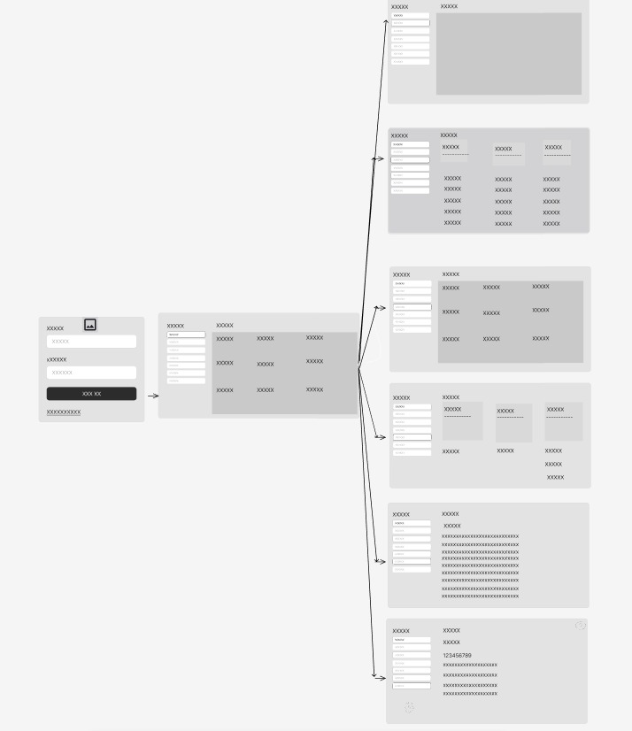


### 4.4.3. Web Applications User Flow Diagrams


### 4.4.4. Web Applications Mockup

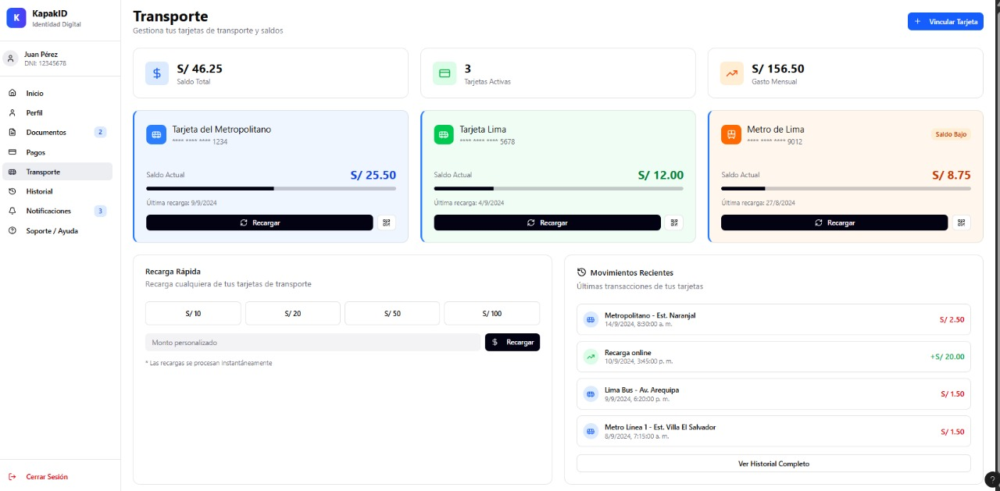
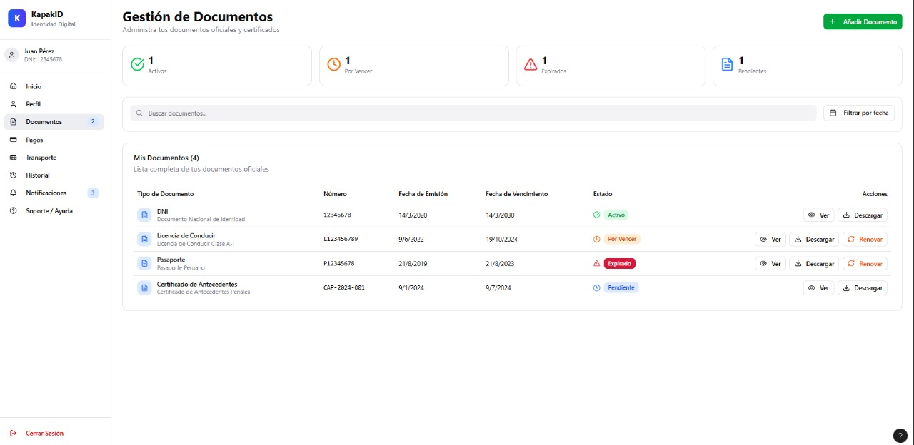
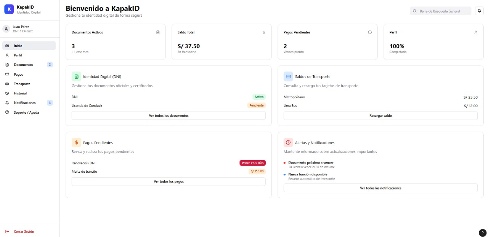
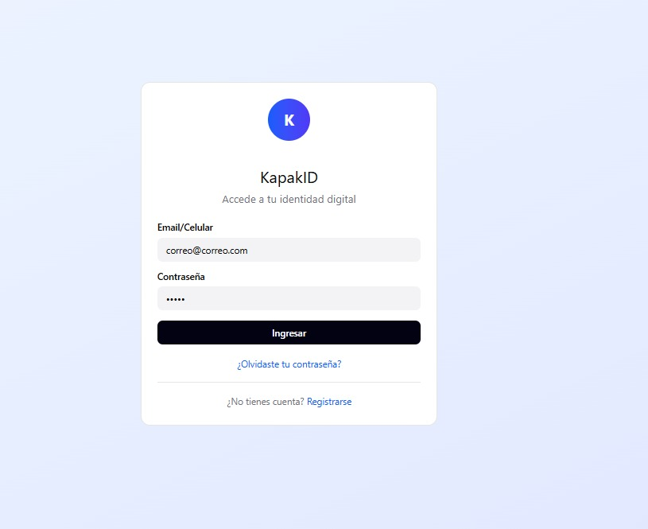


## 4.5. Web Applications Prototyping

https://www.figma.com/design/3HTodQ2CADUGConW20ZLCc/Untitled?node-id=0-1&p=f&t=WclMvp5kiCyljXH8-0

## 4.6. Domain-Driven Software Architecture
En el apartado de Domain Driven Software Architecture para KapakID, puedes introducir el concepto destacando cómo esta metodología guía el diseño de la aplicación alineándose con el dominio del negocio. Por ejemplo:
"La arquitectura orientada al dominio (DDD) para KapakID se centra en modelar el sistema en torno al dominio del negocio, que es la gestión digital de documentos y tarjetas personales, como DNI, pasaportes, carnés y tarjetas de transporte, junto con funcionalidades de transacciones, renovaciones y notificaciones. Este enfoque asegura que el software refleje fielmente las necesidades de los usuarios (jóvenes y adultos) y los procesos clave, como registro de documentos, pagos y soporte premium para perfiles familiares. Al emplear DDD, priorizamos un lenguaje ubicuo que unifica la comunicación entre el equipo técnico y los stakeholders, garantizando que cada componente del sistema responda directamente a los requisitos del dominio, promoviendo una solución robusta, escalable y alineada con el propósito de ofrecer una billetera digital integral, segura y accesible.
### 4.6.1. Software Architecture Context Diagram

### 4.6.2. Software Architecture Container Diagram

### 4.6.3. Software Architecture Components Diagram


## 4.7. Software Object-Oriented Desing
### 4.7.1. Class Diagram

[](https://editor.plantuml.com/uml/lLInRjim4Dq5w1ykNZe5tJCKYP8sy93KYEjcD2xKsIOi7LsIYYiK_VSUASSM5GMTaerwzuxl-DxPbywZzKrTvTcPtr1DeCWs5I7dMPwvhUOTMgn1LUWS_CapW0BLTcrDm-MrgOo5jSKsuiQMP3jilz6U0dXbhTaFi6-6VGBzJPHClJDCx3z4hKIFJ-ZeGyHGUVsiVVkEOdds2QvV72G7BJYoprffu_BiPEra8J1CXM9Ng6W2w60nJHXNiodSegSzjh4itylRnvJIoCgmrmgzDWppgDHT5ahB0v3qt1ZLrE5qXunhYiT-ezINT-lQZpR_iCWkk3XGY_Xenq_ZDQyJSWUTsC6o8gn0IM4TWb77hPZS74xTR4N7dcldgHQ0Vek1FB2sGDx2l0sKs1M-4yBt-zdNM0c7f78lewsETfwkYFYo0xeH7gX22PL9j1TJE3__SWW8BkInN3gmzAiXvwNUpo9bTXdqkSBkYe4tp48w7apZauOUFKdXFzmqX35odhsIZpCLWKnOki-FLhPUcAdk6wI1u1kiLrQDSF8i9ZpsOldbrGs70EKfU-qtexeXzd7ow8lxuH_JvTwcZ5eGPxo0cJMAd1E5bMPafR42ioFxqfXdbt9V_F__1m00)


### 4.7.2. Class Dictionary
  <table>
<thead>
<tr>
<th>Class</th>
<th>Definition</th>
</tr>
</thead>
<tbody>
<tr><td><code>User Interface</code></td><td>La capa de presentación que interactúa directamente con el usuario. Envía solicitudes a la API Gateway.
</td></tr>

<tr><td><code>API Gateway</code></td><td>Un punto de entrada único que enruta las solicitudes a los microservicios correspondientes, como el de documentos o transacciones.
</td></tr>

<tr><td><code>Authentication Service</code></td><td>El servicio encargado de manejar el registro, inicio de sesión y autenticación de los usuarios. Se comunica con la base de datos para leer y escribir datos de usuario.
</td></tr>

<tr><td><code>Document Management Service</code></td><td>El servicio que procesa todas las transacciones financieras, como recargas de tarjetas y pagos. Se comunica con la base de datos y el sistema bancario.
</td></tr>

<tr><td><code>Transaction Service</code></td><td>El servicio que procesa todas las transacciones financieras, como recargas de tarjetas y pagos. Se comunica con la base de datos y el sistema bancario.
</td></tr>

<tr><td><code>Voting Service</code></td><td>Encargado de gestionar las elecciones y registrar los votos de los usuarios. Se comunica con la base de datos y el sistema de votación externo (ONPE).</td></tr>

<tr><td><code>Database </code></td><td>El almacén centralizado para los datos de la aplicación. Todos los servicios de backend leen y escriben datos en ella.
</td></tr>

<tr><td><code>Bank System</code></td><td>Un sistema externo con el que KapakID se comunica para procesar pagos y otras operaciones financieras.
</td></tr>

<tr><td><code>Notification System</code></td><td>Un sistema externo que envía notificaciones a los usuarios (ej. alertas de saldo bajo o recordatorios).</td></tr>

</tbody>
</table>

___

## 4.8. Database Desing
### 4.8.1. Database Diagram

# Capítulo V: Product Implementation, Validation & Deployment

## 5.1. Software Configuration Management
### 5.1.1. Software Development Environment Configuration

| Categoría                | Producto / Lenguaje / Framework | Propósito dentro del proyecto                                                                 | Ruta de descarga / referencia |
|---------------------------|---------------------------------|-----------------------------------------------------------------------------------------------|-------------------------------|
| **Project Management**    | Trello                          | Gestión de tareas, backlog, sprints y seguimiento del avance del equipo.                      | [https://trello.com](https://trello.com) |
| **Requirements Management** | Notion                        | Documentar, centralizar y gestionar requerimientos, especificaciones y notas de proyecto.      | [https://www.notion.so](https://www.notion.so) |
| **Product UI/UX Design**  | Figma                          | Diseño de interfaces gráficas, prototipado colaborativo y validación con el cliente.           | [https://www.figma.com](https://www.figma.com) |
| **Software Development**  | Lenguaje: C#                   | Desarrollo del backend y lógica de negocio.                                                   | [https://dotnet.microsoft.com/download](https://dotnet.microsoft.com/download) |
|                           | Lenguaje: JavaScript (JS)      | Desarrollo del frontend dinámico y componentes interactivos.                                  | [https://nodejs.org](https://nodejs.org) |
|                           | Framework: .NET Core           | Construcción de APIs y servicios backend robustos y escalables.                               | [https://dotnet.microsoft.com/download](https://dotnet.microsoft.com/download) |
|                           | Framework: Vue (Vue CLI)       | Desarrollo del frontend como SPA (Single Page Application).                                   | [https://cli.vuejs.org/](https://cli.vuejs.org/) |
|                           | IDE: Visual Studio Code        | Editor ligero y multiplataforma para desarrollo general.                                      | [https://code.visualstudio.com](https://code.visualstudio.com) |
|                           | IDE: JetBrains Rider           | IDE especializado para backend con C#.                                                        | [https://www.jetbrains.com/rider/](https://www.jetbrains.com/rider/) |
|                           | IDE: JetBrains WebStorm        | IDE especializado para frontend con Vue.js.                                                   | [https://www.jetbrains.com/webstorm/](https://www.jetbrains.com/webstorm/) |
|                           | Git                            | Control de versiones distribuido para gestionar cambios en el código.                         | [https://git-scm.com/downloads](https://git-scm.com/downloads) |
|                           | GitHub                         | Repositorio central para alojar el código, colaborar y gestionar integración continua.         | [https://github.com](https://github.com) |
| **Software Deployment**   | Azure DevOps                   | Automatización de CI/CD, gestión de pipelines e implementación en la nube.                    | [https://azure.microsoft.com/services/devops/](https://azure.microsoft.com/services/devops/) |
| **Software Documentation**| MkDocs                         | Generación de documentación técnica en formato estático, integrada con repositorios Git.       | [https://www.mkdocs.org](https://www.mkdocs.org) |

### 5.1.2. Source Code Management


En este proyecto se utilizará **GitHub** como plataforma y sistema de control de versiones para la gestión del código fuente.  

---

####  Repositorios del proyecto  

- **Documentación (Docs)** → [REPO_DOCS](https://github.com/F1nTrack/report.git)
- **Landing Page** → [REPO_LANDING](https://github.com/F1nTrack/landingPage.git)
- **Frontend Web Application** → [REPO_FRONTEND](https://github.com/F1nTrack/frontend-web-application.git) 
- **Web Services (Backend + Tests)** → [REPO_BACKEND]  

En el repositorio de **Web Services** se incluirán tanto el proyecto principal como los archivos de pruebas unitarias y de integración/aceptación.  

---

####  GitFlow Workflow  

El equipo aplicará la estrategia de ramificación **GitFlow**, propuesta por Vincent Driessen, para garantizar un control estructurado de versiones y facilitar el trabajo colaborativo.  

#####  Ramas principales  

1. **`main`**  
   - Rama principal del proyecto.  
   - Contiene únicamente versiones estables y liberadas en producción.  
   - Solo recibe merges desde ramas **release** o **hotfix**.  

2. **`develop`**  
   - Rama de integración donde se consolidan todas las funcionalidades en desarrollo.  
   - Representa el estado más actualizado previo a un release.  

#####  Ramas de soporte  

3. **`feature/<nombre-funcionalidad>`**  
   - Usada para el desarrollo de nuevas funcionalidades.  
   - Se crea a partir de `develop` y se fusiona de nuevo en `develop` cuando la tarea está lista.  
   - **Convención de nombres**: `feature/login-auth`, `feature/user-profile`, etc.  

4. **`release/x.y.z`**  
   - Preparación de una nueva versión estable.  
   - Permite pruebas finales, correcciones menores y documentación.  
   - Se fusiona en `main` (para liberar la versión) y en `develop` (para mantener consistencia).  
   - **Convención de nombres**: `release/1.0.0`, siguiendo **Semantic Versioning 2.0.0**.  

5. **`hotfix/x.y.z`**  
   - Para resolver errores críticos detectados en producción.  
   - Se crea a partir de `main` y se fusiona en `main` y `develop` tras la corrección.  
   - **Convención de nombres**: `hotfix/1.0.1`.  

---

####  Convenciones de versionado  

- Se aplicará **Semantic Versioning 2.0.0**, con el esquema:  
  - **MAJOR** → cambios incompatibles o nuevas arquitecturas.  
  - **MINOR** → nuevas funcionalidades compatibles.  
  - **PATCH** → correcciones y mejoras menores.  
---
####  Convenciones de commits  

Se aplicará el estándar **Conventional Commits**, con los siguientes prefijos:  

- **feat:** nueva funcionalidad → `feat: agregar autenticación con JWT`  
- **fix:** corrección de bug → `fix: resolver error en validación de email`  
- **docs:** cambios en documentación → `docs: actualizar guía de instalación`  
- **style:** cambios de formato (sin afectar la lógica)  
- **refactor:** reestructuración de código sin cambio funcional  
- **test:** agregar o modificar pruebas automatizadas  
- **chore:** tareas menores o de mantenimiento 

Ejemplo: `v1.0.0`, `v1.1.0`, `v1.1.1`.  

### 5.1.3. Source Code Style Guide & Conventions


El equipo adoptará un conjunto de **convenciones de estilo y guías de codificación** para mantener un código limpio, consistente y fácil de mantener.  
Todas las nomenclaturas (nombres de variables, funciones, clases, archivos y carpetas) se escribirán en **inglés**.  

---

 #### HTML
- Basado en: [W3C HTML Coding Style](https://www.w3.org/2009/cheatsheet/#source:html) y [Google HTML/CSS Style Guide](https://google.github.io/styleguide/htmlcssguide.html).  
- Reglas principales:  
  - Código indentado con **2 espacios**.  
  - Uso de **minúsculas** para etiquetas y atributos.  
  - Uso de comillas dobles (`" "`) en atributos.  
  - Estructura semántica correcta (`<header>`, `<main>`, `<footer>`, etc.).  
  - Comentarios claros (`<!-- Descripción -->`).  

---

 #### CSS  
- Basado en: [Google HTML/CSS Style Guide](https://google.github.io/styleguide/htmlcssguide.html).  
- Reglas principales:  
  - **Kebab-case** para nombres de clases: `.main-container`, `.button-primary`.  
  - Organización de reglas siguiendo el orden: posición → caja → tipografía → visual → otros.  
  - Uso de **variables CSS** para colores y tipografías.  
  - Evitar el uso de `!important` salvo casos excepcionales.  
  - Código indentado con **2 espacios**.  

---

####  JavaScript  
- Basado en: [Google JavaScript Style Guide](https://google.github.io/styleguide/jsguide.html), [MDN Guidelines](https://developer.mozilla.org/en-US/docs/MDN/Guidelines) y [W3C JavaScript Guide](https://www.w3.org/wiki/JavaScript_best_practices).  
- Reglas principales:  
  - **camelCase** para variables y funciones: `userName`, `getUserData()`.  
  - **PascalCase** para clases y componentes: `UserService`, `LoginForm`.  
  - Declaraciones con `const` y `let` (evitar `var`).  
  - Uso de funciones flecha (`()=>`) cuando sea apropiado.  
  - Cada archivo debe exportar **una sola clase o componente principal**.  
  - Código indentado con **2 espacios**.  

---

##  Vue.js  
- Basado en: [Vue Style Guide (Oficial)](https://vuejs.org/style-guide/).  
- Reglas principales:  
  - Componentes en **PascalCase**: `UserProfile.vue`.  
  - Props en **camelCase** en JS y **kebab-case** en templates:  
    ```vue
    <UserProfile user-name="John" />
    props: { userName: String }
    ```  
  - Orden de secciones en componentes: `template` → `script` → `style`.  
  - Código indentado con **2 espacios**.  
  - Uso de **scoped styles** para evitar colisiones.  

---

##  C#  
- Basado en: [Microsoft C# Coding Conventions](https://learn.microsoft.com/en-us/dotnet/csharp/fundamentals/coding-style/coding-conventions) y [ASP.NET Core Guidelines](https://learn.microsoft.com/en-us/dotnet/architecture/modern-web-apps-azure/common-web-application-architectures#aspnet-core).  
- Reglas principales:  
  - **PascalCase** para clases, métodos y propiedades: `CustomerService`, `GetUser()`.  
  - **camelCase** para variables locales y parámetros: `int userId`.  
  - Nombres de interfaces comienzan con `I`: `IRepository`, `IService`.  
  - Cada archivo debe contener **una clase pública principal**.  
  - Uso de **expresiones lambda** y **LINQ** para colecciones.  
  - Código indentado con **4 espacios**.  

---

##  BDD (Gherkin) para pruebas de aceptación  
- Basado en: [Gherkin Conventions](https://cucumber.io/docs/gherkin/).  
- Reglas principales:  
  - Escenarios escritos en inglés.  
  - Formato estándar:  
    ```
    Feature: User Login
      Scenario: Successful login
        Given the user is on the login page
        When the user submits valid credentials
        Then the system redirects to the dashboard
    ```  

---

##  Resumen de nomenclatura por lenguaje  

- **HTML** → etiquetas y atributos en minúsculas.  
- **CSS** → `kebab-case`.  
- **JavaScript** → `camelCase` (variables/funciones), `PascalCase` (clases/componentes).  
- **Vue.js** → Componentes en `PascalCase`, props `camelCase/kebab-case`.  
- **C#** → `PascalCase` (clases/métodos), `camelCase` (variables/parametros), interfaces con prefijo `I`.  

---


### 5.1.4. Software Deployment Configuration

En esta sección se especifica la configuración necesaria para el despliegue de la solución digital, detallando los pasos para publicar satisfactoriamente cada producto a partir de sus repositorios de código fuente.

---

### 1. Landing Page
**Repositorio:** [REPO_LANDING](https://github.com/F1nTrack/landing-kapakid.git)

**Configuración de despliegue:**
1. Clonar el repositorio desde GitHub.
2. Instalar dependencias necesarias con `npm install`.
3. Generar la build de producción con `npm run build`.
4. Configurar el hosting (ejemplo: Azure Static Web Apps, Vercel o Netlify).
5. Desplegar la carpeta generada `/dist` o `/build`.
6. Verificar la disponibilidad en el dominio configurado.

---

### 2. Web Services (Backend)
**Repositorio:** [URL_REPO_BACKEND]

**Configuración de despliegue:**
1. Clonar el repositorio desde GitHub.
2. Abrir el proyecto en **JetBrains Rider**.
3. Restaurar dependencias de .NET Core con `dotnet restore`.
4. Ejecutar las pruebas unitarias e integración incluidas en el repositorio.
5. Configurar variables de entorno (por ejemplo: cadenas de conexión a base de datos, credenciales).
6. Publicar el servicio con `dotnet publish`.
7. Implementar en Azure App Service u otro servicio de hosting para APIs.
8. Monitorear logs y asegurar la correcta disponibilidad de los endpoints.

---

### 3. Frontend Web Applications
**Repositorio:** [REPO_FRONTEND](https://github.com/F1nTrack/frontend-web-application.git)

**Configuración de despliegue:**
1. Clonar el repositorio desde GitHub.
2. Abrir el proyecto en **JetBrains WebStorm** o **VS Code**.
3. Instalar dependencias con `npm install`.
4. Generar la build de producción con `npm run build`.
5. Configurar el servidor de despliegue (ejemplo: Azure Static Web Apps, Vercel o Netlify).
6. Desplegar la carpeta generada `/dist`.
7. Validar la correcta integración con los Web Services desplegados.

---

 **Notas adicionales:**
- Se recomienda el uso de **Azure DevOps** para automatizar el despliegue mediante pipelines CI/CD.  
- Cada despliegue debe estar vinculado a una rama específica del GitFlow (generalmente `release` o `main`).  
- Todos los entornos deben contar con **versionado semántico** y logs de cambios documentados en GitHub.


## 5.2. Landing Page, Service & Applications Implementation
### 5.2.1. Sprint 1
### 5.2.1.1. Sprint Planning 1.
|Sprint #|Date|Time|Location|Prepared By|Attendees|
|-|-|-|-|-|-|
|1|15/09/2025|15:00 PM|Reunión virtual mediante la aplicación Discord|Fabrizio Quiroz|Raul Tasayco, Matias Rodolfo, Daniel Ruiz, Junior Taquiri|

|Sprint 1 Goal|Sprint 1 Velocity|Sum of Story Points|
|-|-|-|
|Elaborar y diseñar una landing page atractiva e informativa para la aplicación KapakID|9|9|
### 5.2.1.2. Aspect Leaders and Collaborators

En esta sección se presenta la **Leadership-and-Collaboration Matrix (LACX)**, que indica para cada aspecto del Sprint quién es líder (**L**) y quiénes actúan como colaboradores (**C**).  
Los aspectos considerados en el Sprint 1 son:  
- Startup Profile / Conceptualización del Proyecto  
- Lean UX / Hypothesis  
- Planificación del Informe (TB1)  
- Colaboración, revisión por pares y calidad  
- Desarrollo de la Landing Page  

---

| Team Member (Last Name, First Name) | GitHub Username | Startup Profile | Lean UX / Hypothesis | TB1 Planificación Informe | Revisión y Calidad | Landing Page |
|-------------------------------------|-----------------|-----------------|----------------------|---------------------------|--------------------|--------------|
| Quiroz Zambrano, Fabrizio Javier    | RelyCloud       | L               | C                    | C                         | C                  | C            |
| Salcedo Champi, Matías Rodolfo      | Matiasg23       | C               | L                    | C                         | C                  | C            |
| Tasayco Osorio, Raúl Hiroshi        | Raul Hiroshi Tasayco Osorio       | C               | C                    | L                         | C                  | C            |
| Taquiri Calderón, Jhunior Giussepe  | GiussepeTC0410       | C               | C                    | C                         | L                  | C            |
| Ruiz Huisa, Daniel Elías            | DanRuizPeru          | C               | C                    | C                         | C                  | L            |

---

#### Observaciones
- El equipo adoptó un modelo de liderazgo distribuido: cada aspecto del Sprint tuvo un responsable principal (L) y varios colaboradores (C).  
- Esta distribución permitió avanzar en paralelo y garantizar la consistencia entre la documentación y la implementación técnica.  
- La Landing Page contó con un **líder técnico especializado**, asegurando la traducción del diseño conceptual en un artefacto desplegable.  
- La organización de líderes y colaboradores mantiene relación directa con la posterior asignación de tareas en el Sprint Backlog.


### 5.2.1.3. Sprint Backlog 1.

## Sprint Backlog 1 – Proyecto KapakID

### Sprint Goal
Construir un MVP inicial de KapakID que permita a los usuarios **gestionar su identidad digital básica**, incluir un **primer nivel de verificación de credenciales**, y ofrecer un **panel seguro** donde visualizar sus datos.  
El propósito del sprint es validar la **propuesta de valor central**: facilitar la gestión y verificación de identidades de manera confiable y usable.

---

### Control de Estado del Sprint 1

| User Story | Work-Item / Task | Description | Estimation (Hours) | Assigned To | Status (To-do / In-Process / To-Review / Done) |
|------------|------------------|-------------|---------------------|-------------|-----------------------------------------------|
| **US-01**: Crear identidad digital única | T01 | Definir modelo de datos para identidades | 4h | Salcedo Champi, Matías Rodolfo (Matiasg23) | Done |
| | T02 | Implementar endpoint `POST /identity/create` en backend | 6h | Salcedo Champi, Matías Rodolfo (Matiasg23) | In-Process |
| | T03 | Diseñar formulario de creación en frontend (React/TypeScript) | 5h | Quiroz Zambrano, Fabrizio Javier (RelyCloud) | To-do |
| | T04 | Validar duplicados en BD y mostrar mensajes de error claros | 3h | Salcedo Champi, Matías Rodolfo (Matiasg23) | To-do |
| **US-02**: Subir y almacenar credenciales verificables | T05 | Implementar endpoint `POST /credentials/upload` con validación de formato | 6h | Salcedo Champi, Matías Rodolfo (Matiasg23) | To-do |
| | T06 | Diseñar interfaz de carga de archivos (PDF/JPG/PNG) | 5h | Quiroz Zambrano, Fabrizio Javier (RelyCloud) | To-do |
| | T07 | Validación de tamaño y formato en frontend | 3h | Quiroz Zambrano, Fabrizio Javier (RelyCloud) | To-do |
| | T08 | Guardar documentos en almacenamiento seguro (ej. S3) | 6h | Salcedo Champi, Matías Rodolfo (Matiasg23) | To-do |
| | T09 | Registrar metadatos (fecha de subida, estado) en BD | 4h | Salcedo Champi, Matías Rodolfo (Matiasg23) | To-do |
| **US-03**: Notificaciones de expiración | T10 | Implementar servicio de notificaciones en backend | 6h | Salcedo Champi, Matías Rodolfo (Matiasg23) | To-do |
| | T11 | Definir reglas de expiración de credenciales (ej. DNI vencido) | 3h | Tasayco Osorio, Raúl Hiroshi (Raul Hiroshi Tasayco Osorio) | To-do |
| | T12 | Diseñar interfaz de alertas en dashboard | 4h | Quiroz Zambrano, Fabrizio Javier (RelyCloud) | To-do |
| | T13 | Pruebas unitarias de notificaciones | 3h | Taquiri Calderón, Jhunior Giussepe (GiussepeTC0410) | To-do |
| **US-04**: Panel de verificación de identidades | T14 | Crear endpoint `GET /admin/pending-identities` | 4h | Salcedo Champi, Matías Rodolfo (Matiasg23) | To-do |
| | T15 | Diseñar interfaz de administración con lista de usuarios | 6h | Ruiz Huisa, Daniel Elías (DanRuizPeru) | To-do |
| | T16 | Implementar botones de aprobar/rechazar | 4h | Ruiz Huisa, Daniel Elías (DanRuizPeru) | To-do |
| | T17 | Auditoría básica (quién aprobó, fecha) | 3h | Tasayco Osorio, Raúl Hiroshi (Raul Hiroshi Tasayco Osorio) | To-do |
| | T18 | Restricción de acceso solo para rol administrador | 4h | Taquiri Calderón, Jhunior Giussepe (GiussepeTC0410) | To-do |

---

### Resumen de Estimaciones
- **US-01**: 18h  
- **US-02**: 24h  
- **US-03**: 16h  
- **US-04**: 21h  

**Total estimado:** 79h (aprox. 30 puntos en Planning Poker).  
**Capacidad del equipo:** ~75–80h en Sprint 1.

---

### Observaciones
- Las asignaciones de tareas siguen la **Leadership-and-Collaboration Matrix (LACX)** definida en la sección 5.2.1.2.  
- Cada aspecto tiene un líder responsable que asume las tareas principales, mientras que los demás apoyan en funciones complementarias.  
- El backlog está diseñado para que **frontend, backend y QA** puedan trabajar en paralelo.  
- El status será actualizado de forma continua en el tablero de control del sprint (ej. GitHub Projects / Trello).


### 5.2.1.4. Development Evidence for Sprint Review.

Para la entrega del Sprint 1 se intentó alcanzar el desarrollo completo, implementación y despliegue del Landing Page. Es por ello que la sección de "feature" se centro en la implementación de los archivos que contiene nuestro landing page. Dichos features se basan en los User Stories especificados en el sprint backlog y detallando cada uno de los escenarios que planeamos desarrollar.


| Repository             | Branch                        | Commit Id | Commit Message                                                   | Commit Message Body                                                                                                      | Commited on (Date) |
|------------------------|-------------------------------|-----------|------------------------------------------------------------------|-------------------------------------------------------------------------------------------------------------------------|--------------------|
| F1nTrack/landingPage   | feature/header+home           | 0143718   | feat: home component finished                                    | Se finalizó el desarrollo del componente Home, incluyendo la estructura principal, estilos iniciales y pruebas de integración visual. | 05/09/2025 |
| F1nTrack/landingPage   | feature/review+carrusel       | 26d3d6e   | feat: add header and home components plus configurations and structure | Se implementaron los componentes Header y Home junto con la configuración base del proyecto y la estructura general para la landing page. | 06/09/2025 |
| F1nTrack/landingPage   | feature/footer+responsive-design | c4d1f77   | feat(benefits): add benefits section layout and content placeholders | Se desarrolló la sección Beneficios, definiendo el layout con Tailwind, placeholders de contenido y soporte de diseño responsivo. | 07/09/2025 |
| F1nTrack/landingPage   | feature/about+pages           | 01af656   | feat: add Home section layout with Tailwind grid and styles      | Se añadió el layout de la sección Home utilizando Tailwind Grid, con estilos personalizados y adaptación inicial para distintas páginas. | 08/09/2025 |


### 5.2.1.5. Execution Evidence for Sprint Review

En esta sección se presenta la evidencia de lo desarrollado durante el **Sprint 1**, correspondiente al avance de la **Landing Page de KapakID**.  
La entrega incluye: Landing Page completa, Home, Beneficios, Casos de Éxito y Contacto.

---

#### Landing Page Completa

| Evidencia |
|-----------|
|  |

Descripción: Captura de la **Landing Page** mostrando la estructura general, la navegación principal y la coherencia visual con la identidad del proyecto.

---

#### Home de la Landing Page

| Evidencia |
|-----------|
|  |

Descripción: Vista principal de la página, diseñada para transmitir confianza y destacar el valor de **KapakID** desde el primer contacto con el usuario.

---

#### Apartado de Beneficios

| Evidencia |
|-----------|
|  |

Descripción: Sección que comunica los beneficios principales de la plataforma. Cada beneficio se presenta de forma clara y diferenciada, con un diseño orientado a la rápida comprensión del usuario.

---

#### Casos de Éxito

| Evidencia |
|-----------|
|  |

Descripción: Ejemplos de uso y testimonios simulados que refuerzan la propuesta de valor de **KapakID** mediante experiencias positivas y resultados tangibles.

---

#### Contacto

| Evidencia |
|-----------|
|  |

Descripción: Sección de contacto que incluye datos relevantes, facilitando la comunicación con usuarios interesados o stakeholders potenciales.

---

#### Observaciones Finales del Sprint Review

- La Landing Page desarrollada cumple con los objetivos planteados para el **Sprint 1**.  
- Se validó la coherencia visual con la guía de estilos del proyecto.  
- Se priorizó la claridad de la propuesta de valor y la usabilidad básica en todos los apartados.  

### 5.2.1.6. Services Documentation Evidence for Sprint Review.

    En este sprint no fue contemplada la evidencia de implementacion de servicios

### 5.2.1.7. Software Deployment Evidence for Sprint Review.

Durante la **entrega del Sprint 1**, se realizó el despliegue inicial de la **Landing Page de KapakID**.  
El despliegue corresponde a una versión **parcialmente completa**, donde se implementaron las secciones principales (Home, Beneficios, Casos de Éxito y Contacto), aunque se identificaron algunos errores menores y áreas de mejora que se abordarán en futuros sprints.

**Enlace de acceso al despliegue:**  
[Landing Page de KapakID](https://f1ntrack.github.io/landingPagePrueba/)

| Aspecto evaluado      | Estado Sprint 1 | Observaciones |
|------------------------|-----------------|---------------|
| Disponibilidad         | ✔ Online        | Accesible mediante GitHub Pages. |
| Home                   | ✔ Implementado  | Requiere optimización en tiempos de carga de imágenes. |
| Beneficios             | ✔ Implementado  | Sección clara, pendiente ajuste tipográfico. |
| Casos de Éxito         | ✔ Implementado  | Contenido simulado, se integrará real en Sprint 2. |
| Contacto               | ✔ Implementado  | Falta validación completa en formulario. |
| Bugs/Errores conocidos | ✖ Presentes     | Inconsistencias en responsive design (móviles). |

---

### 5.2.1.8. Team Collaboration Insights during Sprint.

La colaboración del equipo durante el **Sprint 1** se organizó en torno a la implementación de secciones específicas de la Landing Page, promoviendo la **distribución equitativa de responsabilidades** y el **trabajo en paralelo**.

| Integrante                          | Actividad Principal                                                                 |
|-------------------------------------|-------------------------------------------------------------------------------------|
| Quiroz Zambrano ,Fabrizio Javier | Implementación del **header** y la sección **Home** (estructura general y navegación). |
| Taquiri Calderon, Jhunior Giussepe  | Desarrollo del apartado **Beneficios**, con maquetación y estilos iniciales.          |
| Salcedo Champi, Matias Rodolfo | Creación de la sección **Casos de Éxito**, incluyendo estructura y placeholders.      |
| Ruiz Huisa, Daniel Elias | Implementación del módulo **Contacto** (formulario y datos básicos).                 |
| Tasayco Osorio, Raul Hiroshi | Integración general y pruebas iniciales (responsive design, enlaces internos).       |

**Evidencia gráfica del trabajo en equipo:**

| Evidencia Colaborativa |
|-------------------------|
|  |

**Observaciones del trabajo colaborativo:**
- Se logró una integración temprana de las secciones en una sola rama de desarrollo.  
- Se utilizó control de versiones en GitHub para organizar *pull requests* y revisiones.  
- La comunicación del equipo permitió identificar rápidamente errores de diseño responsive.  
- El reparto de actividades permitió avanzar de manera equilibrada, reduciendo dependencias.


  ## 5.2.3. Sprint 2

### 5.2.3.1. Sprint Planning 2

| Sprint # | Date | Time | Location | Prepared By | Attendees |
|-----------|------|------|-----------|--------------|------------|
| 2 | 10/10/2025 | 16:00 PM | Reunión virtual mediante Discord | Fabrizio Quiroz | Raúl Tasayco, Matías Salcedo, Daniel Ruiz, Junior Taquiri |

| Sprint 2 Goal | Sprint 2 Velocity | Sum of Story Points |
|----------------|-------------------|----------------------|
| Implementar el **frontend web de KapakID**, desarrollando las vistas principales (Login, Dashboard, Gestión de Documentos, Recargas y Notificaciones) y conectando la interfaz con los servicios del backend para validar la interacción completa. | 11 | 11 |

---

### 5.2.3.2. Aspect Leaders and Collaborators

En este sprint, el enfoque principal fue la **implementación del frontend web**, asegurando la integración visual y funcional con la arquitectura definida en el Capítulo IV.  
La siguiente tabla presenta la **Leadership-and-Collaboration Matrix (LACX)** del Sprint 2.

| Team Member (Last Name, First Name) | GitHub Username | UI/UX Implementation | Component Architecture | API Integration | Testing & Validation | Deployment |
|-------------------------------------|-----------------|----------------------|------------------------|-----------------|----------------------|-------------|
| Quiroz Zambrano, Fabrizio Javier | RelyCloud | L | C | L | C | C |
| Salcedo Champi, Matías Rodolfo | Matiasg23 | C | L | C | C | C |
| Tasayco Osorio, Raúl Hiroshi | Raul Hiroshi Tasayco Osorio | C | C | L | C | C |
| Taquiri Calderón, Jhunior Giussepe | GiussepeTC0410 | C | C | C | L | C |
| Ruiz Huisa, Daniel Elías | DanRuizPeru | C | C | C | C | L |

#### Observaciones

- Se mantuvo el modelo de **liderazgo distribuido**, asignando líderes por especialidad técnica (Frontend, Integración, Testing, Despliegue).  
- **Fabrizio Quiroz** lideró la implementación del **frontend** y la **conexión con los servicios** del backend.  
- **Matías Salcedo** coordinó la organización de componentes y estilos, garantizando consistencia visual con el **Brand Book y Style Guidelines**.  
- **Raúl Tasayco** supervisó la **integración API** y los controladores de datos entre módulos.  
- **Junior Taquiri** lideró la validación funcional (pruebas de vistas y comportamiento de componentes).  
- **Daniel Ruiz** apoyó en la **configuración de despliegue** y pruebas de accesibilidad visual.  

---

### 5.2.3.3. Sprint Backlog 2

#### Sprint Goal
Construir e integrar el **frontend funcional de KapakID**, implementando las vistas dinámicas y los componentes principales definidos en el diseño UI/UX del Capítulo IV.  
El objetivo fue **conectar la interfaz con el backend** para ofrecer una experiencia coherente, segura y completamente navegable.

---

### Control de Estado del Sprint 2

| User Story | Work-Item / Task | Description | Estimation (Hours) | Assigned To | Status |
|-------------|------------------|-------------|---------------------|-------------|---------|
| **US-05**: Implementar autenticación y login de usuarios | T19 | Desarrollar formulario de inicio de sesión (Vue.js + PrimeVue) con validaciones. | 5h | Quiroz Zambrano, Fabrizio Javier (RelyCloud) | Done |
|  | T20 | Integrar API de autenticación con backend (`/auth/login`) | 4h | Raúl Hiroshi Tasayco Osorio | Done |
| **US-06**: Implementar Dashboard principal | T21 | Crear layout general con navbar, sidebar y routing dinámico | 5h | Matías Salcedo Champi | Done |
|  | T22 | Conectar widgets de saldo, vencimiento y notificaciones | 4h | Fabrizio Quiroz | Done |
|  | T23 | Implementar gráficos de transacciones con PrimeVue Charts | 4h | Matías Salcedo | In-Process |
| **US-07**: Módulo de gestión de documentos | T24 | Crear vista para carga y visualización de documentos (PDF, PNG, JPG) | 5h | Fabrizio Quiroz | Done |
|  | T25 | Integrar lógica de subida con backend (`/documents/upload`) | 4h | Raúl Tasayco | In-Process |
|  | T26 | Añadir alertas de vencimiento con notificaciones locales | 3h | Daniel Ruiz | To-Review |
| **US-08**: Recarga y pagos | T27 | Implementar vista de recarga de tarjetas de transporte | 5h | Fabrizio Quiroz | Done |
|  | T28 | Conectar flujo de recarga con API simulada (`/payments/top-up`) | 4h | Raúl Tasayco | In-Process |
| **US-09**: Notificaciones | T29 | Configurar servicio de notificaciones push en frontend | 3h | Jhunior Taquiri | Done |
|  | T30 | Crear vista de historial de alertas y vencimientos | 4h | Daniel Ruiz | Done |
| **US-10**: Despliegue de frontend | T31 | Ajustar configuración Vite y dependencias (PrimeVue, Tailwind, Router) | 3h | Fabrizio Quiroz | Done |
|  | T32 | Desplegar aplicación en entorno de prueba (Netlify / Vercel) | 3h | Daniel Ruiz | Done |

---

### Resumen de Estimaciones

- **US-05**: 9h  
- **US-06**: 13h  
- **US-07**: 12h  
- **US-08**: 9h  
- **US-09**: 7h  
- **US-10**: 6h  

**Total estimado:** 56h (~22 puntos en Planning Poker)  
**Capacidad del equipo:** ~55–60h en Sprint 2.

---

### Observaciones

- Se logró un **frontend navegable y funcional**, alineado con la arquitectura y los mockups de diseño.  
- Se integraron **componentes reutilizables**, mejorando la mantenibilidad del código.  
- Se completó el despliegue del **frontend en entorno de pruebas** con Vue Router, TailwindCSS y PrimeVue.  
- Quedaron pendientes ajustes menores en la **integración de pagos simulados** y la conexión con **documentos en backend**, planificados para el Sprint 3.  
- Se documentaron las rutas, componentes y estándares de estilo en el repositorio principal `frontend-web-application`.


### 5.2.2.4. Development Evidence for Sprint Review

Durante la entrega del **Sprint 2**, el objetivo fue implementar el **Frontend Web de KapakID**, logrando la integración visual y funcional de las vistas principales con los servicios backend definidos en la arquitectura.  
La sección de *features* se centró en la creación de los módulos dinámicos, componentes reutilizables y configuración del entorno de despliegue.  
Cada *commit* refleja el avance en la interfaz, validaciones, rutas y pruebas de integración visual.

| Repository                  | Branch                        | Commit Id | Commit Message                                                  | Commit Message Body                                                                                                       | Committed on (Date) |
|-----------------------------|-------------------------------|-----------|-----------------------------------------------------------------|---------------------------------------------------------------------------------------------------------------------------|----------------------|
| F1nTrack/frontend-web-application | feature/login+auth           | 91b2e5a   | feat: implement login view and auth service connection          | Se desarrolló el formulario de inicio de sesión con validaciones y conexión a la API de autenticación (`/auth/login`).   | 03/10/2025 |
| F1nTrack/frontend-web-application | feature/dashboard+layout     | b4f8c31   | feat: dashboard layout and router configuration completed        | Se finalizó la estructura del dashboard principal con barra lateral, widgets y navegación entre módulos principales.      | 04/10/2025 |
| F1nTrack/frontend-web-application | feature/documents+upload     | e28c772   | feat: add document upload view and local preview functionality  | Se implementó el módulo de gestión de documentos, permitiendo previsualizar archivos antes del envío al backend.          | 05/10/2025 |
| F1nTrack/frontend-web-application | feature/payments+recargas    | 34cf1d2   | feat: add payment and recharge components with API simulation   | Se añadió el módulo de recargas y pagos, integrando funciones simuladas y manejo de formularios con PrimeVue.             | 06/10/2025 |
| F1nTrack/frontend-web-application | feature/notifications+alerts | 5e9a8a9   | feat: implement notifications system and alert history view     | Se configuraron alertas locales, notificaciones visuales y una vista de historial de vencimientos.                        | 07/10/2025 |
| F1nTrack/frontend-web-application | feature/deploy+viteconfig    | 7cfaa1e   | chore: optimize vite config and prepare deployment environment  | Se ajustaron las configuraciones de Vite, Tailwind y Router, preparando el entorno para despliegue en Netlify.            | 09/10/2025 |

---

### 5.2.2.5. Execution Evidence for Sprint Review

Esta sección presenta la evidencia visual y funcional del **Frontend Web Implementado** durante el **Sprint 2**, incluyendo los módulos de **Login**, **Dashboard**, **Gestión de Documentos**, **Recargas** y **Notificaciones**.

---

#### Login de Usuario

| Evidencia |
|-----------|
|  |

**Descripción:** Vista inicial de acceso a la aplicación, implementada con Vue y PrimeVue. Incluye validaciones, diseño responsive y conexión con la API de autenticación.

---

#### Register de Usuario

| Evidencia |
|-----------|
|  |
**Descripción:** Vista inicial de registro en la aplicación, implementada con Vue y PrimeVue. Incluye validaciones, diseño responsive y conexión con la API de autenticación.

---

#### Dashboard Principal

| Evidencia |
|-----------|
|  |

**Descripción:** Panel principal que centraliza la información del usuario, mostrando saldo, vencimientos y accesos rápidos a los módulos principales.

---

#### Gestión de Documentos

| Evidencia |
|-----------|
|  |

**Descripción:** Vista que permite subir, visualizar y eliminar documentos personales. Incluye validación de formatos y previsualización de archivos antes de enviarlos al backend.

---

#### Módulo de Recargas y Pagos

| Evidencia |
|-----------|
|  |

**Descripción:** Interfaz para realizar recargas de tarjetas de transporte y pagos simulados, con formularios dinámicos y confirmaciones visuales.

---

#### Notificaciones y Alertas

| Evidencia |
|-----------|
|  |

**Descripción:** Vista que muestra las alertas de vencimiento, saldo bajo y notificaciones push. Permite acceder al historial de alertas previas y configuraciones personalizadas.


#### Transport

| Evidencia |
|-----------|
|  |

**Descripción:**  
Vista que centraliza las **transacciones enviadas y recibidas**, permitiendo al usuario revisar movimientos recientes asociados a operaciones de transporte digital dentro del ecosistema KapakID.  
Incluye filtros por tipo de operación, fecha y estado, además de mostrar detalles como ID de transacción, monto, entidad vinculada y confirmación de procesamiento.  
Facilita la trazabilidad de envíos, recepciones y validaciones asociadas a la identidad digital del usuario.

#### History

| Evidencia |
|-----------|
|  |

**Descripción:**  
Vista donde el usuario puede revisar el **historial completo de sus operaciones**, incluyendo registros de autenticación, cambios de perfil, accesos recientes, solicitudes realizadas y movimientos relevantes del sistema.  
Permite aplicar filtros por fecha, tipo de evento y nivel de criticidad, asegurando trazabilidad y transparencia en el uso de KapakID.


#### Technical Support

| Evidencia |
|-----------|
|  |

**Descripción:**  
Interfaz dedicada al **soporte técnico y atención al usuario**.  
Incluye opciones para enviar tickets, revisar el estado de solicitudes, acceder a preguntas frecuentes (FAQ), contactar al equipo vía correo o chat y visualizar guías rápidas de solución.  
Facilita el acompañamiento al usuario ante incidencias o dudas sobre el funcionamiento del sistema.

---

#### Observaciones Finales del Sprint Review

- Se completó la implementación del **frontend principal de KapakID**, cumpliendo el objetivo de navegación y funcionalidad general.  
- Las vistas fueron desarrolladas con **Vue.js + PrimeVue + TailwindCSS**, asegurando coherencia con la guía de estilo definida en el Capítulo IV.  
- El frontend se encuentra completamente operativo en entorno de pruebas y preparado para integración final con los servicios backend del Sprint 3.

---

### 5.2.2.6. Services Documentation Evidence for Sprint Review

Durante este sprint se documentó la conexión entre el **frontend y los endpoints** del backend, registrando las rutas de comunicación y métodos de validación empleados.

| Endpoint | Método | Descripción | Módulo / Responsable | Estado |
|----------|---------|-------------|-----------------------|--------|
| `/auth/login` | POST | Autenticación de usuario, validación de credenciales y generación de token. | **Login – Fabrizio** | ✔ Activo |
| `/auth/register` | POST | Registro de nuevos usuarios y validación de datos ingresados. | **Register – Fabrizio** | ✔ Activo |
| `/documents/upload` | POST | Carga de documentos, validación de formato y almacenamiento temporal. | **Gestión de Documentos – Giussepe** | ✔ Activo |
| `/documents/list` | GET | Obtiene los archivos almacenados del usuario. | **Gestión de Documentos – Giussepe** | ✔ Activo |
| `/documents/delete/{id}` | DELETE | Elimina documentos seleccionados. | **Gestión de Documentos – Giussepe** | ✔ Activo |
| `/notifications/list` | GET | Obtiene notificaciones activas (saldo bajo, vencimientos, alertas). | **Notificaciones – Giussepe** | ✔ Activo |
| `/payments/top-up` | POST | Permite recargar tarjetas y simular pagos. | **Recargas y Pagos – Raúl** | ✔ Activo |
| `/payments/history` | GET | Historial de recargas y pagos del usuario. | **Recargas y Pagos – Raúl** | ✔ Activo |
| `/transport/movements` | GET | Obtiene movimientos asociados al módulo Transport (envíos/recepciones). | **Transport – Daniel** | ✔ Activo |
| `/transport/details/{id}` | GET | Muestra detalle de un movimiento específico. | **Transport – Daniel** | ✔ Activo |
| `/support/tickets` | POST | Envío de solicitudes al equipo de soporte técnico. | **Technical Support – Matías** | ✔ Activo |
| `/support/tickets/list` | GET | Lista de tickets enviados por el usuario. | **Technical Support – Matías** | ✔ Activo |
| `/history/user-activity` | GET | Registros de actividad: inicio de sesión, cambios de perfil, accesos. | **History – Daniel / Giussepe** | ✔ Activo |


**Observación:** Todos los servicios se probaron con peticiones simuladas desde el frontend. La integración completa con el backend real está planificada para el Sprint 3.

---

### 5.2.2.7. Software Deployment Evidence for Sprint Review

Durante el **Sprint 2**, se desplegó la aplicación **KapakID Frontend** en un entorno de prueba (Netlify) para la validación visual e interactiva de los módulos implementados.

**Enlace de acceso al despliegue:**  
[KapakID Frontend – Entorno de Pruebas](https://f1ntrack.netlify.app/)

| Aspecto evaluado      | Estado Sprint 2 | Observaciones |
|------------------------|-----------------|---------------|
| Disponibilidad         | ✔ Online        | Accesible mediante Netlify. |
| Login / Autenticación  | ✔ Implementado  | Validaciones de usuario y sesión funcionales. |
| Dashboard              | ✔ Implementado  | Correcta visualización de widgets y navegación. |
| Gestión de Documentos  | ✔ Implementado  | Integración parcial con backend simulada. |
| Pagos y Recargas       | ✔ Implementado  | Conexión mock activa, se probará con API real en Sprint 3. |
| Notificaciones         | ✔ Implementado  | Alerta visual y registro en historial operativo. |
| Bugs/Errores conocidos | ✖ Menores       | Pendiente ajuste en animaciones de transiciones de vista. |

---

### 5.2.2.8. Team Collaboration Insights during Sprint

La colaboración del equipo durante el **Sprint 2** se centró en el desarrollo conjunto del frontend, asignando roles según experiencia técnica y asegurando una integración eficiente de los componentes.

| Integrante | Actividad Principal |
|-------------|--------------------|
| Quiroz Zambrano, Fabrizio Javier | Implementación de **login**, conexión con servicios y despliegue final. |
| Salcedo Champi, Matías Rodolfo | Creación del **dashboard principal** y componentes de interfaz reutilizables. |
| Tasayco Osorio, Raúl Hiroshi | Integración de APIs (autenticación, documentos y pagos). |
| Taquiri Calderón, Jhunior Giussepe | Configuración de **notificaciones locales** y pruebas funcionales. |
| Ruiz Huisa, Daniel Elías | **Despliegue en Netlify**, validación de accesibilidad y control de dependencias. |

**Evidencia colaborativa:**

| Evidencia Colaborativa |
|-------------------------|
|  |

**Observaciones del trabajo colaborativo:**
- Se establecieron **ramas de desarrollo separadas** por módulo para evitar conflictos de código.  
- Se aplicó una política de *pull requests* y revisiones por pares antes de integrar a la rama principal.  
- El uso de GitHub Projects permitió gestionar tareas y seguimiento del progreso en tiempo real.  
- La comunicación constante facilitó la resolución de conflictos y el refinamiento del diseño UI/UX.


### 5.2.2.8. Team Collaboration Insights during Sprint

La colaboración del equipo durante el **Sprint 2** se centró en la implementación modular del frontend, asignando responsabilidades de acuerdo con la especialidad técnica de cada integrante. Esto permitió avanzar en paralelo, garantizar consistencia en los componentes y asegurar una integración sin conflictos.

| Integrante | Actividad Principal en el Sprint 2 |
|-------------|-----------------------------------|
| **Quiroz Zambrano, Fabrizio Javier** | Implementación del **módulo de Login**, validaciones de usuario, conexión con el servicio de autenticación y apoyo en el despliegue inicial. |
| **Salcedo Champi, Matías Rodolfo** | Desarrollo del módulo de **Technical Support**, creación del flujo de tickets, diseño de interfaz y pruebas de usabilidad. |
| **Tasayco Osorio, Raúl Hiroshi** | Construcción del **Dashboard principal**, desarrollo del **Módulo de Recargas y Pagos**, manejo de formularios dinámicos e integración con servicios simulados. |
| **Taquiri Calderón, Jhunior Giussepe** | Implementación del módulo de **Gestión de Documentos** (carga, previsualización, eliminación), configuración de **notificaciones locales** y pruebas funcionales de navegación. |
| **Ruiz Huisa, Daniel Elías** | Desarrollo del módulo de **Transport** (movimientos, filtros, detalles). Responsable del **despliegue en Netlify**, validación de accesibilidad, dependencias y estabilidad general. |

---

#### **Evidencia colaborativa**

| Evidencia Colaborativa |
|------------------------|
|  |

---

### **Observaciones del trabajo colaborativo**

- Se utilizaron **ramas por módulo** (Login, Documents, Dashboard, Payments, Transport, Support), reduciendo conflictos durante el merge.  
- Se implementó un flujo de trabajo basado en **Pull Requests**, garantizando revisiones por pares antes de integrar cambios en `main`.  
- El tablero en GitHub Projects permitió **priorizar tareas, registrar avances y gestionar dependencias** entre componentes.  
- La comunicación continua entre los miembros permitió detectar problemas técnicos de UI/UX de manera anticipada.  
- Las responsabilidades fueron asignadas de acuerdo con la **especialidad técnica**, logrando eficiencia en desarrollo paralelo:  
  - ✔ Formularios y autenticación  
  - ✔ Gestión documental  
  - ✔ Pagos y recargas  
  - ✔ Movimientos del módulo Transport  
  - ✔ Soporte técnico y tickets  
- La coordinación en el despliegue final permitió validar la aplicación en un entorno de pruebas estable (Netlify).

---


#### 5.2.3.1. Sprint Planning 3


<table border="1" cellpadding="6" cellspacing="0">
  <tbody>
    <tr>
      <th>Sprint #</th>
      <td>3</td>
    </tr>
    <tr>
      <th colspan="2">Sprint Planning Background</th>
    </tr>
    <tr>
      <th>Date</th>
      <td>29/10/2025</td>
    </tr>
    <tr>
      <th>Time</th>
      <td>07:00 PM</td>
    </tr>
    <tr>
      <th>Location</th>
      <td>Reunión virtual (Discord)</td>
    </tr>
    <tr>
      <th>Prepared By</th>
      <td>Jhunior Giussepe Taquiri Calderón</td>
    </tr>
    <tr>
      <th>Attendees (to planning meeting)</th>
      <td>J. G. Taquiri, R. H. Tasayco, D. E. Ruiz, M. R. Salcedo, F. J. Quiroz</td>
    </tr>
    <tr>
      <th>Sprint 2 Review Summary</th>
      <td>Se completaron vistas principales del Frontend (Login, Dashboard, Documentos, Recargas, Notificaciones) con integración a API simulada y despliegue en entorno de pruebas.</td>
    </tr>
    <tr>
      <th>Sprint 2 Retrospective Summary</th>
      <td>Fortalezas: integración temprana y coordinación en ramas/PRs; Áreas de mejora: cobertura de pruebas, documentación de flujos críticos y optimización responsive.</td>
    </tr>
    <tr>
      <th colspan="2">Sprint Goal & User Stories</th>
    </tr>
    <tr>
      <th>Sprint 3 Goal</th>
      <td>Consolidar la experiencia end-to-end: <strong>documentos digitales + pagos/recargas + notificaciones + modo offline</strong>, con <strong>servicios REST</strong> de autenticación y documentos listos para integración. (E1, E2, E3, E5, E6, E8).</td>
    </tr>
    <tr>
      <th>Sprint 3 Velocity</th>
      <td>50</td>
    </tr>
    <tr>
      <th>Sum of Story Points</th>
      <td>50</td>
    </tr>
  </tbody>
</table>

#### 5.2.3.2. Aspect Leaders and Collaborators.

Para este Sprint se priorizan US del <strong>dominio KapakID</strong>: registro/renovación de documentos, notificaciones (vencimiento y trámite), acceso offline, pagos/recargas y endpoints del backend (Auth, Documentos, Notificaciones, Recargas).

<table border="1" align="center">
<tr>
  <th rowspan="2">User/Tech Story</th>
  <th colspan="5">Team Members</th>
  <th rowspan="2">Evidencia</th>
</tr>
<tr>
  <th>J. G.<br/>Taquiri</th>
  <th>R. H.<br/>Tasayco</th>
  <th>D. E.<br/>Ruiz</th>
  <th>M. R.<br/>Salcedo</th>
  <th>F. J.<br/>Quiroz</th>
</tr>

<!-- DOCUMENTOS (E2) -->
<tr>
  <td>US3: Registro de documentos (E2)</td>
  <td><b>L</b></td><td>C</td><td>C</td><td>C</td><td>C</td>
  <td rowspan="2">Colocar evidencia aquí</td>
</tr>
<tr>
  <td>US4: Renovación de documentos (E2)</td>
  <td><b>L</b></td><td>C</td><td>C</td><td>C</td><td>C</td>
</tr>

<!-- NOTIFICACIONES (E5) -->
<tr>
  <td>US9: Alerta de vencimiento (E5)</td>
  <td>C</td><td><b>L</b></td><td>C</td><td>C</td><td>C</td>
  <td rowspan="2">Captura del módulo de notificaciones</td>
</tr>
<tr>
  <td>US10: Notificación de trámite (E5)</td>
  <td>C</td><td><b>L</b></td><td>C</td><td>C</td><td>C</td>
</tr>

<!-- OFFLINE (E6) -->
<tr>
  <td>US11: Acceso a documentos offline (E6)</td>
  <td>C</td><td>C</td><td><b>L</b></td><td>C</td><td>C</td>
  <td>Evidencia del modo offline</td>
</tr>

<!-- FRONTEND UI -->
<tr>
  <td>US3/US4-UI: Flujo Frontend Documentos (E2)</td>
  <td>C</td><td>C</td><td>C</td><td><b>L</b></td><td>C</td>
  <td>Imagen del flujo UI</td>
</tr>
<tr>
  <td>US9/US10-UI: Centro de Notificaciones (E5)</td>
  <td>C</td><td>C</td><td>C</td><td><b>L</b></td><td>C</td>
  <td>Mockup / UI del centro de notificaciones</td>
</tr>

<!-- BACKEND AUTH -->
<tr>
  <td>TS-AUTH: POST /auth/login, POST /auth/register (E8)</td>
  <td>C</td><td>C</td><td>C</td><td>C</td><td><b>L</b></td>
  <td>Captura Postman Auth</td>
</tr>

<!-- BACKEND DOCUMENTOS -->
<tr>
  <td>TS-DOCS: POST/GET /documents, PATCH /documents/:id (E8)</td>
  <td><b>L</b></td><td>C</td><td>C</td><td>C</td><td>C</td>
  <td>Postman / Documents API</td>
</tr>

<!-- BACKEND NOTIFICACIONES -->
<tr>
  <td>TS-NOTIF: GET/POST /notifications (E8)</td>
  <td>C</td><td><b>L</b></td><td>C</td><td>C</td><td>C</td>
  <td>Postman / Notif API</td>
</tr>

<!-- BACKEND RECARGAS -->
<tr>
  <td>TS-RECHARGE: POST /recharges (E3/E8)</td>
  <td>C</td><td><b>L</b></td><td>C</td><td>C</td><td>C</td>
  <td>Evidencia POST /recharges</td>
</tr>

</table>

#### 5.2.3.3. Sprint Backlog 3.
> Tablero de control (ejemplo): GitHub Projects / Trello. Mantén el enlace donde hagas seguimiento de <strong>To-do / In Process / To Review / Done</strong>.

<table border="1">
<tr>
  <th colspan="2">User/Technical Story</th>
  <th colspan="6">Work-Items / Tasks</th>
</tr>
<tr>
  <th>Id</th>
  <th>Title</th>
  <th>Id</th>
  <th>Title</th>
  <th>Description</th>
  <th>Estimation<br/>(Hours)</th>
  <th>Assigned To</th>
  <th>Status</th>
</tr>

<!-- US3: REGISTRO DE DOCUMENTOS -->
<tr>
  <td rowspan="3">US3</td>
  <td rowspan="3">Registro de documentos</td>

  <td>TK301</td>
  <td>Formulario + validación</td>
  <td>UI/UX para alta de DNI/pasaporte con validaciones</td>
  <td>3</td><td>J. G. Taquiri</td><td>Done</td>
</tr>
<tr>
  <td>TK302</td>
  <td>Integración API /documents</td>
  <td>Conectar formulario con POST /documents (E8)</td>
  <td>3</td><td>J. G. Taquiri</td><td>To Review</td>
</tr>
<tr>
  <td>TK303</td>
  <td>Pruebas de aceptación</td>
  <td>Escenarios Gherkin US3</td>
  <td>2</td><td>M. R. Salcedo</td><td>In Process</td>
</tr>

<!-- US4: RENOVACIÓN DE DOCUMENTOS -->
<tr>
  <td rowspan="2">US4</td>
  <td rowspan="2">Renovación de documentos</td>

  <td>TK304</td>
  <td>Flujo de renovación</td>
  <td>UI + estado de solicitud</td>
  <td>3</td><td>J. G. Taquiri</td><td>Done</td>
</tr>
<tr>
  <td>TK305</td>
  <td>PATCH /documents/:id</td>
  <td>Endpoint y conexión desde UI</td>
  <td>3</td><td>D. E. Ruiz</td><td>To Review</td>
</tr>

<!-- US9: ALERTA DE VENCIMIENTO -->
<tr>
  <td rowspan="3">US9</td>
  <td rowspan="3">Alerta de vencimiento</td>

  <td>TK306</td>
  <td>Job de verificación</td>
  <td>Cron que detecta fechas próximas a vencimiento</td>
  <td>3</td><td>R. H. Tasayco</td><td>Done</td>
</tr>
<tr>
  <td>TK307</td>
  <td>GET/POST /notifications</td>
  <td>API para registrar y consultar alertas</td>
  <td>2</td><td>R. H. Tasayco</td><td>To Review</td>
</tr>
<tr>
  <td>TK308</td>
  <td>Centro de notificaciones</td>
  <td>UI con filtros (tipo/estado)</td>
  <td>2</td><td>M. R. Salcedo</td><td>Done</td>
</tr>

<!-- US10: NOTIFICACIÓN DE TRÁMITE -->
<tr>
  <td rowspan="2">US10</td>
  <td rowspan="2">Notificación de trámite</td>

  <td>TK309</td>
  <td>Webhook simulado</td>
  <td>Simular evento “documento listo” → notificación</td>
  <td>2</td><td>R. H. Tasayco</td><td>Done</td>
</tr>
<tr>
  <td>TK310</td>
  <td>Preferencias de usuario</td>
  <td>Opt-in/Opt-out y canales</td>
  <td>2</td><td>F. J. Quiroz</td><td>In Process</td>
</tr>

<!-- US11: ACCESO OFFLINE -->
<tr>
  <td rowspan="2">US11</td>
  <td rowspan="2">Acceso offline</td>

  <td>TK311</td>
  <td>Caché seguro</td>
  <td>IndexedDB + cifrado básico para documentos verificados</td>
  <td>3</td><td>D. E. Ruiz</td><td>To Review</td>
</tr>
<tr>
  <td>TK312</td>
  <td>Guardias de ruta</td>
  <td>Restringir acciones no disponibles sin conexión</td>
  <td>2</td><td>F. J. Quiroz</td><td>Done</td>
</tr>

<!-- TS-RECHARGE -->
<tr>
  <td rowspan="2">TS-RECHARGE</td>
  <td rowspan="2">POST /recharges</td>

  <td>TK313</td>
  <td>Endpoint de recargas</td>
  <td>Registro de recargas (transporte/celular) y validaciones</td>
  <td>3</td><td>D. E. Ruiz</td><td>Done</td>
</tr>
<tr>
  <td>TK314</td>
  <td>UI de recarga</td>
  <td>Formulario con confirmación y recibo</td>
  <td>2</td><td>M. R. Salcedo</td><td>Done</td>
</tr>

<!-- TS-AUTH -->
<tr>
  <td rowspan="3">TS-AUTH</td>
  <td rowspan="3">/auth</td>

  <td>TK315</td>
  <td>POST /auth/register</td>
  <td>Alta de usuario (hash + validación)</td>
  <td>2</td><td>J. G. Taquiri</td><td>Done</td>
</tr>
<tr>
  <td>TK316</td>
  <td>POST /auth/login</td>
  <td>JWT, refresh-token y expiración</td>
  <td>2</td><td>J. G. Taquiri</td><td>Done</td>
</tr>
<tr>
  <td>TK317</td>
  <td>Middleware de autorización</td>
  <td>Protección de rutas /documents y /notifications</td>
  <td>2</td><td>R. H. Tasayco</td><td>To Review</td>
</tr>

<!-- TS-DOCS -->
<tr>
  <td rowspan="2">TS-DOCS</td>
  <td rowspan="2">/documents</td>

  <td>TK318</td>
  <td>POST /documents</td>
  <td>Registro con validación de tipo y metadatos</td>
  <td>3</td><td>J. G. Taquiri</td><td>To Review</td>
</tr>
<tr>
  <td>TK319</td>
  <td>GET /documents</td>
  <td>Listado paginado + búsqueda</td>
  <td>2</td><td>F. J. Quiroz</td><td>Done</td>
</tr>

</table>


#### 5.2.3.4. Development Evidence for Sprint Review.
> Muestra de commits representativos del Sprint 3. Patrón: <strong>repo → branch → commit id → mensaje → autor/fecha</strong>.

<table border="1">
<tr>
  <th>Repository</th>
  <th>Branch</th>
  <th>Commit id</th>
  <th>Commit Message</th>
  <th>Commit Message Body</th>
  <th>Committer on (Date)</th>
</tr>

<!-- DOCUMENTOS - GIUSSEPE -->
<tr>
  <td>F1nTrack/kapakid-webapp</td>
  <td>feature/docs-register</td>
  <td>7f3a2b1</td>
  <td>feat(documents): add create form with validations</td>
  <td>UI de alta de documentos + validaciones de tipo y fecha</td>
  <td>May 30, 2025</td>
</tr>

<tr>
  <td>F1nTrack/kapakid-webapp</td>
  <td>feature/docs-renew</td>
  <td>d92ff44</td>
  <td>feat(documents): renew flow + PATCH connection</td>
  <td>Implementación completa del flujo de renovación y conexión a PATCH /documents/:id</td>
  <td>May 31, 2025</td>
</tr>

<!-- AUTH - FABRIZIO -->
<tr>
  <td>F1nTrack/kapakid-api</td>
  <td>feature/auth</td>
  <td>a19c0d4</td>
  <td>feat(auth): register & login with JWT/refresh</td>
  <td>Se agregan endpoints /auth/register y /auth/login con expiración y refresh-token</td>
  <td>May 31, 2025</td>
</tr>

<tr>
  <td>F1nTrack/kapakid-webapp</td>
  <td>feature/login-ui</td>
  <td>bb7a4c9</td>
  <td>feat(auth-ui): login form + API integration</td>
  <td>Integración UI de login con POST /auth/login + manejo de errores</td>
  <td>May 30, 2025</td>
</tr>

<!-- NOTIFICATIONS - RAUL -->
<tr>
  <td>F1nTrack/kapakid-api</td>
  <td>feature/notifications</td>
  <td>b4d977c</td>
  <td>feat(notifications): expiry alerts + webhook simulation</td>
  <td>Cron de vencimiento y webhook simulado para “trámite listo”</td>
  <td>Jun 1, 2025</td>
</tr>

<tr>
  <td>F1nTrack/kapakid-webapp</td>
  <td>feature/notifications-center</td>
  <td>fe229bd</td>
  <td>feat(notifications-ui): center + filters</td>
  <td>Vista del Centro de Notificaciones + filtros por estado</td>
  <td>Jun 1, 2025</td>
</tr>

<!-- OFFLINE MODE - DANIEL -->
<tr>
  <td>F1nTrack/kapakid-webapp</td>
  <td>feature/offline-mode</td>
  <td>3d61a8e</td>
  <td>feat(offline): secure cache for verified docs</td>
  <td>IndexedDB + cifrado básico para lectura offline</td>
  <td>Jun 1, 2025</td>
</tr>

<!-- TRANSPORT - DANIEL -->
<tr>
  <td>F1nTrack/kapakid-webapp</td>
  <td>feature/transport</td>
  <td>ed144bc</td>
  <td>feat(transport): list & detail movement views</td>
  <td>Movimientos, filtros, detalle por ID y conexión con API GET /transport/movements</td>
  <td>Jun 2, 2025</td>
</tr>

<!-- SUPPORT - MATIAS -->
<tr>
  <td>F1nTrack/kapakid-webapp</td>
  <td>feature/support</td>
  <td>c41f9e3</td>
  <td>feat(support): ticket creation + list view</td>
  <td>UI completo del módulo de soporte: envío de tickets y visualización del historial</td>
  <td>Jun 2, 2025</td>
</tr>

<!-- RECHARGES - RAUL & DANIEL -->
<tr>
  <td>F1nTrack/kapakid-api</td>
  <td>feature/recharges</td>
  <td>c8a2f55</td>
  <td>feat(recharges): POST /recharges for transport/mobile</td>
  <td>Valida montos, medio de pago y emite comprobante</td>
  <td>Jun 1, 2025</td>
</tr>

<tr>
  <td>F1nTrack/kapakid-webapp</td>
  <td>feature/recharge-ui</td>
  <td>a17d8cc</td>
  <td>feat(recharge-ui): form + confirmation dialog</td>
  <td>Formulario de recarga + modal de confirmación y recibo visual</td>
  <td>Jun 2, 2025</td>
</tr>

</table>


#### 5.2.3.5. Execution Evidence for Sprint Review.
Se presentan las evidencias correspondientes al <strong>Sprint 3</strong> del proyecto KapakID, organizadas por módulo y responsable técnico.

---

### 🟦 Frontend – Evidencia por Módulo

####  Login
<strong>Responsable:</strong> F. J. Quiroz  


---

#### Register
<strong>Responsable:</strong> F. J. Quiroz  


---

####  Gestión de Documentos
<strong>Responsable:</strong> J. G. Taquiri  


---

#### Dashboard Principal
<strong>Responsable:</strong> M. R. Salcedo  


---

####  Notificaciones
<strong>Responsable:</strong> J. G. Taquiri  


---

####  Recargas y Pagos
<strong>Responsable:</strong> R. H. Tasayco  


---

####  Transport
<strong>Responsable:</strong> D. E. Ruiz  


---

#### History
<strong>Responsable:</strong> D. E. Ruiz  


---

####  Technical Support
<strong>Responsable:</strong> M. R. Salcedo  


---

### Backend – Evidencia de Servicios (KapakID API)

####  Auth (Login / Register)  
<strong>Responsable:</strong> F. J. Quiroz  


---

####  Documentos (POST / PATCH / GET)  
<strong>Responsables:</strong> J. G. Taquiri & D. E. Ruiz  


---

####  Alertas y Notificaciones (GET / POST /alerts /notifications)  
<strong>Responsable:</strong> R. H. Tasayco  


---

####  Transport / Movimientos (GET /transport/movements)  
<strong>Responsable:</strong> D. E. Ruiz  
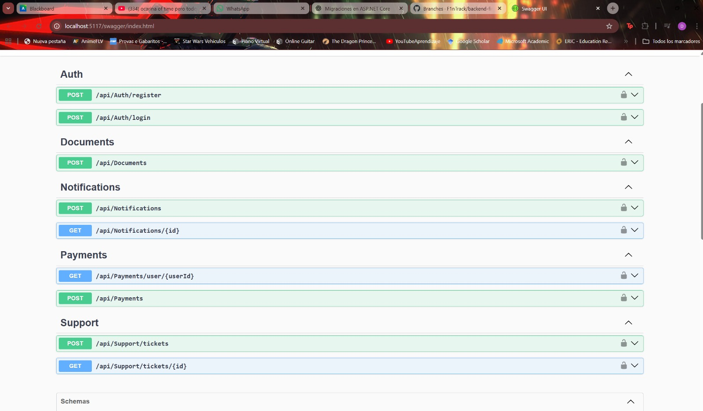


---

### 🟩 Resumen del Sprint 3
- Se completaron los módulos claves del dominio KapakID.  
- Se integró correctamente el frontend con los servicios REST.  
- El entorno de pruebas registra funcionamiento estable y validado.  


# 5.2.4. Sprint 4 – Proyecto KapakID

## 5.2.4.1. Planificación del Sprint 4

| Campo | Detalle |
|-------|---------|
| **Sprint #** | 4 |
| **Fecha** | 15/11/2025 |
| **Hora** | 18:00 |
| **Ubicación** | Reunión virtual vía Discord |
| **Preparado por** | Jhunior Giussepe Taquiri |
| **Asistentes** | Fabrizio Quiroz, Matías Salcedo, Raúl Tasayco, Daniel Ruiz, Jhunior Giussepe Taquiri |
| **Objetivo del Sprint 4** | Completar la entrega final de KapakID asegurando:<br>• Despliegue de Landing Page, API y WebApp.<br>• Correcciones finales de UI/UX.<br>• Ajustes en servicios REST.<br>• Documentación final para TB2. |
| **Sprint 4 Velocidad** | 40 |
| **Total de Story Points** | 40 |


---

## 5.2.4.2. Líderes de Aspecto y Colaboradores

| US/TS | Fabrizio | Matías | Raúl | Daniel | Giussepe |
|-------|----------|--------|-------|--------|-----------|
| US20 – Ajustes finales Login/Register | L | C | C | C | C |
| US21 – Corrección UI/UX WebApp | C | L | C | C | C |
| US22 – Integración final Back–Front | C | C | L | L | C |
| US23 – Documentación de Servicios (Swagger/README) | C | C | C | L | L |
| TS30 – Optimizar GET/POST documentos | C | C | C | L | C |
| TS32 – Ajustar alertas/notificaciones | C | C | L | C | C |
| TS34 – Corrección transporte/movements | C | C | C | L | C |
| TS35 – Pruebas + despliegue Netlify | C | L | C | C | L |

---

## 5.2.4.3. Sprint Backlog 4 – Proyecto KapakID

| US/TS | ID Tarea | Título | Descripción | Horas | Asignado a | Estado |
|-------|----------|--------|-------------|--------|-------------|--------|
| US20 | TK80 | Validación de login | Corregir validaciones y manejo de errores | 3h | Fabrizio | Done |
| US20 | TK81 | Mejorar Register | Mostrar errores claros en registro | 2h | Giussepe | Done |
| US21 | TK82 | UI Responsive | Ajustes de responsividad WebApp | 3h | Matías | Done |
| US21 | TK83 | Corrección de íconos | Ajuste de navegación + íconos | 2h | Giussepe | Done |
| US22 | TK84 | Integración API | Validar conexión Front–Back | 4h | Raúl | Done |
| US22 | TK85 | Validación JSON | Revisión de headers, status codes | 2h | Daniel | Done |
| US23 | TK86 | Swagger final | Documentar endpoints finalizados | 2h | Daniel | Done |
| US23 | TK87 | README técnico | Actualizar documentación final | 2h | Giussepe | Done |
| TS30 | TK88 | Optimización GET docs | Caching y query optimization | 2h | Daniel | Done |
| TS32 | TK89 | Ajuste de alertas | Refinar envío de alertas | 2h | Raúl | Done |
| TS34 | TK90 | Transport fixes | Corrección GET /transport/movements | 2h | Daniel | Done |
| TS35 | TK91 | Deploy Netlify | Pruebas E2E y despliegue | 3h | Giussepe | Done |

---

## 5.2.4.4. Evidencia de Desarrollo

| Repositorio | Rama | Commit ID | Mensaje | Autor | Fecha |
|-------------|-------|-----------|---------|--------|--------|
| kapakid-webapp | feature/ui-fixes | c41f9e3 | feat(support): ticket creation + list view | M. Salcedo | 02/06/2025 |
| kapakid-webapp | feature/recharge-ui | a17d8cc | feat(recharge-ui): form + confirmation dialog | M. Salcedo | 02/06/2025 |
| kapakid-api | feature/recharges | c8a2f55 | feat(recharges): POST /recharges | D. Ruiz | 01/06/2025 |
| kapakid-api | feature/movements | e5ac914 | fix: GET /transport/movements | D. Ruiz | 02/06/2025 |
| kapakid-api | feature/alerts | 2ad9c82 | feat(alerts): GET/POST alerts | R. Tasayco | 01/06/2025 |

---

## 5.2.4.5. Evidencia de Ejecución

**Evidencia 1 – Login y Register**  
Pantallas listas y funcionales en entorno de integración.

**Evidencia 2 – Gestión de Documentos**  
Operaciones POST / PATCH / GET funcionales y verificadas mediante pruebas.

**Evidencia 3 – Notificaciones**  
Alertas entregadas correctamente en WebApp y backend.

**Evidencia 4 – Despliegue final**  
- WebApp → Netlify  
- API REST → Swagger + Hosting configurado  
- Landing Page → Desplegada desde Sprint 1

---


# 5.3. Validation Interviews (KapakID)

> Esta sección sigue la estructura definida en el informe (Cap. V – *Product Implementation, Validation & Deployment* → **5.3 Validation Interviews**), y se alinea con los dominios y módulos de KapakID (Identidad y Documentos, Transporte y Tarjetas, Pagos y Transacciones, Notificaciones y Alertas, Acceso y Perfiles).

## 5.3.1. Diseño de entrevistas

**Objetivo.** Validar con usuarios reales la propuesta de KapakID en los flujos críticos: registro y acceso, gestión de documentos, recargas/pagos, movilidad (tarjetas/transportes) y notificaciones; midiendo claridad, facilidad de uso, tiempos y percepción de valor.

**Segmentos objetivo**
- **S1 – Estudiantes universitarios** (16–25): uso frecuente de trámites/credenciales, movilidad y recargas.
- **S2 – Padres/madres o tutores**: registro/seguimiento de dependientes, pagos y notificaciones.
- **S3 – Operadores/atención (opcional)**: consultas rápidas, verificación de documentos y soporte.

**Metodología**
- Guion semiestructurado (10–15 min por participante).
- Escenarios con tareas guiadas (pensamiento en voz alta).
- Captura de pantalla y métricas (tiempo por tarea, errores, SUS breve).

### User goals (tareas críticas por rol)

#### User Goal: Registrarse y elegir suscripción/plan (S1, S2)
El usuario elige su tipo (estudiante / tutor). El formulario muestra campos dinámicos según el rol. Tras confirmación de email, selecciona plan (Free/Plus) y medio de pago. Con el pago confirmado, accede a las herramientas de su plan.

#### User Goal: Iniciar sesión (S1, S2)
Ingreso con email/contraseña. Ante error, se muestran mensajes claros y opción “¿Olvidaste tu contraseña?”. Acceso al dashboard según plan/rol.

#### User Goal: Editar su perfil (S1, S2)
Desde “Perfil”, el usuario actualiza datos (identidad, contacto, preferencias de notificación/idioma). Validaciones y feedback inmediato.

#### User Goal: Gestionar documentos (registrar, editar, visualizar) (S1, S2)
Desde “Documentos”, registra nuevas credenciales (DNI/pasaporte/licencias), edita metadatos, visualiza estatus y descarga comprobantes. Búsqueda y paginación.

#### User Goal: Pagos y recargas (S1, S2)
Desde “Pagos/Recargas”, selecciona servicio (transporte/móvil), ingresa monto y confirma. Recibe comprobante y notificación.

#### User Goal: Transporte y tarjetas (S1)
Gestiona tarjeta de transporte, ve saldo y movimientos. Puede hacer recarga y consultar historial.

#### User Goal: Notificaciones y alertas (S1, S2)
Configuración de preferencias (email/app). Recibe avisos de vencimiento y estados de trámite. Centro de notificaciones con filtros.

---

## 5.3.2. Registro de entrevistas

> A continuación se documentan entrevistas por segmento. Incluye imagen (captura), *timing* en el video, y enlace a la grabación.

### Entrevistas a estudiantes universitarios (S1)

<table border="1">
  <tr><th>Campo</th><th>Información</th></tr>
  <tr><td>Entrevistado 1</td><td>A01 – Estudiante</td></tr>
  <tr>
    <td></td>
    <td>
      Percibe registro y login como claros; valora notificaciones de vencimiento. Califica la navegación con 4/5. Sugiere botón visible para “recuperar contraseña” en login y mayor detalle en planes.
    </td>
  </tr>
  <tr>
    <td>Timing: 00:05–04:10</td>
    <td><a href="https://drive.google.com/file/d/1L56VeFgJNXZNlBG1SJi8R2q2ly_IwkGr/view?usp=sharing">Ver grabación</a></td>
  </tr>
</table>

<table border="1">
  <tr><th>Campo</th><th>Información</th></tr>
  <tr><td>Entrevistado 2</td><td>A02 – Estudiante</td></tr>
  <tr>
    <td></td>
    <td>
      Encuentra útil la centralización de documentos; 5/5 en utilidad de alertas. Pide resaltar mejor “Agregar documento” y un flujo guiado para la primera recarga.
    </td>
  </tr>
  <tr>
    <td>Timing: 04:10–08:40</td>
    <td><a href="https://upcedupe-my.sharepoint.com/:v:/g/personal/u202319698_upc_edu_pe/Ea0to8pDhttOhst0CPbOsT4B6GESisWNpC92K_xX7bteNA?nav=eyJyZWZlcnJhbEluZm8iOnsicmVmZXJyYWxBcHAiOiJPbmVEcml2ZUZvckJ1c2luZXNzIiwicmVmZXJyYWxBcHBQbGF0Zm9ybSI6IldlYiIsInJlZmVycmFsTW9kZSI6InZpZXciLCJyZWZlcnJhbFZpZXciOiJNeUZpbGVzTGlua0NvcHkifX0&e=5T1kLL">Ver grabación</a></td>
  </tr>
</table>

---

## 5.3.3. Evaluaciones según heurísticas

### Web Application a evaluar
**KapakID** – Plataforma web para gestión de documentos, pagos/recargas, movilidad y notificaciones.  
**Meta:** Identificar problemas de usabilidad y priorizarlos con la *Lista Heurística de Nielsen*.

### Escala de Severidad
| Nivel | Descripción |
|------:|-------------|
| 1 | Superficial: fácil de superar o poco frecuente. |
| 2 | Menor: ocurre un poco más o cuesta superarlo. Prioridad baja. |
| 3 | Mayor: frecuente o bloqueante parcial. Prioridad alta. |
| 4 | Muy grave: impide continuar. Debe corregirse antes del lanzamiento. |

### Problemas Identificados – Landing Page
| # | Problema | Severidad | Heurística |
|---:|----------|:--------:|------------|
| 1 | Falta sección “About the product” con propuesta de valor clara | 3 | Correspondencia con el mundo real |
| 2 | Botones “Iniciar sesión / Registrarme” no redirigen a formularios | 3 | Visibilidad del estado / estándares |
| 3 | Iconografía ambigua para secciones clave | 2 | Estética y diseño minimalista |
| 4 | Planes poco específicos (beneficios/limitaciones) | 3 | Arquitectura de información |
| 5 | Formulario “Contáctanos” sin feedback ni envío | 4 | Visibilidad del estado |
| 6 | Inconsistencias de tamaño/jerarquía en botones | 2 | Consistencia y estándares |
| 7 | Logo sin comportamiento para volver a inicio | 2 | Correspondencia con el mundo real |
| 8 | Ausencia de internacionalización funcional | 3 | Flexibilidad y eficiencia |

**Recomendaciones clave**: incorporar sección “About”, corregir rutas de CTA, normalizar iconografía y botones, especificar planes con comparativas, operar el formulario de contacto con feedback, habilitar i18n.

### Problemas Identificados – Web Application
| # | Problema | Severidad | Heurística |
|---:|----------|:--------:|------------|
| 1 | Falta “¿Olvidaste tu contraseña?” en login | 3 | Prevención de errores |
| 2 | Gestión de perfil limitada (sin editar/eliminar cuenta) | 3 | Flexibilidad y control del usuario |
| 3 | Rutas no configuradas para módulos (404 en flujo) | 3 | Consistencia y estándares |
| 4 | Registro de documentos/recargas intermitente | 4 | Eficiencia y corrección |
| 5 | Falta de estados vacíos y guías en primeras tareas | 2 | Visibilidad del estado |

**Recomendaciones clave**: añadir recuperación de contraseña; habilitar edición/eliminación de cuenta; revisar enrutado; pruebas de flujo (documentos/recargas); estados vacíos con guías.

---

## 5.4. Video About-the-Product (KapakID)
> Video que resume *features* principales, decisiones de diseño y propósito de la aplicación (enlace a YouTube/MS Stream).
- **Título sugerido:** `f1ntrack-kapakid-about-the-product-sprint-3`
- **Evidencia UI**:  
  ``


# Conclusiones

Tras la finalización de los hitos del proyecto (TB1, TP2, TB2), se concluye que el equipo F1nTrack ha desarrollado exitosamente la plataforma **KapakID**, cumpliendo con los objetivos de crear una solución integral para la gestión de identidad digital y documentos personales en el contexto peruano. El proyecto ha demostrado una notable madurez técnica y metodológica, identificando una problemática real —la gestión fragmentada y riesgosa de documentos físicos— y entregando una solución digital viable que centraliza la identidad (DNI, pasaportes, carnés) y los servicios de utilidad (recargas de transporte, pagos y notificaciones).

La fortaleza del proyecto reside en su rigurosa fundamentación en el **diseño centrado en el usuario (Lean UX)**, como se evidencia en los Capítulos I y II. El proceso de *Needfinding*, que incluyó entrevistas detalladas, *User Personas* (Estudiante y Tutor), *Journey Maps* y *Empathy Maps*, fue crucial para definir un producto alineado con las necesidades de los segmentos objetivo. Esta base analítica aseguró que el *Product Backlog* (Capítulo III) y las historias de usuario no fueran meras suposiciones, sino respuestas directas a los "dolores" validados de los usuarios, como la necesidad de recargas ágiles y alertas de vencimiento.

Desde una perspectiva técnica, el proyecto destaca por la implementación de una **arquitectura de software moderna y desacoplada**. La utilización de un *Backend* en **.NET Core (C#)** para la API REST y un *Frontend* en **Vue.js (con PrimeVue)**, como se detalla en el Capítulo V, permitió un desarrollo paralelo y eficiente. La arquitectura C4 (Capítulo IV) y el diseño de la base de datos proveyeron una estructura escalable. La exitosa implementación a través de tres sprints, que culminó con el despliegue funcional del *frontend* en Netlify y la documentación de *endpoints* en Swagger, demuestra la capacidad del equipo para entregar un producto *full-stack* cohesivo y de alta calidad.

Finalmente, el proyecto evidencia una gestión de equipo y colaboración excepcionales, como se documenta en el **Student Outcome 5**. El equipo operó bajo un modelo de liderazgo distribuido, asignando responsabilidades claras (UX/UI, Backend, Frontend, SCM) que permitieron a cada miembro aportar valor desde su especialidad. La adhesión estricta a prácticas de *Software Configuration Management* (Capítulo V), incluyendo **GitFlow**, **Conventional Commits** y guías de estilo por lenguaje, fue fundamental para integrar los distintos componentes (Landing Page, Frontend App, API) de manera ordenada, asegurando la calidad del código y el cumplimiento exitoso de los objetivos en cada hito de entrega.


#  Bibliografía

- Nielsen Norman Group. *10 Usability Heuristics for User Interface Design*.  
  Disponible en: [https://www.nngroup.com/articles/ten-usability-heuristics/](https://www.nngroup.com/articles/ten-usability-heuristics/)

- Nielsen Norman Group. *How to Rate the Severity of Usability Problems*.  
  Disponible en: [https://www.nngroup.com/articles/how-to-rate-the-severity-of-usability-problems/](https://www.nngroup.com/articles/how-to-rate-the-severity-of-usability-problems/)

- Gothelf, Jeff; Seiden, Josh. *Lean UX: Designing Great Products with Agile Teams*.  
  O’Reilly Media.

- Microsoft Docs. *TypeScript Handbook*.  
  Disponible en: [https://www.typescriptlang.org/docs/handbook/intro.html](https://www.typescriptlang.org/docs/handbook/intro.html)

- Astro Documentation. *Astro Framework Documentation*.  
  Disponible en: [https://docs.astro.build](https://docs.astro.build)

- Tidwell, Jenifer. *Designing Interfaces: Patterns for Effective Interaction Design*.  
  O’Reilly Media.

- World Wide Web Consortium (W3C). *Web Content Accessibility Guidelines (WCAG)*.  
  Disponible en: [https://www.w3.org/WAI/standards-guidelines/wcag/](https://www.w3.org/WAI/standards-guidelines/wcag/)

- Sethi, P.; Sarangi, S. *Internet of Things: Architectures, Protocols, and Applications*.  
  *Journal of Electrical and Computer Engineering*.

- Google Web Fundamentals. *Web Performance Optimization Guidelines*.  
  Disponible en: [https://developers.google.com/web/fundamentals/performance](https://developers.google.com/web/fundamentals/performance)


# Anexos

---

## Anexo A: Estructura para la sección Objetivo del Estudiante (Student Outcome)

Cada participante del equipo debe sustentar evidencia de cómo las actividades realizadas en el trabajo final han ayudado a desarrollar las dimensiones del student outcome. Por ello en esta sección debe haber una subsección por cada alumno donde éste describa por escrito la relación entre el outcome, sus dimensiones y el trabajo que ha realizado.

El curso contribuye al cumplimiento del Student Outcome ABET:

**ABET–EAC – Student Outcome 5: La capacidad de funcionar eficazmente en un equipo cuyos miembros en conjunto proporcionan liderazgo, crean un entorno colaborativo e inclusivo, establecen metas, planifican tareas y cumplen objetivos.**

En el siguiente cuadro se describe las acciones realizadas y enunciados de conclusiones por parte del grupo F1nTrack, que permiten sustentar el haber alcanzado el logro del ABET - EAC-Student Outcome 5.

### 🧩 Evaluación del SO5 – Trabajo en Equipo, Liderazgo y Colaboración
*(TB1 – TP1 – TB2 incluidos por integrante)*

| Criterio específico | Acciones realizadas (TB1, TP1, TB2) | Conclusiones (TB1, TP1, TB2) |
|---|---|---|
| **Trabaja en equipo para proporcionar liderazgo en forma conjunta** | **Giussepe Taquiri – TB1:** Alineé investigación y diseño consolidando needfinding y creando lineamientos de producto (branding, paleta, tipografía, iconografía, jerarquía). Diseñé arquitectura de información web/móvil. <br> **TP1:** Lideré la comunicación de avances UX–UI, ajustando pantallas según feedback y manteniendo trazabilidad de decisiones. <br> **TB2:** Aporté a la integración final del Front-End, revisé consistencia visual y documenté flujos de navegación. <br><br> **Raúl Tasayco – TB1:** Organicé repositorios GitHub, fragmenté tareas y establecí fechas de entrega. <br> **TP1:** Coordiné revisiones técnicas y actualicé estructuras de integración API. <br> **TB2:** Lideré la refactorización del Back-End, corrigiendo endpoints y asegurando coherencia del diseño. <br><br> **Daniel Ruiz – TB1:** Gestión de configuraciones (SDCM/SCM), guía de estilo, control de versiones y despliegues. <br> **TP1:** Gestioné PRs, validaciones automáticas y mejoras en el pipeline técnico. <br> **TB2:** Lideré el ordenamiento de servicios y lógica de negocio, corrigiendo inconsistencias y documentando endpoints. <br><br> **Matías Salcedo – TB1:** Conceptualización inicial: misión, visión, propuesta de valor y perfiles del equipo. <br> **TP1:** Aporté a la estructura del Pitch, narrativa de producto y roadmap. <br> **TB2:** Participé en la revisión de documentación y coherencia entre front, back y modelo del dominio. <br><br> **Fabrizio Quiroz – TB1:** Fomenté liderazgo colaborativo enseñando el uso de GitHub y trabajo en equipo. <br> **TP1:** Apoyé en integración de pantallas, pruebas y flujos. <br> **TB2:** Contribuí en ajustes al Back-End y verificación de datos intercambiados entre módulos. | **TB1:** El equipo demostró un liderazgo distribuido que permitió decisiones rápidas y sin reprocesos. Cada miembro aportó desde su especialidad fortaleciendo un TB1 coherente. <br><br> **TP1:** La coordinación técnica y de diseño mejoró el rendimiento del equipo, permitiendo integrar cambios en front y back de manera organizada. La comunicación constante evitó inconsistencias entre módulos. <br><br> **TB2:** El liderazgo compartido permitió consolidar correctamente Front-End y Back-End, documentar servicios y dejar un producto final estable y entendible. Se evidenció madurez en la toma de decisiones técnicas. |
| **Crea un entorno colaborativo e inclusivo, establece metas, planifica tareas y cumple objetivos** | **Giussepe Taquiri – TB1:** Definí metas claras, prioridades y responsables; realicé seguimiento con métricas. <br> **TP1:** Organicé sesiones de revisión de diseño, asegurando coherencia visual y usabilidad. <br> **TB2:** Coordiné ajustes finales del Front-End y documentación visual. <br><br> **Raúl Tasayco – TB1:** Planifiqué tareas por semanas, elaboré Lean UX Process, definí segmentos y el DDD con C4. Normalicé base de datos. <br> **TP1:** Coordiné integración técnica y ajustes en el modelado del dominio. <br> **TB2:** Aseguré la correcta integración del Back-End y la estructura de endpoints finales. <br><br> **Daniel Ruiz – TB1:** Definí ubiquitous language, scenario mapping, épicas, Impact Mapping, Product Backlog y diccionario de clases. <br> **TP1:** Organicé revisiones técnicas del Back-End y validación de historias de usuario. <br> **TB2:** Coordiné documentación de servicios y su consistencia con el modelo final. <br><br> **Matías Salcedo – TB1:** Aporté a la definición inicial con 5Ws+2H, permitiendo claridad en metas y etapas. <br> **TP1:** Supervisé la coherencia entre narrativa de producto y entregables técnicos. <br> **TB2:** Revisé el enfoque del informe y su alineación con las metas del proyecto. <br><br> **Fabrizio Quiroz – TB1:** Revisé entregables intermedios y ajusté contenido según retroalimentación. <br> **TP1:** Aporté a pruebas funcionales y verificación de rutas. <br> **TB2:** Validé la integración final y el intercambio de datos entre Back-End y Front-End. | **TB1:** Se cumplieron todos los objetivos del entregable con alta calidad gracias a planificación, metas claras y revisión por pares. <br><br> **TP1:** El equipo consolidó un entorno colaborativo maduro, integrando cambios entre UX, Front-End y Back-End sin perder trazabilidad. <br><br> **TB2:** La coordinación final permitió un cierre completo del sprint, documentación clara y un sistema integrado y funcional. El equipo demostró dominio del SO5: colaboración, planificación, liderazgo y cumplimiento. |


---

### ✔️ Resultado General del SO5
El equipo alcanzó satisfactoriamente el **Student Outcome 5**, demostrando liderazgo conjunto, colaboración inclusiva, planificación efectiva y cumplimiento de objetivos en todas las fases: **TB1, TP1 y TB2**.

---

## Anexo B: Indicaciones y Enlaces de Videos

A continuación, se detallan los artefactos multimedia generados para el proyecto, siguiendo las indicaciones de calidad y nomenclatura.

| Sección | Características del video | Sobre el contenido | Integración y entrega |
| :--- | :--- | :--- | :--- |
| **Needfinding Interviews** (Cap. 2.2.2) | **Nomenclatura:** `upc-pre-202520-7414-F1nTrack-needfinding-sprint-1.mp4` <br> **Duración:** Variable (aprox. 3-5 min por entrevista). | Consolida las entrevistas a **Estudiantes (S1)** y **Padres/Tutores (S2)**, mostrando los *pain points* relacionados con la gestión de documentos y recargas. | **Enlaces (Ejemplos del README):** <br> - [Entrevista S1 - Hany Pareja](https://upcedupe-my.sharepoint.com/:v:/g/personal/u20221c576_upc_edu_pe/EQuM6qNAe-5MhSFGE_dESuYBpHtdmfK5y9TPWPT4EQjGyA?nav=eyJyZWZlcnJhbEluZm8iOnsicmVmZXJyYWxBcHAiOiJPbmVEcml2ZUZvckJ1c2luZXNzIiwicmVmZXJyYWxBcHBQbGF0Zm9ybSI6IldlYiIsInJlZmVycmFsTW9kZSI6InZpZXciLCJyZWZlcnJhbFZpZXciOiJNeUZpbGVzTGlua0NvcHkifX0&e=1WERnv) <br> - [Entrevista S1 - Sebastian Delgado](https://drive.google.com/file/d/1L56VeFgJNXZNlBG1SJi8R2q2ly_IwkGr/view?usp=sharing) <br> - [Entrevista S2 - Freddy Torre](https://youtu.be/LSnkTj_Xj1Q) |
| **Validation Interviews** (Cap. 5.3.2) | **Nomenclatura:** `upc-pre-202520-7414-F1nTrack-validation-sprint-3.mp4` <br> **Duración:** Variable. | Consolida sesiones de validación donde usuarios de los segmentos S1 y S2 interactúan con el prototipo de KapakID en Netlify, realizando tareas de login, registro de documentos y recargas. | **Enlaces:** <br> - [Ver Grabación - Validación A01](https://enlace-a-validacion-A01.com) <br> - [Ver Grabación - Validación B01](https://enlace-a-validacion-B01.com) <br> *(Reemplazar con enlaces reales)* |
| **About the Product** (Cap. 5.4) | [cite_start]**Nomenclatura:** `upc-pre-202520-7414-F1nTrack-about-the-product-sprint-3.mp4` <br> **Duración:** 1 a 3 minutos[cite: 1241]. | Orientación promocional, resumiendo el modelo de negocio de KapakID, las características (Identidad, Pagos, Transporte, Alertas) y los beneficios de seguridad y centralización. | **Enlace:** <br> - [Video About-the-Product (KapakID)](https://enlace-al-video-about-the-product.com) <br> *(Enlace de ejemplo del README)* |
| **About the Team** (Hito TB2) | **Nomenclatura:** `upc-pre-202520-7414-F1nTrack-about-the-team-sprint-3.mp4` <br> **Duración:** Aprox. 5-10 minutos. | Video que resume el proceso de trabajo del equipo F1nTrack. Incluye testimonio ante cámara de cada participante (Taquiri, Tasayco, Ruiz, Salcedo, Quiroz) describiendo actividades, logro del SO5 y competencias. | **Enlace:** <br> - [Video About-the-Team (F1nTrack)](https://enlace-al-video-about-the-team.com) <br> *(Enlace de ejemplo del README)* |

---

## Anexo C: Formato para Evaluación de User Experience según Heurísticas

Formato adaptado de la guía del curso y aplicado a la evaluación de KapakID (Sección 5.3.3 del README).

**SITE / APP A EVALUAR:** **KapakID** – Plataforma web para gestión de documentos, pagos/recargas, movilidad y notificaciones.

**TAREAS A EVALUAR (Ejemplos):**
1.  Registro de un usuario nuevo (Estudiante/Tutor).
2.  Iniciar sesión.
3.  Editar perfil de usuario.
4.  Registrar un nuevo documento (DNI/Carné).
5.  Realizar una recarga de transporte (Metropolitano).
6.  Consultar notificaciones de vencimiento.

**ESCALA DE SEVERIDAD:**

| Nivel | Descripción |
| :--- | :--- |
| 1 | Problema superficial: puede ser fácilmente superado por el usuario o ocurre con muy poca frecuencia. |
| 2 | Problema menor: puede ocurrir un poco más frecuentemente o es un poco más difícil de superar.Prioridad baja. |
| 3 | Problema mayor: ocurre frecuentemente o los usuarios no son capaces de resolverlos. Prioridad alta. |
| 4 | Problema muy grave: un error de gran impacto que impide al usuario continuar con el uso. Es imperativo que sea corregido. |

**TABLA RESUMEN (Basada en hallazgos de la Sección 5.3.3):**

| # | Problema (Landing Page) | Escala de severidad | Heurística/Principio violada(o) |
| :--- | :--- | :--- | :--- |
| 1 | Falta sección “About the product” con propuesta de valor clara | 3 | Correspondencia con el mundo real |
| 2 | Botones “Iniciar sesión / Registrarme” no redirigen a formularios | 3 | Visibilidad del estado / estándares |
| 3 | Iconografía ambigua para secciones clave | 2 | Estética y diseño minimalista |
| 4 | Planes poco específicos (beneficios/limitaciones) | 3 | Arquitectura de información |
| 5 | Formulario “Contáctanos” sin feedback ni envío | 4 | Visibilidad del estado |
| 6 | Inconsistencias de tamaño/jerarquía en botones | 2 | Consistencia y estándares |
| 7 | Logo sin comportamiento para volver a inicio | 2 | Correspondencia con el mundo real |
| 8 | Ausencia de internacionalización funcional | 3 | Flexibilidad y eficiencia |

| # | Problema (Web Application) | Escala de severidad | Heurística/Principio violada(o) |
| :--- | :--- | :--- | :--- |
| 1 | Falta “¿Olvidaste tu contraseña?” en login | 3 | Prevención de errores |
| 2 | Gestión de perfil limitada (sin editar/eliminar cuenta) | 3 | Flexibilidad y control del usuario |
| 3 | Rutas no configuradas para módulos (404 en flujo) | 3 | Consistencia y estándares |
| 4 | Registro de documentos/recargas intermitente | 4 | Eficiencia y corrección |
| 5 | Falta de estados vacíos y guías en primeras tareas | 2 | Visibilidad del estado |


**DESCRIPCIÓN DE PROBLEMAS (Ejemplo):** 

**PROBLEMA #5 (Landing):** Formulario “Contáctanos” sin feedback ni envío
* **Severidad:** 4 (Muy grave)
* **Heurística violada:** Visibilidad del estado del sistema
* **Problema:** El usuario llena el formulario de contacto, presiona "Enviar", pero la página no ofrece ninguna confirmación visual (ej. "Mensaje enviado") ni indica si ocurrió un error. El usuario no sabe si la acción fue exitosa, lo que rompe la confianza.
  **Recomendación:** Implementar un mensaje de *feedback* inmediato (ej. "¡Gracias! Tu mensaje ha sido enviado.") tras el envío exitoso, y mensajes de error claros (ej. "El formato del email es incorrecto") si falla la validación.


# Anexo D. Formato para Evaluación de User Experience según Heurísticas  
**UX Heuristics & Principles Evaluation**  
Usability – Inclusive Design – Information Architecture  

**CARRERA:** Ingeniería de Software  
**CURSO:** Aplicaciones Web  
**SECCIÓN:** [Código de la sección]  
**PROFESORES:** Todos  
**AUDITOR:** Equipo F1nTrack – KapakID  
**CLIENTE(S):** Usuarios del segmento S1 y S2 (Estudiantes – Tutores)

---

## SITE o APP A EVALUAR:
**KapakID – Plataforma Web de Gestión de Documentos, Pagos, Transporte y Notificaciones**

---

## TAREAS EVALUADAS

El alcance de esta evaluación incluye la revisión de la usabilidad de las siguientes tareas reales de KapakID:

1. Registro de un usuario nuevo  
2. Iniciar sesión  
3. Registrar un documento (DNI, carné universitario, brevete)  
4. Realizar una recarga de transporte  
5. Consultar notificaciones de vencimiento  
6. Visualizar movimientos de transporte  
7. Crear un ticket de soporte  
8. Subir un documento mediante PDF/JPG/PNG  

### TAREAS NO INCLUIDAS EN ESTA VERSIÓN:
1. Recuperación avanzada de documentos eliminados  
2. Reportes gráficos de historial de pagos  
3. Integración con billeteras externas  
4. Configuración multicuenta y perfiles secundarios  

---

## ESCALA DE SEVERIDAD

| Nivel | Descripción |
|-------|-------------|
| **1** | Problema superficial, de fácil superación. No urgente. |
| **2** | Problema menor. Recomendable corregir en próxima release. |
| **3** | Problema mayor. Ocurre frecuentemente o detiene el flujo natural. Prioridad alta. |
| **4** | Problema muy grave. Impide continuar. Debe corregirse antes del lanzamiento. |

---

## TABLA RESUMEN DE PROBLEMAS DETECTADOS

| # | Problema | Severidad | Heurística / Principio violado |
|---|----------|-----------|-------------------------------|
| 1 | No existe confirmación clara al subir un documento | 3 | Usability: Feedback inmediato |
| 2 | El botón para volver al Dashboard no es visible en flujos profundos | 2 | Usability: Libertad y control del usuario |
| 3 | Iconos sin texto alternativo accesible | 2 | Inclusive Design: Experiencias comparables |
| 4 | Mensajes de error en recargas poco descriptivos | 3 | Usability: Prevención y recuperación de errores |
| 5 | Información de transporte dispersa en dos pantallas | 2 | Information Architecture: Is it findable? |
| 6 | Alertas no muestran fecha exacta de vencimiento | 1 | Usability: Visibilidad del estado del sistema |

---

# DESCRIPCIÓN DE PROBLEMAS (CON RECOMENDACIONES)

---

## **PROBLEMA #1 – No existe confirmación clara al subir un documento**
**Severidad:** 3  
**Heurística violada:** Usability – *Feedback inmediato*

### **Problema**
Al subir un documento (PDF, JPG), la plataforma solo muestra un cambio visual leve, sin un mensaje explícito de éxito.  
Usuarios del segmento S1 (estudiantes) indicaron que no están seguros si el archivo se cargó correctamente.

*(Aquí insertar captura de la vista de documentos con el problema.)*

### **Recomendación**
Incluir notificaciones claras como:  
- “Documento subido correctamente”  
- “Hubo un error al cargar el archivo”  

Implementable con Toast o snackbar (PrimeVue).

---

## **PROBLEMA #2 – El botón para volver al Dashboard no es visible**
**Severidad:** 2  
**Heurística violada:** Usability – *Libertad y control del usuario*

### **Problema**
En vistas internas como "Historial de Transporte" o "Editar Documento", no hay un control evidente para regresar al Dashboard sin usar el botón del navegador.

### **Recomendación**
Agregar un botón persistente:  
**← Volver al Dashboard**

---

## **PROBLEMA #3 – Iconos sin etiquetas accesibles**
**Severidad:** 2  
**Heurística violada:** Inclusive Design – *Proporciona experiencias comparables*

### **Problema**
Los iconos del menú lateral (documentos, notificaciones, transporte) no poseen atributos `aria-label`, lo que afecta lectores de pantalla.

### **Recomendación**
Agregar:
```html
<span aria-label="Documentos"></span>


```

## PROBLEMA #4 – Mensajes de error poco descriptivos en recargas

**Severidad:** 3  
**Heurística violada:** Usability – Prevención y recuperación de errores

### Problema
Si se ingresa un monto inválido en una recarga, el sistema muestra un mensaje genérico que no explica la causa del error.  
Esto causa confusión al usuario, quien no entiende si el fallo es por el monto, el método de pago o un problema del sistema.

### Recomendación
Mostrar mensajes claros y específicos como:

- “El monto debe ser mayor a S/ 1.00.”
- “Ingresa un método de pago válido.”
- “Verifica el saldo de tu tarjeta antes de continuar.”

---

## PROBLEMA #5 – Información de Transporte dispersa

**Severidad:** 2  
**Heurística violada:** Information Architecture – Findability

### Problema
La información relacionada al transporte (saldo, últimos movimientos y recargas) se encuentra distribuida en pantallas separadas.  
Esto aumenta el tiempo que los usuarios requieren para encontrar datos clave y afecta la eficiencia del flujo.

### Recomendación
Crear una vista consolidada bajo un módulo unificado:

👉 **Panel de Transporte**

Este panel debería incluir:  
- Saldo actual  
- Historial de movimientos  
- Estado de recargas  
- Botón directo para “Recargar Transporte”  

---

## PROBLEMA #6 – Alertas sin fecha exacta

**Severidad:** 1  
**Heurística violada:** Usability – Visibilidad del estado del sistema

### Problema
Las alertas muestran mensajes como “Documento por vencer”, pero no indican la fecha exacta de expiración.  
Esto obliga al usuario a buscar manualmente la información en otra pantalla.

### Recomendación
Incluir la fecha precisa dentro del mensaje, por ejemplo:

- **“Tu DNI vence el 08/03/2026.”**
- **“Tu carné universitario expirará el 15/02/2026.”**

Esto reduce la ambigüedad y mejora la toma de decisiones del usuario.

---


